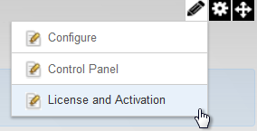
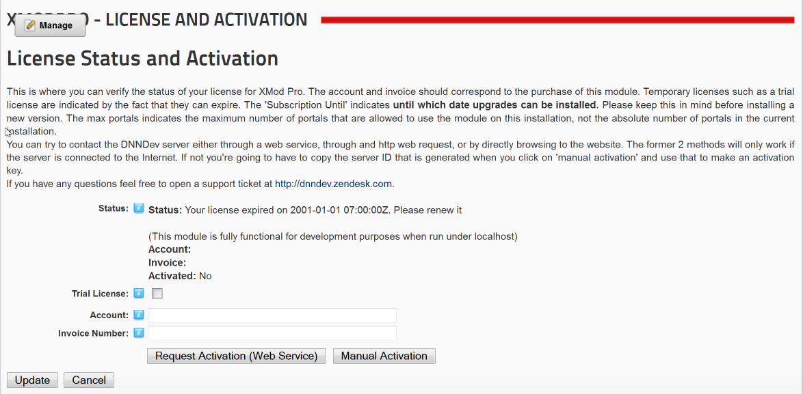
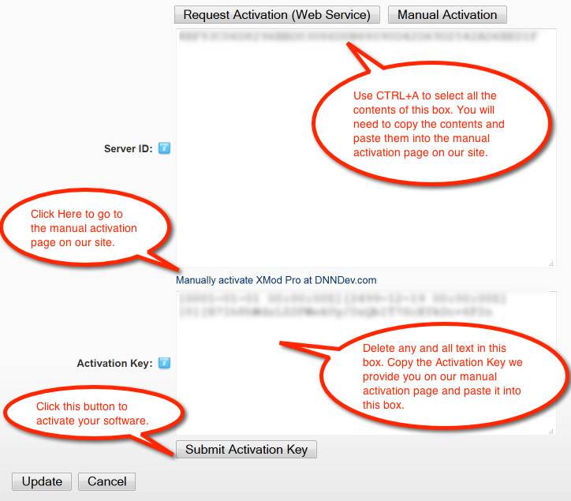

# Activating Your License

In order to use XMod Pro on a web site, you must Activate the license. Please note that you may use XMod Pro for development purposes only on "localhost" (http://localhost). For all other uses you must activate the license. This is done through the License and Activation page. This page is only available to Hosts or SuperUser accounts. To get there, select "License and Activation" from the module's Actions/Manage Menu:

The License and Activation page allows you to check the status of your license. If you haven't yet activated, this page allows you to request a Trial License (a temporary license that will expire) or activate your license.

**Requesting A Trial License**: Tick the "Trial License" check box and click the "Request Activation" or "Manual Activation" button

**Activating Your License**:

*   Make sure the Trial License check box is not ticked.
*   Account: Enter the email address you used to purchase the license.
*   Invoice Number: If you purchased from The DNN Store (formerly Snowcovered), enter the Invoice Number found on your receipt. If you purchased from PayPal, use the Transaction ID, which can be found on your receipt.
*   Ensure you have a connection to the internet.
*   Click the "Request Activation" button.
    *   NOTE: If you are behind a Firewall or you're having difficulty activating, click the "Manual Activation" button and follow the instructions below for Manually Activating your License.
*   Click the "Update" link to save your changes.

**Manually Activating Your License**:

*   Fill in the Account and Invoice Number text boxes. Ensure this information is correct.
*   Click the "Manual Activation" button
*   The following appears:  
    
*   Press CTRL+A on your keyboard to select ALL the information in the Server ID box and copy that to the clipboard. You will need to paste that information into our manual activation page.
*   Click the link below the Server ID box to browse to our manual activation page and follow the instructions on that page. Paste the text copied from the Server ID box into the "STEP THREE" text box on the manual activation page.
*   The manual activation page will generate an Activation Key for you. Copy and paste that text into the "Activation Key" text box on the License and Activation page in XMod Pro.
*   Click the "Submit Activation Key" button to activate your software
*   Click the "Update" link to save your changes.
