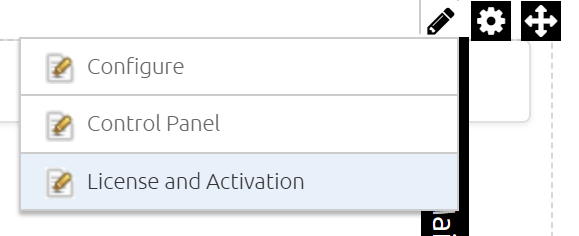
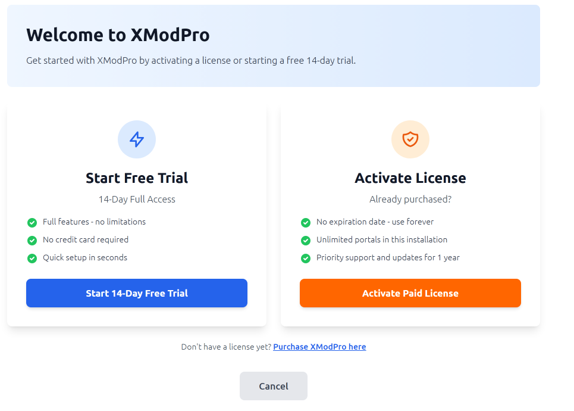
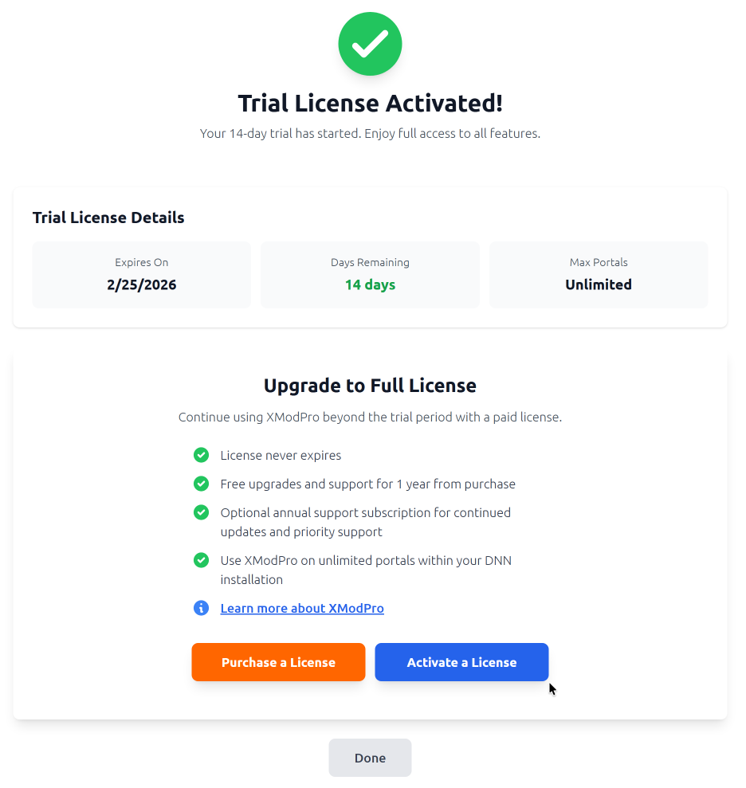
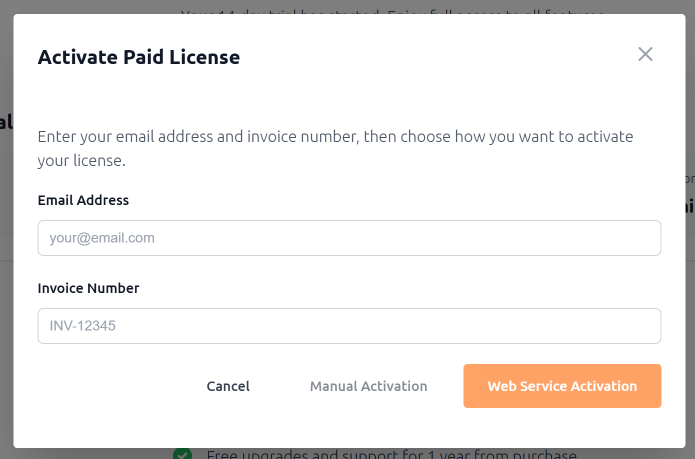
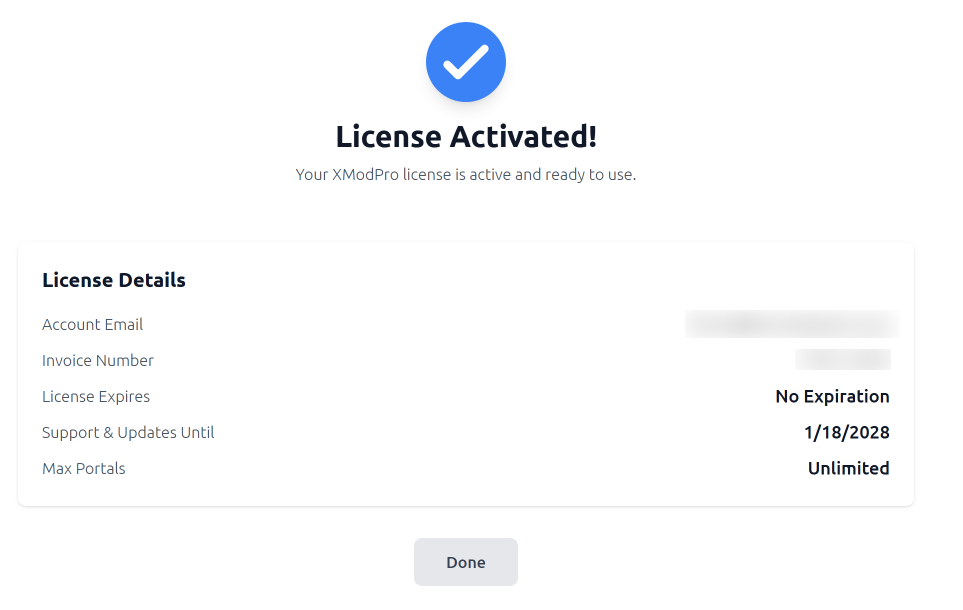
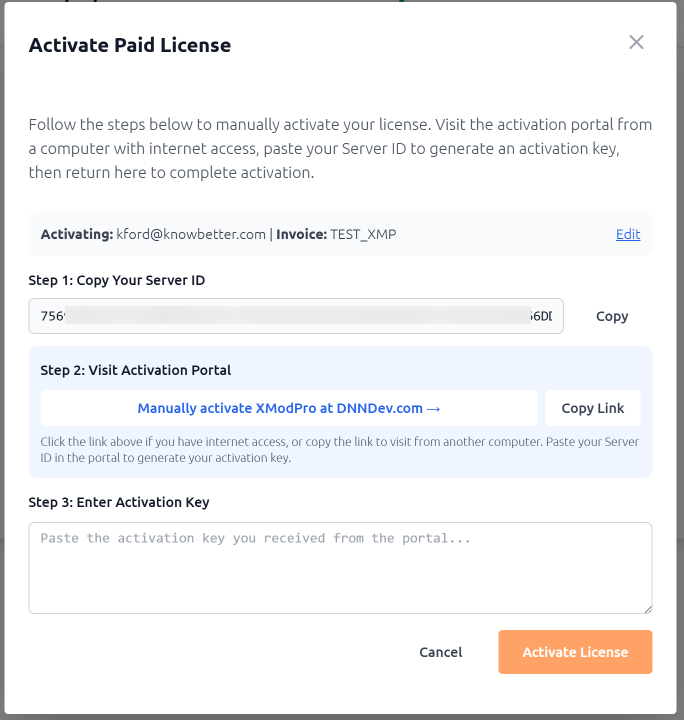

# Activating Your License

To use XMod Pro on a live site, you need to activate your license. You can use XMod Pro without activation only on `localhost` for local development.

The License and Activation page is available to **Host (SuperUser) accounts only**. To get there, hover over the XMod Pro module and select **License and Activation** from the actions menu:

When you open the page for the first time, you'll see two options: start a free trial or activate a paid license.

## Requesting a Trial License

If you'd like to try XMod Pro before purchasing, you can activate a **14-day trial license** with a single click. Click the **Start 14-Day Free Trial** button — no email address or other information is required. The trial gives you full access to all features with no limitations.

Once activated, the page shows your trial details including the expiration date, days remaining, and maximum portals.

When you're ready to upgrade, click **Activate a License** to begin the paid activation process, or click **Purchase a License** if you haven't bought one yet.

## Activating a Paid License

To activate a purchased license:

1. On the License and Activation page, click **Activate Paid License** (or **Activate a License** if you're on a trial).
2. In the dialog that appears, enter the **email address** you used when purchasing the license.
3. Enter your **invoice number** from your purchase receipt.
4. Click **Web Service Activation**.

Your server needs an internet connection to complete the activation. Once activated, the page displays your license details including the account email, invoice number, license expiration, support and updates period, and portal allowance.

## Manual Activation

If your server doesn't have a direct internet connection or you're having trouble with web service activation, you can activate manually:

1. In the activation dialog, enter your **email address** and **invoice number**.
2. Click the **Manual Activation** button (instead of Web Service Activation).
3. The dialog walks you through three steps:

- **Step 1: Copy Your Server ID** — Click **Copy** to copy the Server ID to your clipboard.
- **Step 2: Visit Activation Portal** — Click the link to open the activation portal at DNNDev.com (or click **Copy Link** to visit from a computer with internet access). On the portal page, select **DNNDev** as the manufacturer and **XModPro** as the product. Paste your Server ID and click **Generate Activation Key**. Copy the resulting key.
- **Step 3: Enter Activation Key** — Paste the activation key you received from the portal into the text box.

4. Click **Activate License** to complete the activation.
