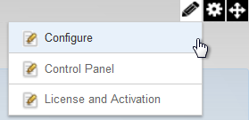
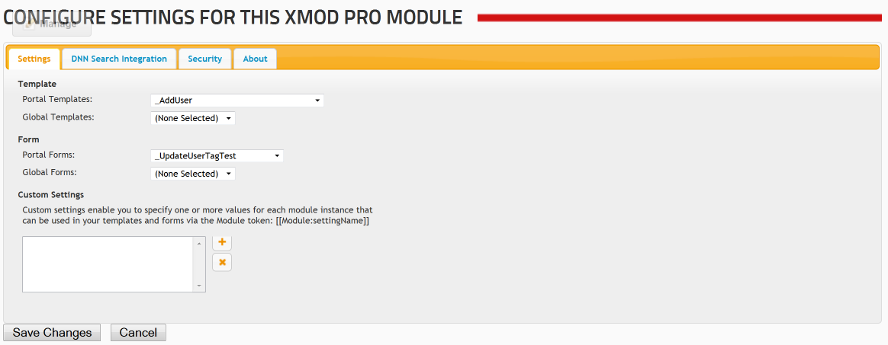
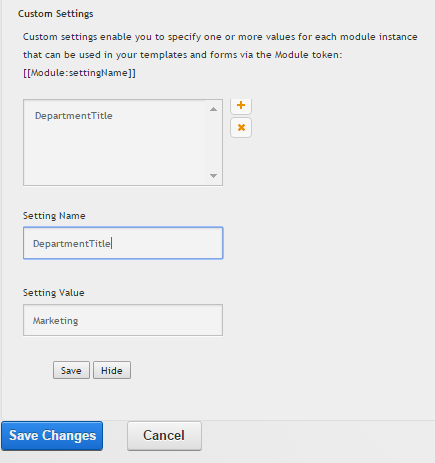
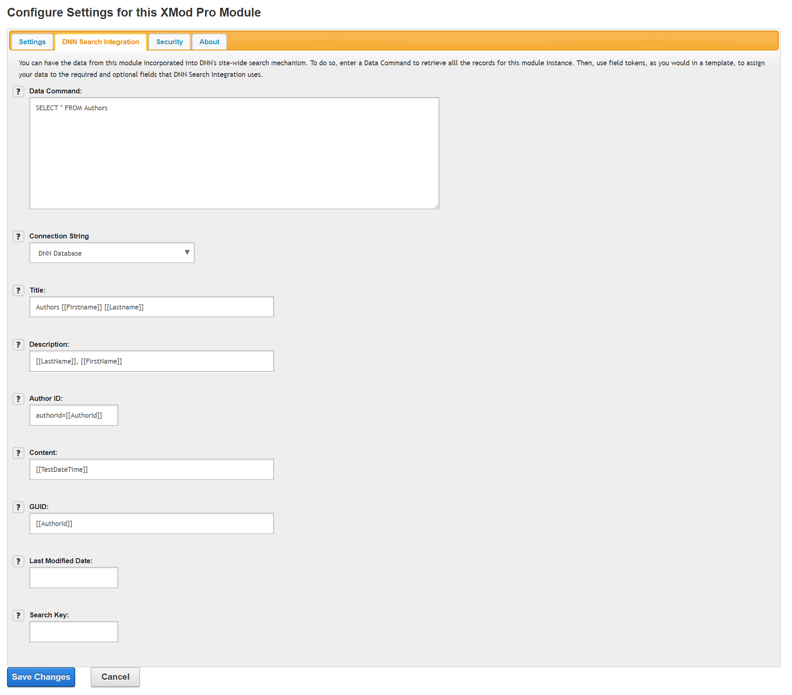
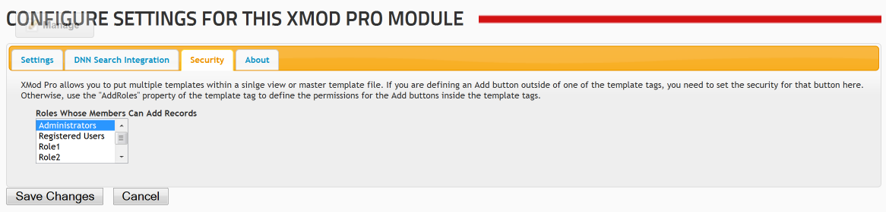
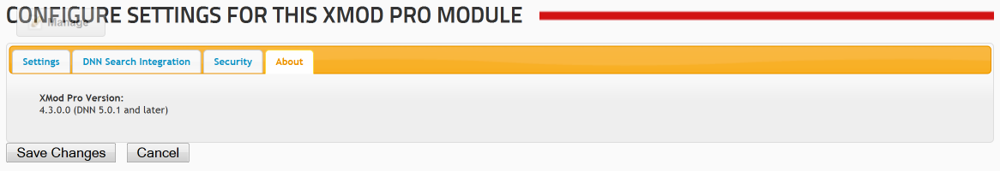

# Configuring XMod Pro

The XMod Pro module configuration page allows you to assign forms and templates and set some security options for the module. The Configuration page is available to portal administrators as well as Hosts and SuperUsers. You can view the Configuration page by selecting "Configure" from the Actions/Manage Menu for the module, as seen below.

Most of the settings that define how your XMod Pro application operates are defined within the forms and templates. However, the Configure page is where you determine what forms and templates you'll use and, if necessary, how they will operate.

It contains four tabs:

## Settings Tab

On the **Settings Tab**, you select which **Template** and which **Form** this module will use. You can choose to select just a template and no form, just a form and no template, or both. If you select just a form, then that form will appear when the module is loaded. If you're familiar with XMod, you can think of this as the FormView module. The net effect is that the user, when he/she navigates to the page, will see the form without having to click any links or buttons to do so. This mode is perfect for "Contact Us" or "Feedback" kinds of forms.

### Custom Settings

New to version 2.7: You can also specify your own **Custom Settings** for each module instance. This essentially allows you to create your own tokens that can be used in the form and template the module is using.

To add a setting, click the `+` button. To delete a setting, select it in the list box and click the `X` button. To edit a setting, select it in the list box. For each setting you'll provide a Name and a Value. To use the setting, you'll create a Module token with that Name like so: `[[Module:settingName]]` where _settingName_ is the value you enter into the **Setting Name** box. To save the Custom Setting, click on Save. Then, select Save Changes to commit the changes to the Settings tab. At run time, the Module token will be replaced by the setting Value you specify. So, in the example shown in the screen shot, if we placed `[[Module:DepartmentTitle]]` in our template, it would be replaced by _Marketing_ at run-time.

## DNN Search Integration Tab

New to version 4.0: XMod Pro now allows you to get your data indexed by DNN's Search Engine, making it possible to include XMod Pro managed data in site-wide searches.

As with all things XMod, we made **Search Integration** as flexible as possible to better accommodate the different scenarios in which it might be used.

*   **Data Command**: Just like you would enter SQL for a ListDataSource in a template tag, do the same here to retrieve all the records that should be indexed through this module instance. You can use certain tokens like `[[Portal:ID]]` and `[[Module:ID]]` but not user or session specific tokens like `[[User:ID]]`, `[[Url:paramName]]`, or `[[Form:paramName]]` since this will be executed by DNN without a web page being loaded (and thus no user session). 
::: tip
Simply embed your tokens in the command and they'll be replaced at run-time. This is different than you would do for data commands in your templates. Field tokens are not allowed in the Data Command. 
:::

*   **Connection String**: (New to v4.8) Defaults to the DNN database. To utilize a different connection string, simply add it to your web.config `<connectionStrings>...</connectionStrings>` node.

*   **Title**: The title for the record that will appear on the DNN Search Results page. Titles can be a maximum length of 200 characters. As shown in the example, you can use field tokens combined with plain text for your title. Note that the maximum length is the rendered length - after any field tokens have been processed.  

*   **Description**: A description of the record that will be displayed in the DNN Search Results page. Descriptions can be a maximum length of 2000 characters. You can use field tokens and plain text in the description. Note that the maximum length is the rendered length - after any field tokens have been processed.  

*   **Author ID**: User ID of record author (optional). This should evaluate to the DNN User ID of the record's author. Leave it blank if there is no author. As shown in the example, you can use field tokens for your Author ID.  

*   **Content**: The actual content that will be indexed by DNN. As shown in the example, you can use field tokens combined with plain text for your title.  

*   **GUID**: Use this field to add URL parameters to the link that DNN creates that points to the detail view of the record. If your template is displaying a list of books, you might enter: `bookid=[[BookId]]`. You can chain multiple parameters together just as you would in a standard URL: `bookid=[[BookId]]&authorid=[[AuthorId]]`. Please ensure that your selected template has a DetailTemplate tag and that the DetailDataSource has Parameter tags set to the same names as the URL parameters you pass-in. As shown in the example, you can use field tokens combined with plain text for your GUID.  

*   **Last Modified Date**: This should evaluate to a valid date and time value. This value should be the date the record was last updated. DNN uses this value to determine if the record should be re-indexed. If you use a date that doesn't change when the record is updated, the record will not be re-indexed. As shown in the example, you can use a field token for your Last Modified Date. **This value is required**.  

*   **Search Key**: A text value that uniquely identifies this record. Typically this may be the unique numeric ID that is assigned to a record. Search keys can be a maximum of 100 characters. Note that the maximum length is the rendered length - after any field tokens have been processed.

## Security Tab

On the **Security Tab** you select which DNN roles have permission to add records through the module. Edit, Delete, and Detail View permissions are set within the template. Each user within the selected role(s) will be able to add records. You can select multiple roles by Shift-Clicking to select adjacent roles or Ctrl-Clicking (or Command-Clicking on the Mac) to select non-adjacent roles.

## About Tab

On the About Tab you can see the "DLL Version" of XMod Pro (4.3.0.0 in the image above). This may be different than what is reported by DNN in the Module Definitions page. When reporting issues, we may ask you for this version as it will help us identify which release you're using. The value in parentheses is the DNN version that this version of XMod Pro should be running in. If you are running DNN 4.6 and the About tab reports DNN 5.0.1 and later, you are running the wrong version of XMod Pro. You should instead install the version for DNN 4.x.