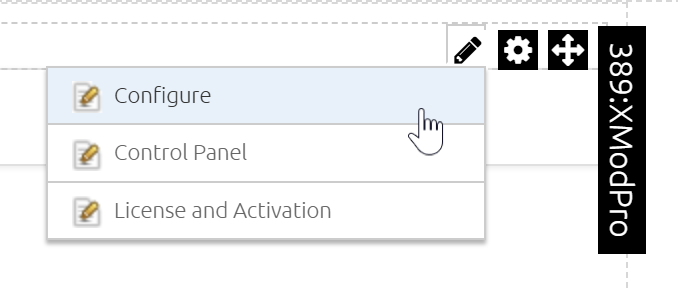
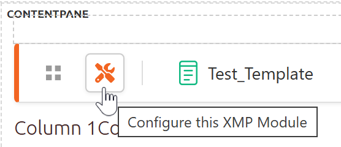
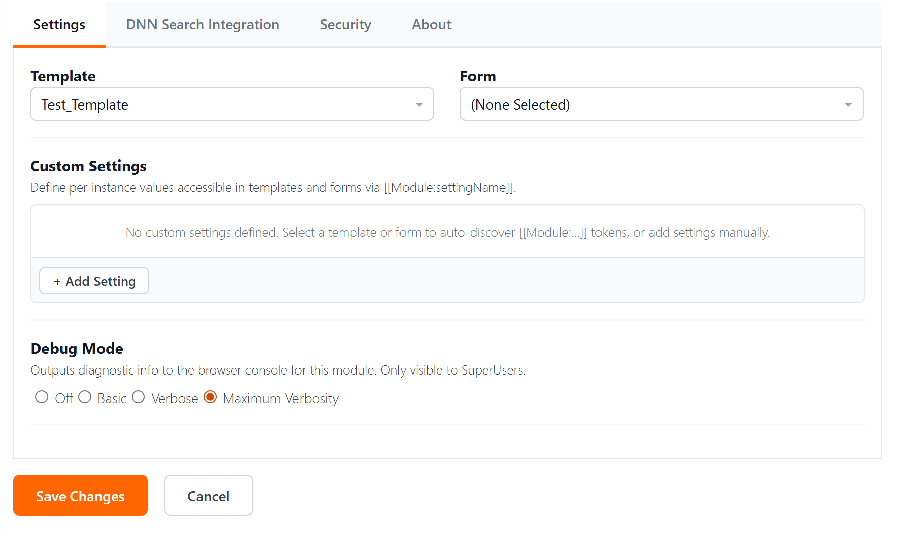
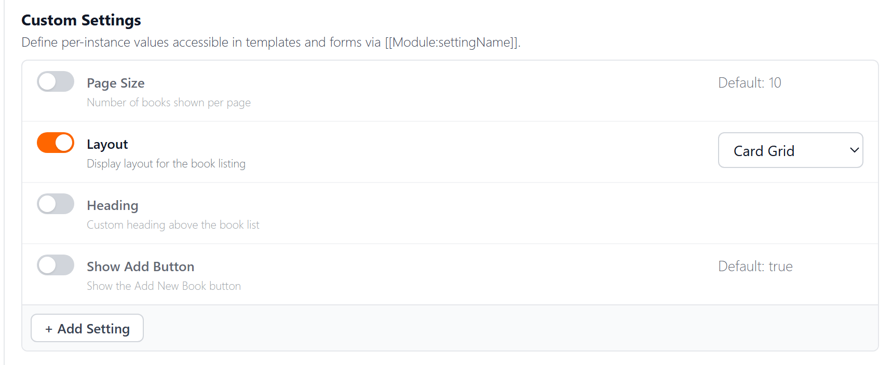
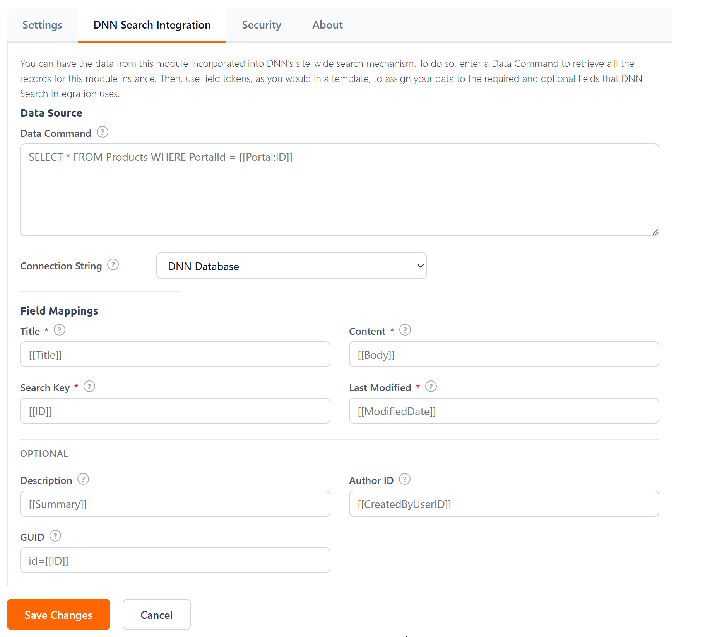
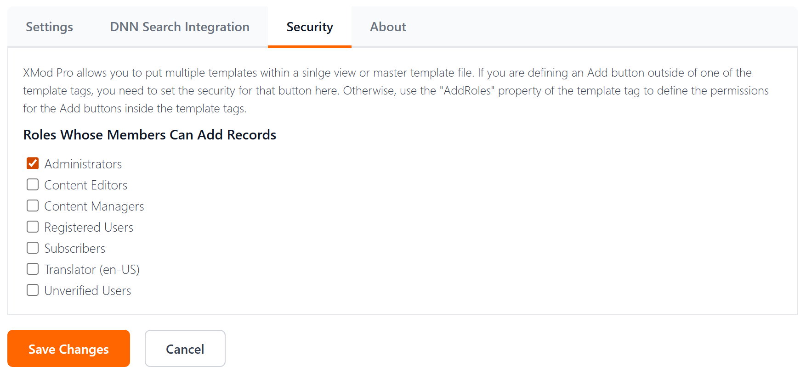
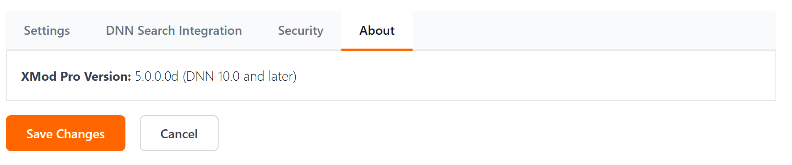

# Configuring XMod Pro

The Configure page is where you assign views and forms to an XMod Pro module instance and control how it behaves. It's available to portal administrators as well as Host (SuperUser) accounts — though some sections are only visible to Hosts.

Most of the settings that define how your XMod Pro solution works live inside the views and forms themselves. The Configure page determines **which** view and form the module uses, along with security, search integration, and a few other options.

## Opening the Configure Page

There are two ways to open the Configure page:

- **From the module actions menu** — Click the module's action menu (pencil icon) and select **Configure**.

  

- **From the quick-edit toolbar** — When the module is in Edit Mode, click the **wrench icon** in the toolbar that appears above the module.

  

::: tip
You must be in **Edit Mode** to see the quick-edit toolbar. Toggle Edit Mode using the pencil icon in the DNN Persona Bar.
:::

The Configure page has four tabs: **Settings**, **DNN Search Integration** (Host only), **Security**, and **About**.

## Settings Tab

On the Settings tab you choose which **view** and **form** this module will display. You can assign just a view, just a form, or both. If you assign only a form, visitors will see the form as soon as they navigate to the page — perfect for "Contact Us" or feedback scenarios.

The **Template** and **Form** dropdowns are searchable — just start typing to filter. Each dropdown combines both portal-level and global items into a single list, grouped under **Portal** and **Global** headings. (Portal items belong to the current portal only, while Global items are shared across all portals in the DNN installation.)

### Custom Settings <Badge type="warning" text="Host Only" />

Custom Settings let you define per-instance values that your views and forms can reference using `[[Module:settingName]]` tokens. For example, if you create a setting named `DepartmentTitle` with a value of `Marketing`, then placing `[[Module:DepartmentTitle]]` in your view or form will output `Marketing` at runtime.

**Auto-scan** — When you select a view or form, XMod Pro automatically scans the file for any `[[Module:...]]` tokens and lists them in the Custom Settings table. Each token shows a **source badge** indicating where it was found:

- **Template** — found in the view only
- **Form** — found in the form only
- **Both** — found in both
- **Manual** — added by hand, not found by scanning
- **Not referenced** — was previously saved but is no longer used in either file

To include a discovered token, check its checkbox and enter a value. You can also add settings manually with the **+ Add Setting** button, or edit and delete existing ones.

### Debug Mode <Badge type="warning" text="Host Only" />

Debug Mode outputs diagnostic information to the browser console for this module instance. It's only visible to Host users in the browser — regular visitors never see it.

| Level | Description |
|-------|-------------|
| **Off** | No debug output (default) |
| **Basic** | Key events and data source execution |
| **Verbose** | Detailed processing information |
| **Maximum Verbosity** | Full diagnostic output |

## DNN Search Integration Tab <Badge type="warning" text="Host Only" />

XMod Pro can have your data indexed by DNN's search engine, making it possible to include your data in site-wide searches.

### Data Source

- **Data Command** — Enter a SQL command to retrieve all records that should be indexed for this module instance. You can use tokens like `[[Portal:ID]]` and `[[Module:ID]]`, but not user- or session-specific tokens (`[[User:ID]]`, `[[Url:paramName]]`, `[[Form:paramName]]`) since DNN runs this command in the background without an active user session.

::: tip
Embed tokens directly in the SQL command — they'll be replaced at runtime. Field tokens are **not** allowed in the Data Command itself; they're used in the field mappings below.
:::

- **Connection String** — Defaults to the DNN database. To use a different database, add a connection string to your site's `web.config` file (in the `<connectionStrings>` section) and select it from the dropdown.

### Field Mappings

Use field tokens (like `[[Title]]` or `[[ProductId]]`) to map your data to the fields that DNN's search engine expects. Required fields are marked with an asterisk.

**Required:**

| Field | Description | Max Length |
|-------|-------------|-----------|
| **Title** | The record title shown on the search results page. Supports field tokens and plain text. | 200 chars |
| **Content** | The text that DNN will index for searching. Supports field tokens and plain text. | — |
| **Search Key** | A value that uniquely identifies the record (typically its ID). | 100 chars |
| **Last Modified** | A valid date/time value indicating when the record was last updated. DNN uses this to decide whether to re-index the record. If this value doesn't change when a record is updated, the record won't be re-indexed. | — |

**Optional:**

| Field | Description | Max Length |
|-------|-------------|-----------|
| **Description** | A description shown on the search results page. Supports field tokens and plain text. | 2,000 chars |
| **Author ID** | The DNN User ID of the record's author. Leave blank if not applicable. | — |
| **GUID** | URL parameters appended to the search result link, pointing to the record's detail view. For example: `bookid=[[BookId]]` or `bookid=[[BookId]]&authorid=[[AuthorId]]`. Make sure your view has a detail area with matching parameters. | — |

::: info
All maximum lengths refer to the **rendered** length — after field tokens have been replaced with actual values.
:::

## Security Tab

On the Security tab you choose which DNN roles have permission to **add records** through this module. Check the box next to each role whose members should be allowed to add data. The Administrator role is always included.

Edit, delete, and detail view permissions are controlled within the view itself, not on this page.

## About Tab

The About tab displays the XMod Pro version number and the DNN version it was built for. When reporting issues, you may be asked for this version to help identify which release you're running.

