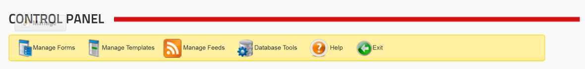

# Control Panel

Beginning with version 2, most administrative tasks have been consolidated and placed in the Control Panel. It is only available to Host and SuperUser accounts. You can access the Control Panel by selecting it from the Actions/Manage menu:

On the Control Panel page you'll see the following toolbar:

A brief description of each area is provided below. Click the links to see a more detailed explanation of each area.

[Manage Forms](manage-forms.md): In this area you can add, edit, rename, copy, and delete forms.

[Manage Templates](manage-templates.md): In this area you can add, edit, rename, copy, and delete templates.

[Manage Feeds](manage-feeds.md): In this area you can add, edit, rename, copy, and delete XMod Pro feeds.

[Database Tools](database-tools.md): In this area you can create basic tables in your DNN database and, optionally, auto-generate forms and templates from the newly created table.

**Help**: The help page provides a list of videos and instructional blog posts which appear periodically on our site. These items are updated as they are added to our site, so check the Help page periodically to see what has been added.

**Exit**: This exits the Control Panel and returns you to the previous page.
