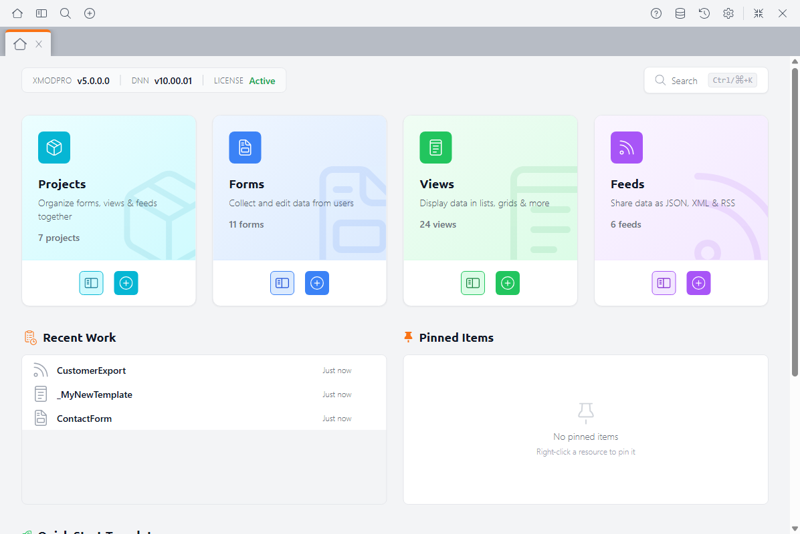
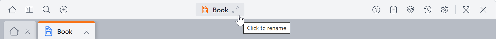
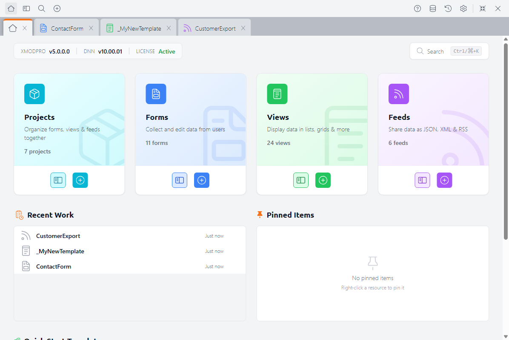
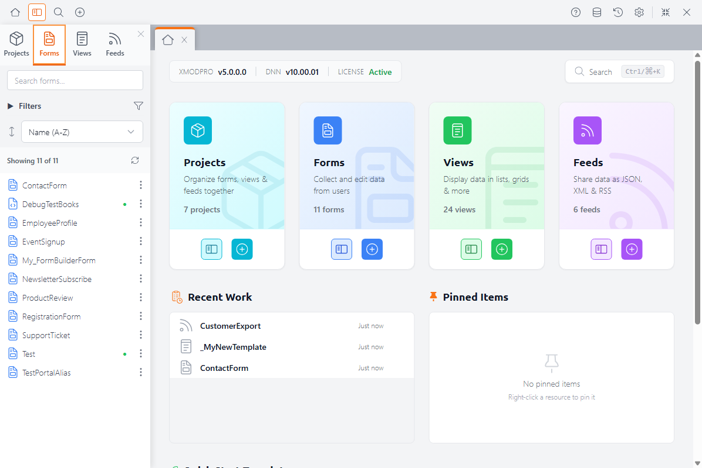
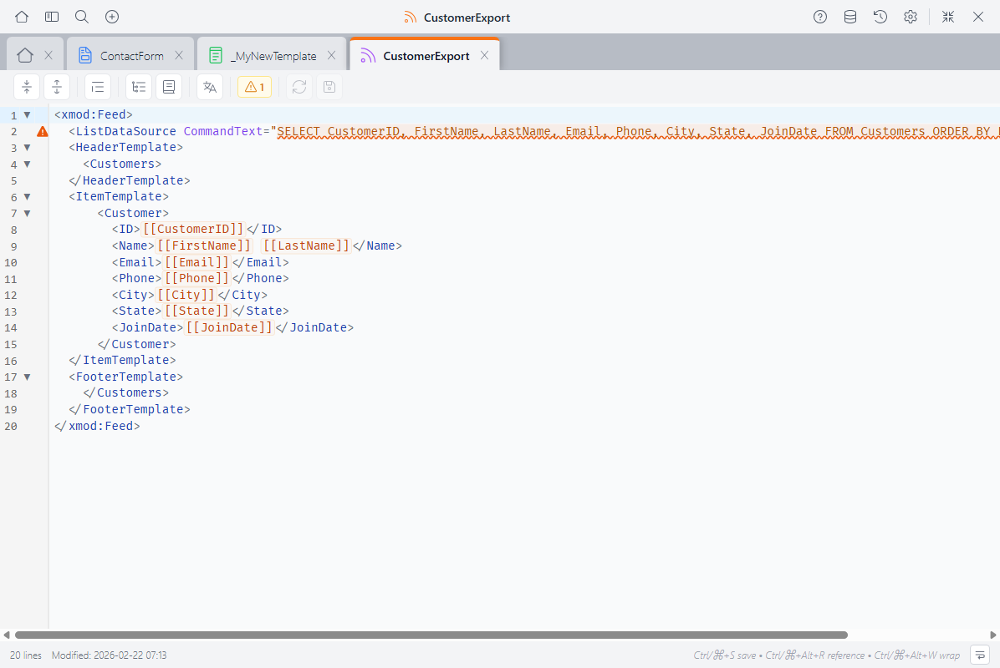
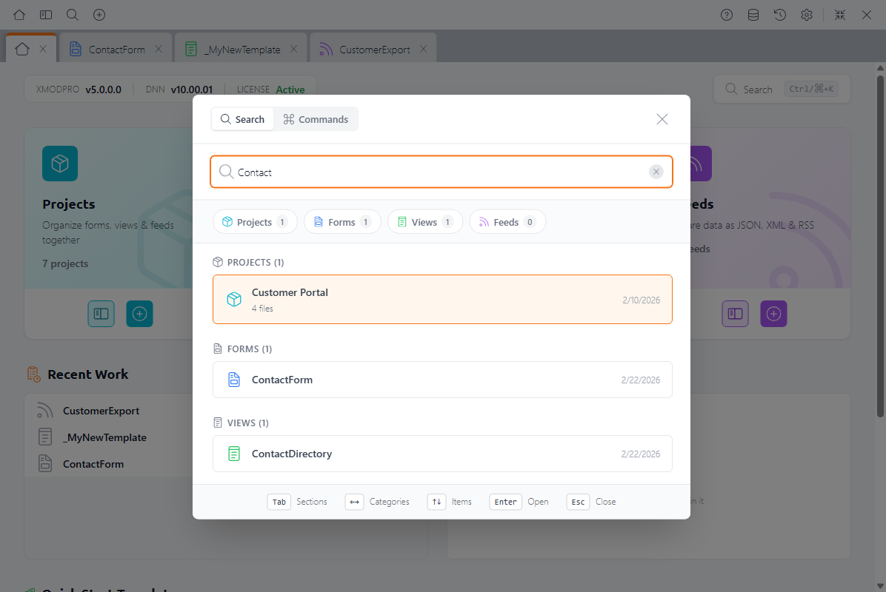
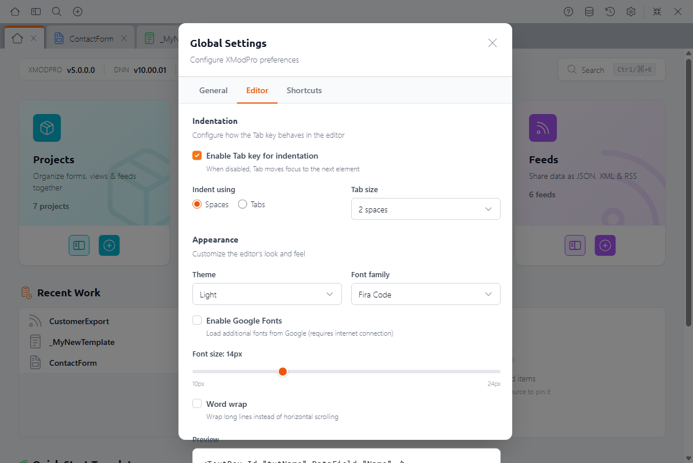

# Control Panel <Badge type="info" text="v5.0" />

The Control Panel is the central workspace for everything you build with XMod Pro. From here you can create and edit forms, views, and feeds, manage database tables, organize resources into projects, and access every tool XMod Pro offers — all in a single, modern interface.

In v5, the Control Panel has been completely redesigned. It now uses a tab-based layout similar to a code editor like VS Code — you can have multiple resources open at once, switch between them instantly, and pick up right where you left off. Your open tabs are remembered between sessions.

::: info Host Access Only
The Control Panel is only available to Host (SuperUser) accounts.
:::

## Accessing the Control Panel

To open the Control Panel:

1. Log in as a Host (SuperUser) account
2. Navigate to any page that has an XMod Pro module
3. Enter **Edit Mode** by clicking the pencil icon at the bottom of the DNN Persona Bar (the sidebar on the left)
4. Select **Control Panel** from the module's action menu

<!-- SCREENSHOT: cp-action-menu — needs manual capture: hover over module to show action menu with Control Panel option -->

## The Toolbar

The toolbar runs across the top of the Control Panel and gives you quick access to every major feature.

From left to right:

- <svg class="cp-tb-icon" xmlns="http://www.w3.org/2000/svg" viewBox="0 0 576 512" aria-hidden="true"><path d="M272.5 5.7c9-7.6 22.1-7.6 31.1 0l264 224c10.1 8.6 11.4 23.7 2.8 33.8s-23.7 11.4-33.8 2.8L512 245.5V432c0 44.2-35.8 80-80 80H144c-44.2 0-80-35.8-80-80V245.5L39.5 266.3c-10.1 8.6-25.3 7.3-33.8-2.8s-7.3-25.3 2.8-33.8l264-224zM96 432c0 26.5 21.5 48 48 48h288c26.5 0 48-21.5 48-48V222.1L288 40.5 96 222.1V432z"/></svg> **Home** — Return to the [Dashboard](#the-dashboard)
- <svg class="cp-tb-icon" xmlns="http://www.w3.org/2000/svg" viewBox="0 0 512 512" aria-hidden="true"><path d="M224 96l0 320-160 0c-17.7 0-32-14.3-32-32l0-256c0-17.7 14.3-32 32-32l160 0zm16-32L64 64C28.7 64 0 92.7 0 128L0 384c0 35.3 28.7 64 64 64l384 0c35.3 0 64-28.7 64-64l0-256c0-35.3-28.7-64-64-64L240 64zm16 32l192 0c17.7 0 32 14.3 32 32l0 256c0 17.7-14.3 32-32 32l-192 0 0-320zM80 160c0 8.8 7.2 16 16 16l64 0c8.8 0 16-7.2 16-16s-7.2-16-16-16l-64 0c-8.8 0-16 7.2-16 16zm0 64c0 8.8 7.2 16 16 16l64 0c8.8 0 16-7.2 16-16s-7.2-16-16-16l-64 0c-8.8 0-16 7.2-16 16zm0 64c0 8.8 7.2 16 16 16l64 0c8.8 0 16-7.2 16-16s-7.2-16-16-16l-64 0c-8.8 0-16 7.2-16 16z"/></svg> **Explorer** — Toggle the [Explorer sidebar](#the-explorer) to browse your resources
- <svg class="cp-tb-icon" xmlns="http://www.w3.org/2000/svg" viewBox="0 0 512 512" aria-hidden="true"><path d="M384 208a176 176 0 1 0 -352 0 176 176 0 1 0 352 0zM343.3 366C307 397.2 259.7 416 208 416 93.1 416 0 322.9 0 208S93.1 0 208 0 416 93.1 416 208c0 51.7-18.8 99-50 135.3L507.3 484.7c6.2 6.2 6.2 16.4 0 22.6s-16.4 6.2-22.6 0L343.3 366z"/></svg> **Command Palette** — Search for any resource by name (also available with **Ctrl+K** / **Cmd+K**)
- <svg class="cp-tb-icon" xmlns="http://www.w3.org/2000/svg" viewBox="0 0 512 512" aria-hidden="true"><path d="M256 32a224 224 0 1 1 0 448 224 224 0 1 1 0-448zm0 480a256 256 0 1 0 0-512 256 256 0 1 0 0 512zM240 352c0 8.8 7.2 16 16 16s16-7.2 16-16l0-80 80 0c8.8 0 16-7.2 16-16s-7.2-16-16-16l-80 0 0-80c0-8.8-7.2-16-16-16s-16 7.2-16 16l0 80-80 0c-8.8 0-16 7.2-16 16s7.2 16 16 16l80 0 0 80z"/></svg> **New** — Create a new form, view, feed, or project
- <svg class="cp-tb-icon" xmlns="http://www.w3.org/2000/svg" viewBox="0 0 512 512" aria-hidden="true"><path d="M480 256a224 224 0 1 0 -448 0 224 224 0 1 0 448 0zM0 256a256 256 0 1 1 512 0 256 256 0 1 1 -512 0zm256-96c-26.5 0-48 21.5-48 48 0 8.8-7.2 16-16 16s-16-7.2-16-16c0-44.2 35.8-80 80-80s80 35.8 80 80c0 39.6-25.7 60.3-46.2 70.1-11.5 5.5-17.8 14.5-17.8 22.2l0 5.7c0 8.8-7.2 16-16 16s-16-7.2-16-16l0-5.7c0-24.6 18.3-42.6 36-51 14.5-6.9 28-18.8 28-41.2 0-26.5-21.5-48-48-48zM232 376a24 24 0 1 1 48 0 24 24 0 1 1 -48 0z"/></svg> **Help** — Open the built-in help viewer with searchable documentation
- <svg class="cp-tb-icon" xmlns="http://www.w3.org/2000/svg" viewBox="0 0 448 512" aria-hidden="true"><path d="M416 416c0 2.4-1 7.4-8.4 14.9-7.5 7.6-19.9 15.9-37.8 23.6-35.7 15.3-87.2 25.5-145.8 25.5S113.9 469.8 78.2 454.5c-17.9-7.7-30.3-16-37.8-23.6-7.4-7.5-8.4-12.5-8.4-14.9l0-84.5c17.2 8.9 38.1 16.3 61.2 21.9 37.5 9.2 82.5 14.5 130.8 14.5s93.3-5.3 130.8-14.5c23.1-5.7 44-13 61.2-21.9l0 84.5zm0-212.5l0 90.6c-14.5 10.6-37.9 20.6-68.9 28.3-34.7 8.5-77.1 13.6-123.1 13.6s-88.5-5.1-123.1-13.6c-31-7.6-54.4-17.7-68.9-28.3l0-90.6c17.2 8.9 38.1 16.3 61.2 21.9 37.5 9.2 82.5 14.5 130.8 14.5s93.3-5.3 130.8-14.5c23.1-5.7 44-13 61.2-21.9zm0-37.4c-14.5 10.6-37.9 20.6-68.9 28.3-34.7 8.5-77.1 13.6-123.1 13.6s-88.5-5.1-123.1-13.6c-31-7.6-54.4-17.7-68.9-28.3L32 96c0-2.4 1-7.4 8.4-14.9 7.5-7.6 19.9-15.9 37.8-23.6 35.7-15.3 87.2-25.5 145.8-25.5S334.1 42.2 369.8 57.5c17.9 7.7 30.3 16 37.8 23.6 7.4 7.5 8.4 12.5 8.4 14.9l0 70.1zM448 416l0-320C448 43 347.7 0 224 0S0 43 0 96L0 416c0 53 100.3 96 224 96s224-43 224-96z"/></svg> **Database Tools** — Open [Database Tools](database-tools.md) to create and manage tables
- <svg class="cp-tb-icon" xmlns="http://www.w3.org/2000/svg" viewBox="0 0 512 512" aria-hidden="true"><path d="M243.6 37.3c8-3.4 17-3.4 25 0l176.7 75c11.3 4.8 18.9 15.5 18.8 27.6-.5 94-39.4 259.8-195.5 334.5-7.9 3.8-17.2 3.8-25.1 0-156.1-74.7-195-240.4-195.4-334.5-.1-12.1 7.5-22.8 18.8-27.6l176.7-75zM281.1 7.8c-16-6.8-34-6.8-50 0L54.3 82.8c-22 9.3-38.4 31-38.3 57.2 .5 99.2 41.3 280.7 213.6 363.2 16.7 8 36.1 8 52.8 0 172.4-82.5 213.2-264 213.6-363.2 .1-26.2-16.3-47.9-38.3-57.2L281.1 7.8zM200 128l-21.3 0c-32.4 0-58.7 26.3-58.7 58.7l0 29.3c0 22.6 13.4 42.1 32.7 50.9l-15 29.9c-4 7.9-.7 17.5 7.2 21.5s17.5 .7 21.5-7.2L186.4 271c26-4.9 45.6-27.7 45.6-55l0-56 60.2 0c6.1 0 11.6 3.4 14.3 8.8l7.2 14.3c2.7 5.4 8.2 8.8 14.3 8.8l56 0 0 16c0 35.3-28.7 64-64 64l-48 0c-8.8 0-16 7.2-16 16l0 80c0 8.8 7.2 16 16 16s16-7.2 16-16l0-64 32 0c53 0 96-43 96-96l0-16c0-17.7-14.3-32-32-32l-46.1 0-2.7-5.5c-8.1-16.3-24.8-26.5-42.9-26.5L200 128zM175.8 240c-13.1-.1-23.7-10.8-23.7-24l0-29.3c0-10.9 6.6-20.3 16-24.4 3.3-1.4 6.9-2.2 10.7-2.2l21.3 0 0 56c0 13.2-10.6 23.9-23.7 24l-.5 0zM272 208a16 16 0 1 0 0-32 16 16 0 1 0 0 32z"/></svg> **Watchdog** — Open the Watchdog security audit to scan your forms, views, and feeds for risky patterns
- <svg class="cp-tb-icon" xmlns="http://www.w3.org/2000/svg" viewBox="0 0 512 512" aria-hidden="true"><path d="M32 132l0-84c0-8.8-7.2-16-16-16S0 39.2 0 48L0 176c0 8.8 7.2 16 16 16l128 0c8.8 0 16-7.2 16-16s-7.2-16-16-16l-90.4 0C89.5 84.3 166.7 32 256 32 379.7 32 480 132.3 480 256S379.7 480 256 480c-73.3 0-138.3-35.2-179.2-89.6-5.3-7.1-15.3-8.5-22.4-3.2s-8.5 15.3-3.2 22.4C97.9 471.8 172.2 512 256 512 397.4 512 512 397.4 512 256S397.4 0 256 0C159.6 0 75.7 53.3 32 132zm224-4c-8.8 0-16 7.2-16 16l0 112c0 4.2 1.7 8.3 4.7 11.3l80 80c6.2 6.2 16.4 6.2 22.6 0s6.2-16.4 0-22.6L272 249.4 272 144c0-8.8-7.2-16-16-16z"/></svg> **Version History** — Open [Version History](version-history.md) to browse and restore previous versions
- <svg class="cp-tb-icon" xmlns="http://www.w3.org/2000/svg" viewBox="0 -16 512 544" aria-hidden="true"><path d="M185.9 112.3c-6.5 3.2-12.8 6.8-18.8 10.9-8.2 5.5-18.5 6.9-28 3.8L67.4 103.2 29.5 168.8 86 219.1c7.4 6.6 11.3 16.2 10.7 26.1-.5 7.2-.5 14.6 0 21.8 .7 9.9-3.3 19.5-10.7 26.1l-56.5 50.2 37.9 65.7 71.7-23.8c9.4-3.1 19.7-1.7 28 3.8 6 4 12.3 7.7 18.8 10.9 8.9 4.4 15.2 12.6 17.2 22.3l15.2 74 75.8 0 15.2-74c2-9.7 8.4-17.9 17.2-22.3 6.5-3.2 12.8-6.8 18.8-10.9 8.2-5.5 18.5-6.9 28-3.8l71.7 23.8 37.9-65.7-56.5-50.2c-7.4-6.6-11.3-16.2-10.7-26.1 .2-3.6 .4-7.2 .4-10.9s-.1-7.3-.4-10.9c-.7-9.9 3.3-19.5 10.7-26.1l56.5-50.2-37.9-65.7-71.7 23.8c-9.4 3.1-19.7 1.7-28-3.8-6-4-12.3-7.7-18.8-10.9-8.9-4.4-15.2-12.6-17.2-22.3l-15.2-74-75.8 0-15.2 74c-2 9.7-8.4 17.9-17.2 22.3zM294.2-16c15.2 0 28.3 10.7 31.3 25.5l15.2 74c7.8 3.8 15.4 8.2 22.6 13.1l71.7-23.8c14.4-4.8 30.2 1.2 37.8 14.4l37.9 65.7c7.6 13.2 4.9 29.8-6.5 39.9L447.9 243c.6 8.6 .6 17.5 0 26l56.5 50.2c11.4 10.1 14 26.8 6.5 39.9l-37.9 65.7c-7.6 13.2-23.4 19.2-37.8 14.4l-71.7-23.8c-7.2 4.8-14.7 9.2-22.6 13.1l-15.2 74c-3.1 14.9-16.2 25.5-31.3 25.5l-75.8 0c-15.2 0-28.3-10.7-31.3-25.5l-15.2-74c-7.8-3.8-15.4-8.2-22.6-13.1L77.5 439.2C63.1 444 47.3 438 39.7 424.8L1.8 359.2c-7.6-13.1-4.9-29.8 6.5-39.9L64.7 269c-.6-8.6-.6-17.5 0-26L8.2 192.8c-11.4-10.1-14-26.8-6.5-39.9L39.7 87.2C47.3 74 63.1 68 77.5 72.8l71.7 23.8c7.2-4.8 14.7-9.2 22.6-13.1l15.2-74C190.1-5.3 203.2-16 218.4-16l75.8 0zM200.3 256a55.7 55.7 0 1 0 111.4 0 55.7 55.7 0 1 0 -111.4 0zm55.4 88a88 88 0 1 1 .6-176 88 88 0 1 1 -.6 176z"/></svg> **Settings** — Open global settings (theme, editor preferences, snippets)
- <svg class="cp-tb-icon" xmlns="http://www.w3.org/2000/svg" viewBox="0 0 448 512" aria-hidden="true"><path d="M304 32c-8.8 0-16 7.2-16 16s7.2 16 16 16L393.4 64 224 233.4 54.6 64 144 64c8.8 0 16-7.2 16-16s-7.2-16-16-16L16 32C7.2 32 0 39.2 0 48L0 176c0 8.8 7.2 16 16 16s16-7.2 16-16L32 86.6 201.4 256 32 425.4 32 336c0-8.8-7.2-16-16-16S0 327.2 0 336L0 464c0 8.8 7.2 16 16 16l128 0c8.8 0 16-7.2 16-16s-7.2-16-16-16L54.6 448 224 278.6 393.4 448 304 448c-8.8 0-16 7.2-16 16s7.2 16 16 16l128 0c8.8 0 16-7.2 16-16l0-128c0-8.8-7.2-16-16-16s-16 7.2-16 16L416 425.4 246.6 256 416 86.6 416 176c0 8.8 7.2 16 16 16s16-7.2 16-16l0-128c0-8.8-7.2-16-16-16L304 32z"/></svg> **Fullscreen** — Expand the Control Panel to fill the browser window
- <svg class="cp-tb-icon" xmlns="http://www.w3.org/2000/svg" viewBox="0 0 448 512" aria-hidden="true"><path d="M4.7 36.7c6.2-6.2 16.4-6.2 22.6 0L160 169.4 160 80c0-8.8 7.2-16 16-16s16 7.2 16 16l0 128c0 8.8-7.2 16-16 16L48 224c-8.8 0-16-7.2-16-16s7.2-16 16-16L137.4 192 4.7 59.3c-6.2-6.2-6.2-16.4 0-22.6zm438.6 0c6.2 6.2 6.2 16.4 0 22.6L310.6 192 400 192c8.8 0 16 7.2 16 16s-7.2 16-16 16l-128 0c-8.8 0-16-7.2-16-16l0-128c0-8.8 7.2-16 16-16s16 7.2 16 16l0 89.4 132.7-132.7c6.2-6.2 16.4-6.2 22.6 0zM32 304c0-8.8 7.2-16 16-16l128 0c8.8 0 16 7.2 16 16l0 128c0 8.8-7.2 16-16 16s-16-7.2-16-16l0-89.4-132.7 132.7c-6.2 6.2-16.4 6.2-22.6 0s-6.2-16.4 0-22.6L137.4 320 48 320c-8.8 0-16-7.2-16-16zm224 0c0-8.8 7.2-16 16-16l128 0c8.8 0 16 7.2 16 16s-7.2 16-16 16l-89.4 0 132.7 132.7c6.2 6.2 6.2 16.4 0 22.6s-16.4 6.2-22.6 0L288 342.6 288 432c0 8.8-7.2 16-16 16s-16-7.2-16-16l0-128z"/></svg> **Exit Fullscreen** — Restore the Control Panel to its normal size (replaces the Fullscreen icon while in fullscreen mode)
- <svg class="cp-tb-icon" xmlns="http://www.w3.org/2000/svg" viewBox="0 0 384 512" aria-hidden="true"><path d="M379.3 91.3c6.2-6.2 6.2-16.4 0-22.6s-16.4-6.2-22.6 0L192 233.4 27.3 68.7c-6.2-6.2-16.4-6.2-22.6 0s-6.2 16.4 0 22.6L169.4 256 4.7 420.7c-6.2 6.2-6.2 16.4 0 22.6s16.4 6.2 22.6 0L192 278.6 356.7 443.3c6.2 6.2 16.4 6.2 22.6 0s6.2-16.4 0-22.6L214.6 256 379.3 91.3z"/></svg> **Exit** — Close the Control Panel and return to your DNN page

### The Active Resource Indicator

When you have a form, view, feed, or project open, its name appears in the center of the toolbar — color-coded by resource type and prefixed with the matching icon. This is a quick visual reminder of what you're currently editing, no matter which tab is in focus.

Click the name to rename the resource right from the toolbar — no need to open the Explorer's context menu. Press **Enter** to save the new name, or **Escape** to cancel.

A **New** badge appears next to the name when the resource hasn't been saved yet. Once you save, the badge disappears.

## The Dashboard

The Dashboard is your home screen — the first thing you see when you open the Control Panel. It's designed to get you to what you need quickly.

At the top, you'll see **resource cards** for Forms, Views, Feeds, and Projects. Each card shows a count and offers buttons to browse or create new resources.

Below that, two columns show:

- **Recent Work** — Resources you've opened recently, with timestamps. Click any item to open it immediately.
- **Pinned Items** — Your favorite resources, pinned for quick access. Pin a resource from its context menu in the Explorer.

The Dashboard also provides quick access to the **View Quick Start** wizard, which can generate a complete view from a data source in seconds.

## The Explorer

The Explorer is a slide-out sidebar where you browse, search, and manage all your resources. Click the **Explorer** button in the toolbar to open it.

It's organized into four tabs:

- **[Forms](explorer-forms.md)** — Your form definitions
- **[Views](explorer-views.md)** — Your view definitions
- **[Feeds](explorer-feeds.md)** — Your feed definitions
- **[Projects](explorer-projects.md)** — Your project containers

Each tab includes:

- **Search** — Filter resources by name
- **Filters** — Narrow by scope (Portal / Global), type (Form Builder / Custom), or usage (In Use / Unused)
- **Sorting** — Sort by name, creation date, or last modified date
- **Context menu** — Right-click any resource for options like Open, Rename, Duplicate, Delete, Pin, and View Usage

For full details, see [The Explorer](explorer.md).

## Editor Tabs

When you open a resource, it appears as a tab — just like browser tabs or tabs in a code editor. You can have as many tabs open as you need and switch between them without losing your place.

Tabs are color-coded by resource type so you can tell them apart at a glance:

| Color | Resource Type |
|-------|--------------|
| Blue | Forms |
| Green | Views |
| Purple | Feeds |
| Cyan | Projects |

Each tab shows a **dirty indicator** (a dot) when it has unsaved changes. You can:

- **Drag tabs** to reorder them
- **Right-click a tab** to close it, close other tabs, or close all saved tabs
- **Close with the X** button on each tab

Your open tabs are **saved between sessions** — when you come back to the Control Panel, the same tabs will be open and ready.

## Command Palette

Press **Ctrl+K** (or **Cmd+K** on Mac) to open the Command Palette — a quick search that lets you find and open any resource by name without touching the Explorer. Just start typing, and results appear instantly.

Results are grouped by type — Projects, Forms, Views, and Feeds — with counts showing how many matches were found in each category. Use the **Tab** key to move between sections, the **arrow keys** to navigate items, and **Enter** to open the selected resource.

This is the fastest way to jump to a specific form, view, or feed when you know its name.

## Settings

Click the **gear icon** in the toolbar to open the Global Settings dialog.

Settings are organized into three tabs:

- **General** — Configure [Version History](version-history.md) options: enable/disable automatic versioning, keep original backups, set max versions per resource, and auto-delete old versions
- **Editor** — Customize the code editor's look and behavior: indentation (tabs or spaces), theme (light or dark), font family and size, word wrap, and Google Fonts support
- **Shortcuts** — View and customize keyboard shortcuts

These settings apply everywhere in the Control Panel, including the [code editors](code-editor.md).

## Keyboard Shortcuts

| Shortcut | Action |
|----------|--------|
| **Ctrl+K** / **Cmd+K** | Open Command Palette |
| **Ctrl+S** / **Cmd+S** | Save the current resource (in the editor) |
| **Escape** | Close dialogs and menus |

## Next Steps

- **[The Explorer](explorer.md)** — Browse and manage your resources in detail
- **[Code Editors](code-editor.md)** — The built-in editors for views, feeds, and custom forms
- **[Database Tools](database-tools.md)** — Create and manage database tables
- **[Version History](version-history.md)** — Browse, compare, and restore previous versions
- **[Forms](forms.md)** — Learn about XMod Pro forms
- **[Views](views.md)** — Learn about XMod Pro views
- **[Feeds](feeds.md)** — Learn about XMod Pro feeds
