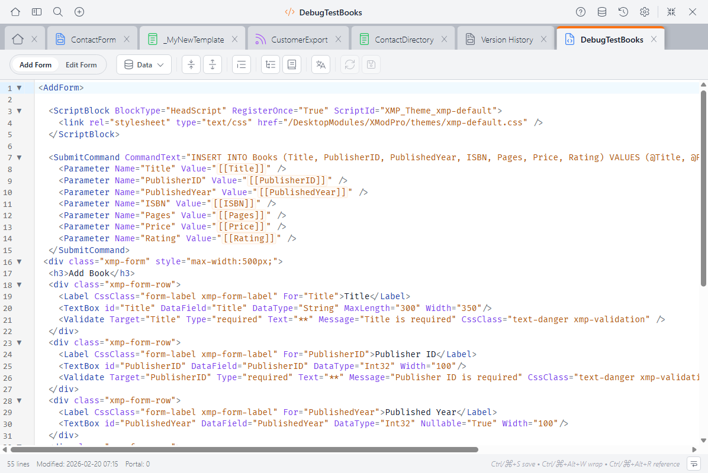
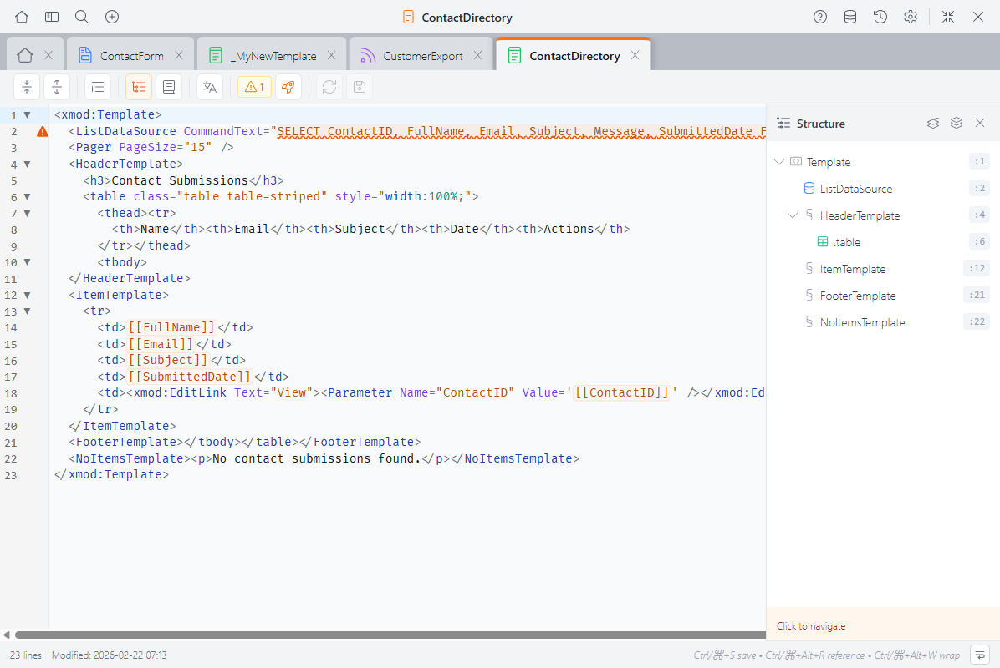
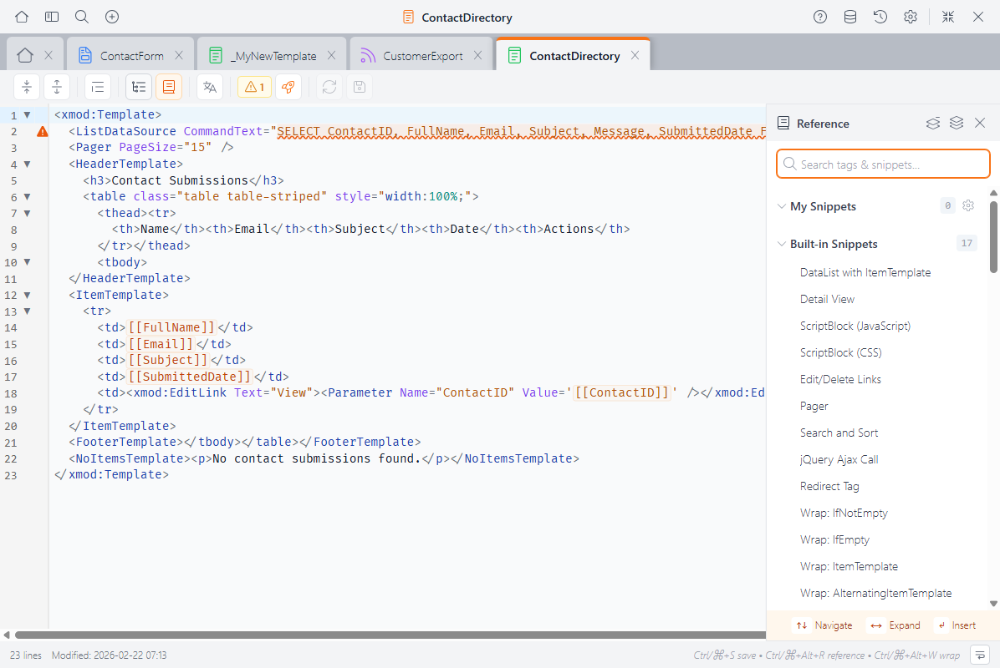

# Custom Form Editor <Badge type="info" text="v5.0" />

When you need full control over a form's HTML layout and behavior, the Custom Form Editor is where you work. It's a professional-grade code editor built into the Control Panel, designed specifically for writing XMod Pro forms by hand.



Custom forms give you complete control over your form's HTML structure, styling, and behavior. You write `<AddForm>` and `<EditForm>` blocks containing XMP form controls like `<TextBox>`, `<DropDownList>`, and `<Validate>` tags — all mixed freely with your own HTML and CSS.

::: tip Custom Forms vs. Form Builder
The [Form Builder](form-builder.md) is a visual, drag-and-drop editor for building forms quickly. The Custom Form Editor is for when you need more control — custom HTML layout, advanced JavaScript, or tag configurations the Form Builder doesn't support. You can also [convert a Form Builder form to a custom form](form-builder.md#converting-to-a-custom-form) and continue editing it here.
:::

## What You Write Here

A custom form contains one or both of these blocks:

- **`<AddForm>`** — The form displayed when creating a new record
- **`<EditForm>`** — The form displayed when editing an existing record

Inside these blocks, you use XMP **form controls** — tags like `<TextBox>`, `<DropDownList>`, `<CheckBox>`, `<FileUpload>`, and [many more](form-controls/textbox.md). Unlike view tags, form controls do **not** use the `xmod:` prefix.

```xml
<AddForm>
  <Label For="txtName" Text="Name" />
  <TextBox Id="txtName" DataField="FullName" DataType="string" />
  <Validate Type="required" Target="txtName" Text="Name is required." />

  <Label For="ddlCategory" Text="Category" />
  <DropDownList Id="ddlCategory" DataField="Category" DataType="string">
    <ListItem Value="">-- Select --</ListItem>
    <ListItem Value="Bug">Bug Report</ListItem>
    <ListItem Value="Feature">Feature Request</ListItem>
  </DropDownList>

  <AddButton Text="Submit" />

  <SubmitCommand CommandText="INSERT INTO Tickets (FullName, Category)
    VALUES (@FullName, @Category)" />
</AddForm>
```

## The Toolbar

The toolbar runs along the top of the editor:

<!-- TODO: screenshot of custom form editor toolbar -->

- **Fold All / Unfold All** — Collapse or expand all foldable sections
- **Format Code** — Clean up indentation (selected code, or all code if nothing is selected)
- **Structure Navigator** — Toggle a sidebar showing `<AddForm>`, `<EditForm>`, and any regions you've defined ([details below](#structure-navigator))
- **Reference Panel** — Toggle a sidebar with form controls, tokens, and snippets ([details below](#reference-panel))
- **Localization** — Edit localization strings for this form
- **Validation** — Shows the count of errors and warnings ([details below](#validation))
- **Reload** — Discard unsaved changes and reload from the server
- **Save** — Save your changes (**Ctrl+S** / **Cmd+S**)

The status bar at the bottom shows the line count, last modified date, keyboard shortcuts, and a word wrap toggle.

## Autocomplete

The editor understands the form context and offers suggestions as you type:

<!-- TODO: screenshot of custom form editor autocomplete -->

- **Form controls** — `<TextBox>`, `<DropDownList>`, `<CheckBox>`, `<FileUpload>`, `<Label>`, and all other [form controls](form-controls/textbox.md)
- **Validation tags** — `<Validate>` with its Type, Target, and other attributes
- **Action controls** — `<AddButton>`, `<UpdateButton>`, `<CancelButton>`, and their image/link variants
- **Data commands** — `<SubmitCommand>`, `<SelectCommand>`, `<ControlDataSource>`, and related tags
- **Tag attributes** — Context-aware suggestions for the current tag's attributes
- **Attribute values** — Known values for attributes like `DataType`, `Orientation`, etc.
- **Tokens** — `[[FieldName]]`, `[[User:...]]`, `[[Portal:...]]`, and other token types
- **Database columns** — Column names from your form's data source
- **HTML elements** — Standard HTML tags
- **Snippets** — Your saved code [snippets](snippets.md), ready to insert

Autocomplete appears automatically as you type, or press **Ctrl+Space** to trigger it manually.

## Validation

The editor validates your form structure in real time, catching problems before you save:

<!-- TODO: screenshot of custom form editor validation -->

- **Errors** appear with red indicators in the gutter and wavy red underlines
- **Warnings** appear with orange indicators and orange underlines
- **Info messages** appear with blue indicators

The validation badge in the toolbar shows a count of current errors and warnings. Click it to open the validation panel, which lists all issues with line numbers — click any issue to jump to that line.

::: info What Gets Validated
The editor runs two levels of checks. **Structural checks** run automatically as you type:

- A `<ControlDataSource>` reference that doesn't match any defined `<ControlDataSource Id="...">` element
- Controls with `DataField` attributes but no `<SelectCommand>` to load data
- `<Validate>` targets that don't match any control `Id`
- Controls with `DataField` but no data source elements at all
- Data source elements (`<SelectCommand>`, `<SubmitCommand>`, etc.) with empty or missing `CommandText`

**Database checks** run when you click the validation button and verify your SQL against the actual database:

- Tables or stored procedures referenced in your SQL that don't exist
- `DataField` values that don't match columns in the `<SelectCommand>` table
- `DataTextField` or `DataValueField` on list controls that don't match columns in their `<ControlDataSource>`

Validation is advisory — it highlights issues but never blocks saving.
:::

## Shared Editor Features

The Custom Form Editor shares these features with the [View Editor](view-editor.md) and [Feed Editor](feed-editor.md):

### Syntax Highlighting

- **XMP tokens** like `[[FieldName]]` and `[[User:ID]]` are highlighted in orange
- **XMP tags** are syntax-colored (each editor highlights the tags relevant to its context)
- **Comments** using `[-- ... --]` syntax are dimmed
- **HTML tags**, attributes, and strings each get their own colors
- **Regions** (`#region` / `#endregion`) are visually marked

The editor supports light and dark themes — switch between them in [Settings](control-panel.md).

### Code Folding

Collapse sections to focus on what you're working on. Click the fold indicator in the gutter, or use **Fold All** / **Unfold All** in the toolbar.

Foldable sections include `<AddForm>` / `<EditForm>` blocks, `#region` / `#endregion` blocks, and any multi-line XML/HTML tags.

::: tip Using Regions
Wrap sections in `#region Section Name` and `#endregion` to create named, collapsible sections — great for organizing long forms:
```xml
#region Validation Rules
  <Validate Type="required" Target="txtName" Text="Name is required." />
  <Validate Type="email" Target="txtEmail" Text="Please enter a valid email." />
#endregion
```
:::

### Structure Navigator

Click **Structure Navigator** in the toolbar to see an outline of your form: `<AddForm>`, `<EditForm>`, and any regions. Click an item to jump directly to it.



### Reference Panel

Click **Reference Panel** (or press **Ctrl+Alt+R** / **Cmd+Alt+R**) to open a searchable sidebar with:

- **Form controls & attributes** — Every available form control and its properties
- **Tokens** — All token types and their syntax
- **Snippets** — Your saved snippets, ready to insert with a click



The panel automatically shows form-context content when you're editing a form.

## Keyboard Shortcuts

| Shortcut | Action |
|----------|--------|
| **Ctrl+S** / **Cmd+S** | Save |
| **Ctrl+Z** / **Cmd+Z** | Undo |
| **Ctrl+Shift+Z** / **Cmd+Shift+Z** | Redo |
| **Ctrl+F** / **Cmd+F** | Find |
| **Ctrl+Space** | Trigger autocomplete |
| **Ctrl+Alt+W** / **Cmd+Alt+W** | Wrap selection with a tag |
| **Ctrl+Alt+R** / **Cmd+Alt+R** | Toggle Reference Panel |
| **Tab** / **Shift+Tab** | Indent / outdent selected lines |

## Next Steps

- **[Form Controls Reference](form-controls/textbox.md)** — Detailed docs for every form control
- **[Form Builder](form-builder.md)** — Build forms visually when you don't need full code control
- **[Snippets](snippets.md)** — Create reusable code snippets
- **[Version History](version-history.md)** — Browse, compare, and restore previous versions
