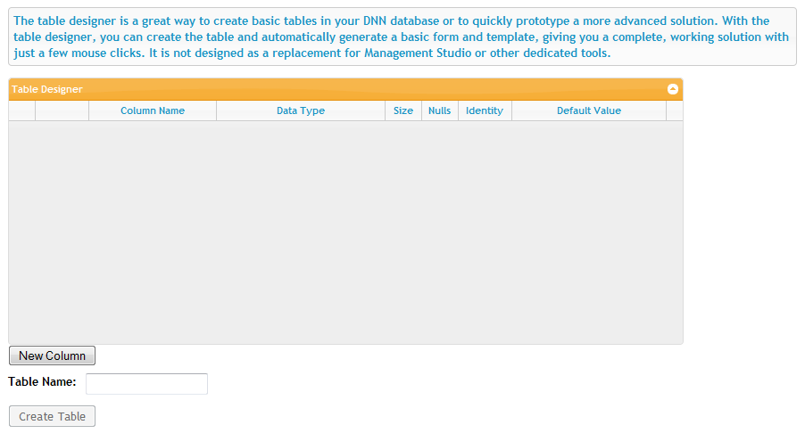
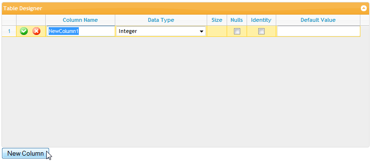
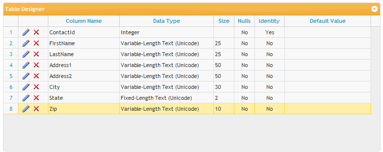

# Database Tools

Beginning with version 2, XMod Pro provides you with a Table Designer that allows you to quickly define and create basic tables in your DNN database. Additionally, you can optionally instruct XMod Pro to auto-generate a form and template for the newly created table - giving you the ability to have a complete base solution up and running with just a few clicks. The Database Tools area is only available to Host and SuperUser accounts. You can access the Database Tools by selecting "Control Panel" from the Actions menu:

On the Control Panel's toolbar, click "Database Tools":

The Database Tools screen is displayed. This screen is designed to allow you to quickly create basic tables in your DNN database. It is not designed as a replacement for dedicated database tools such as SQL Server Management Studio. Rather, it is useful for prototyping or creating basic tables without having to use an external tool.

To design your table, click the New Column button just beneath the Table Designer grid. This will add a new column to your table and give you the opportunity to modify its characteristics.

First, type a name for your column in the Column Name field.

Next, select the data type for the column from the drop down list of options in the Data Type field.

If you have selected a text-type column that allows a size, the Size field will be available for you to specify the maximum number of characters allowed.

Other options: You can check the Nulls checkbox to allow null values in the column, tick the Identity checkbox to have the database automatically generate a unique ID for the column - starting at 1 and incrementing by 1\. Finally, you can specify a Default Value for your column too.

NOTE: depending on the options you choose, other options may not be available. For instance, if you choose to make a column an Identity column, you cannot make the column nullable.

In the screen shot below, we've created a sample Contacts table:

Once you've designed your table, give it a name (Contacts in our example):

Once you're done, click the Create Table button and your table will be created.
