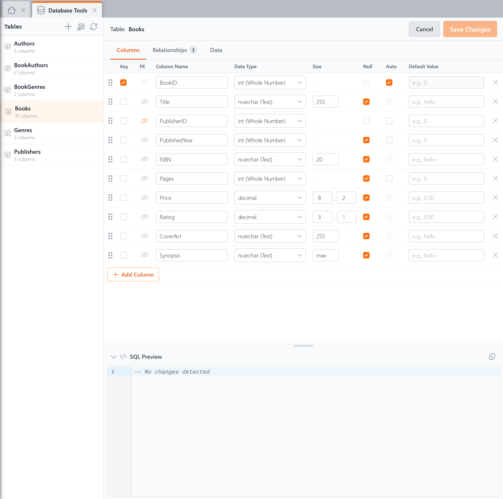
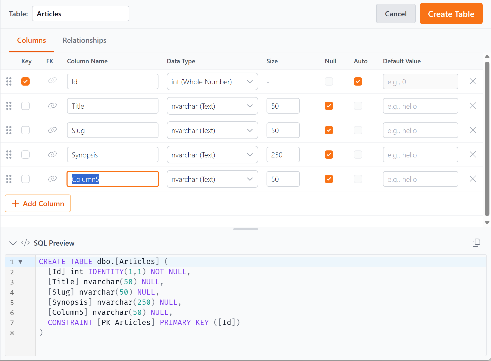
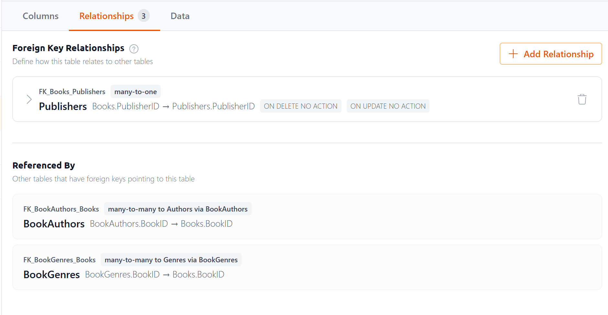
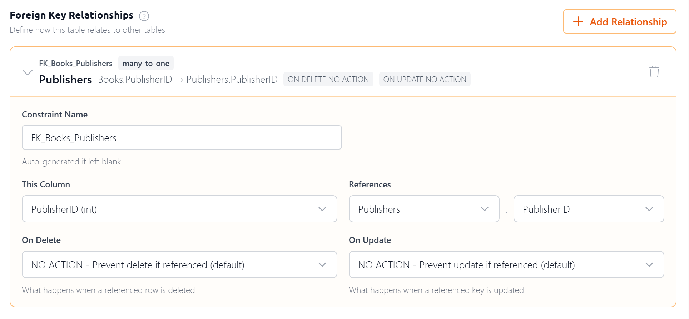
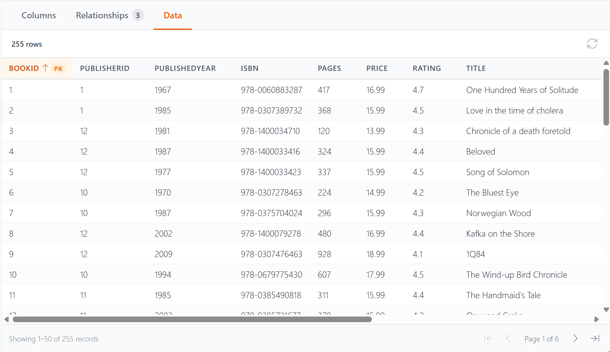

# Database Tools <Badge type="info" text="v5.0" />

Database Tools lets you create and manage database tables without leaving the XMod Pro [Control Panel](control-panel.md). You can define columns, set up relationships between tables, browse your data, and preview the exact SQL that will run before saving any changes.

It's designed for building the tables your XMod Pro forms and views need — not as a replacement for full-featured tools like SQL Server Management Studio. Think of it as a quick, convenient way to set up and maintain your data structures right where you're working.

::: info Host Access Only
Database Tools is only available to Host (SuperUser) accounts.
:::

## The Tables Sidebar

The left sidebar lists all tables managed by Database Tools, along with the number of columns in each. Click a table name to select it and work with its columns, relationships, or data.

The toolbar at the top of the sidebar has three buttons:

- **+** — Create a new table
- **Import** — Add an existing database table so it can be managed in Database Tools. This is useful when tables were created outside of XMod Pro (for example, in SQL Server Management Studio). DNN system tables cannot be imported, to prevent accidental changes to your site.
- **Refresh** — Sync the table list and column counts if changes were made outside of Database Tools

## Columns Tab

The Columns tab is where you define your table's structure. Each row represents a column in your table.

For each column, you can set:

- **Key** — Mark the column as the primary key
- **FK** — Indicates the column is part of a foreign key relationship (see [Relationships](#relationships-tab) below)
- **Column Name** — The name of the column
- **Data Type** — Choose from a list of common types like *int (Whole Number)*, *nvarchar (Text)*, *decimal*, and others
- **Size** — For text columns, the maximum number of characters. For decimal columns, the precision and scale (e.g., 8,2)
- **Null** — Whether the column allows empty (null) values
- **Auto** — Make this an identity column that automatically generates a unique number for each new row
- **Default Value** — A value to use when no value is provided

Click **+ Add Column** to add a new column. Use the drag handles on the left to reorder columns. Click the **X** on the right to remove a column.

::: tip
When you mark a column as a primary key, Database Tools automatically creates an index on it for better performance.
:::

### Creating a New Table

When creating a new table, type the table name in the **Table** field at the top, define your columns, and click **Create Table**. The [SQL Preview](#sql-preview) at the bottom shows you the exact `CREATE TABLE` statement that will be executed.

## Relationships Tab

The Relationships tab shows how your table connects to other tables through foreign keys. It's divided into two sections.

### Foreign Key Relationships

The top section lists the foreign key relationships that *this* table defines — where a column in your table points to a column in another table. Each relationship shows:

- The constraint name
- The relationship type (e.g., many-to-one)
- The column mapping (e.g., Books.PublisherID → Publishers.PublisherID)
- The ON DELETE and ON UPDATE actions

Click the expand arrow to view or edit the relationship details, or click **+ Add Relationship** to create a new one.

When adding or editing a relationship, you can set:

- **Constraint Name** — A name for the foreign key constraint. Auto-generated if left blank.
- **This Column** — The column in your table that holds the reference
- **References** — The target table and column
- **On Delete** — What happens when a referenced row is deleted (e.g., NO ACTION prevents the delete)
- **On Update** — What happens when a referenced key value changes

::: tip
When you create a foreign key relationship, Database Tools automatically creates an index on the foreign key column to improve query performance.
:::

### Referenced By

The bottom section is read-only and shows incoming relationships — other tables that have foreign keys pointing *to* this table. This gives you a complete picture of how the selected table fits into your database.

Database Tools also detects many-to-many relationships through junction tables and labels them accordingly (e.g., "many-to-many to Authors via BookAuthors").

## Data Tab

The Data tab lets you browse the actual data in the selected table.

The row count appears at the top. Column headers are clickable to sort the data, and the primary key column is marked with a **PK** badge. A refresh button in the top-right corner reloads the data if it has changed.

For larger tables, pagination controls at the bottom let you move through the data page by page.

## SQL Preview

The SQL Preview pane appears at the bottom of the screen (below the Columns and Relationships tabs). It dynamically shows the SQL that will be executed when you save your changes.

This is useful in two ways:

- **Review before saving** — See exactly what will happen before you click Save Changes. If you're a DBA or comfortable with SQL, you can verify the statement is correct.
- **Copy and customize** — Click the copy button to grab the SQL and paste it into your preferred SQL tool as a starting point for further modifications.

When no changes have been made, the preview shows "No changes detected."

## Next Steps

- **[Control Panel](control-panel.md)** — Overview of the XMod Pro Control Panel
- **[The Explorer](explorer.md)** — Browse and manage your forms, views, feeds, and projects
- **[Forms](forms.md)** — Learn about XMod Pro forms
- **[Views](views.md)** — Learn about XMod Pro views
