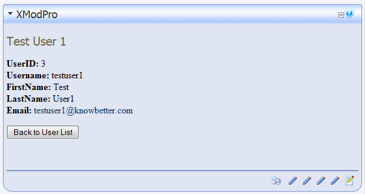

# Walkthrough Two: Adding A Detail View

In this walkthrough, we're going to enhance the List View created in [Walkthrough One](1_listing-users.md) by adding a way to view the details of a user's record. As with the first walkthrough, we'll keep it as simple as possible, so you can see the basic steps involved in the process and then be able to apply those concepts to other walkthroughs and projects.

::: warning
Using XMod Pro, you will be interacting directly with your live data source. You should BACKUP you data beforehand to prevent the accidental loss or corruption of data due to typo's and other unforeseen circumstances.
:::

Please recall the columns in the Users table: For our purposes, the Users table has the following columns (Note that the term "column" and "field" will be used interchangeably throughout the documentation): 

*   UserID
*   Username
*   FirstName
*   LastName
*   DisplayName
*   Email

There are some other fields and different versions of DNN may have slight variations but we'll focus on just these. It's also important to _note the capitalization of the field names_ as you will need to match it exactly when referring to that field: 'UserID' is not the same as 'UserId' or 'userid'.

1.  If you haven't done so already open the page we created in the first walkthrough and ensure you're logged-in as Host or SuperUser.
2.  We're going to edit the template we created in the first walkthrough. So, from the Actions menu, select **Manage Templates**:  
    
3.  The **Manage Templates** page is where you add, edit, copy, and delete your display templates. For the mechanics of how to use the Manage Templates page, refer to [this topic](../manage-templates.md).
4.  Find the "AllUsers" template in the grid and click the **Edit** link next to its name.
5.  We'll be modifying what we have so, let's first review the template code:  
    ```html
    <xmod:template>  
      <ListDataSource CommandText="SELECT UserID, DisplayName 
                                   FROM Users ORDER BY DisplayName ASC" />  
      <HeaderTemplate>  
        <ul>  
      </HeaderTemplate>  
      <ItemTemplate>  
        <li class="Normal">[[DisplayName]] ([[UserID]])</li>  
      </ItemTemplate>  
      <AlternatingItemTemplate>  
        <li class="Normal"><strong>[[DisplayName]] ([[UserID]])</strong></li>  
      </AlternatingItemTemplate>  
      <FooterTemplate>  
        </ul>  
      </FooterTemplate>  
    </xmod:template>
    ```
6.  From this starting point, we will need to add a data source to use for our detail record and also provide a link the user can click to see that user's details. Finally, we'll need to add a template that tells XMod Pro what to display for the user's details. All of this will be added to our current template. As in the first walkthrough, we'll take a look at the individual bits and put them together for you at the end. Let's get started.
    1.  ``` html
        <DetailDataSource CommandText="SELECT UserID, Username, FirstName,
                                       LastName, DisplayName, Email  
                                       FROM Users WHERE UserID = @uid" />
        ```
        This tag is a bit more complicated than the ListDataSource tag because we need to accept a parameter that identifies _which_ user's details to display. So, we are selecting our full list of fields from Users table (remember, you may need to modify this with a database owner and/or object qualifier depending on how your DNN database is configured). We use the WHERE clause to specify we only want the user that has a UserID equal to the value of the "uid" parameter. Remember the "uid" parameter name. We'll need to use it in the next step.  

    2.  ``` html
        <xmod:detaillink text='[[DisplayName]]'>
          <parameter name="uid" value='[[UserID]]' />
        </xmod:detaillink>
        ```
        This tag is placed in the `<ItemTemplate>` tag and displays as a hyperlink, using the user's Display Name as its text. This is done using the field token to retrieve the value of the DisplayName column. It is important to note at this point that whenever you use any of XMod Pro's tokens as the value of an attribute for non-HTML tags, you MUST delimit them with single quotes (`'`) rather than the customary double quotes (`"`). Don't worry about XHTML validation because these tags are processed on the server.  

        When the link is clicked, XMod Pro will execute the command specified in `<DetailDataSource>`, passing it any parameters defined in the tag. You define parameters by using the `<parameter>` child tag. In our case, we want to pass the detail data source a parameter whose name is "uid" and whose value is the value in the UserID column for the current record. As with the "text" attribute in the detail link tag, we specify the "value" attribute, using the `[[UserID]]` field token, delimited by single quotes.  

        We'll repeat this for the `<AlternatingItemTemplate>` tag.  

    3.  ``` html
        <DetailTemplate>
          <h1>Details for: [[DisplayName]]</h1>  
          <p>  
            <strong>UserID:</strong> [[UserID]]<br />  
            <strong>Username:</strong> [[Username]]<br />  
            <strong>FirstName:</strong> [[FirstName]]<br />  
            <strong>LastName:</strong> [[LastName]]<br />  
            <strong>Email:</strong> <a href="mailto:[[Email]]">[[Email]]</a>  
          </p>  
          <xmod:returnbutton text="Back to Users List" />
        </DetailTemplate>
        ```
        Finally, we need to tell XMod Pro how to display the user's details. Just as we added `<HeaderTemplate>`, `<ItemTemplate>` and the like, we'll add a `<DetailTemplate>` tag and fill it with our HTML and field tokens. You've seen much of this already. There are two points to note.  

        First, notice the display of the user's email. We're enabling the page's visitor to click a standard HTML "mailto" link to launch their email client to send an email to the user. It was stated earlier that when using field tokens as attribute values, you should delimit them with single quotes, but I didn't do that here. Single-quote delimiters are ONLY required when dealing with server-based controls like many of the xmod tags. You can use double quotes in HTML tags, to help maintain XHTML compliance.  

        Second, we've introduced another new tag: `<xmod:returnbutton>`. This is a specialized button that, when clicked, will return the user to the previous page. Without it, the user would be essentially stuck on the detail view. This tag could be replaced with `<xmod:returnlink>` or `<xmod:returnimage>` if you wanted to render a hyperlink or clickable image, respectively.  

    4.  Your changed template code will look like the following. Note, the code has been reformatted somewhat. Those items we've changed are highlighted in red.  
        ```html
        <xmod:template>  
          <ListDataSource CommandText="SELECT UserID, DisplayName FROM Users ORDER BY DisplayName ASC" />  
          <DetailDataSource CommandText="SELECT UserID, Username, FirstName,
                                         LastName, DisplayName, Email
                                         FROM Users WHERE UserID = @uid" />
          <HeaderTemplate>  
            <ul>  
          </HeaderTemplate>  
          <ItemTemplate>  
            <li class="Normal">
              <xmod:detaillink text='[[DisplayName]]'>
                <parameter name="uid" value='[[UserID]]' />
              </xmod:detaillink>` ([[UserID]])  
            </li>  
          </ItemTemplate>  
          <AlternatingItemTemplate>  
            <li class="Normal"><strong>  
              <xmod:detaillink text='[[DisplayName]]'>
                <parameter name="uid" value='[[UserID]]' />
              </xmod:detaillink>` ([[UserID]])</strong>  
            </li>  
          </AlternatingItemTemplate>  
          <FooterTemplate>  
            </ul>  
          </FooterTemplate>  
        
          <DetailTemplate>
            <h1>Details for: [[DisplayName]]</h1>
            <p>
              <strong>UserID:</strong> [[UserID]]<br />
              <strong>Username:</strong> [[Username]]<br />
              <strong>FirstName:</strong> [[FirstName]]<br />
              <strong>LastName:</strong> [[LastName]]<br />
              <strong>Email:</strong> <a href="mailto:[[Email]]">[[Email]]</a>
            </p>
            <xmod:returnbutton text="Back to Users List" />
          </DetailTemplate>
        </xmod:template>
        ```

7.  Your list display should look something like this (though your list of users may be different and your site's style may be different):  
     
8.  Click on one of the links and your detail view should look similar to this:  
    