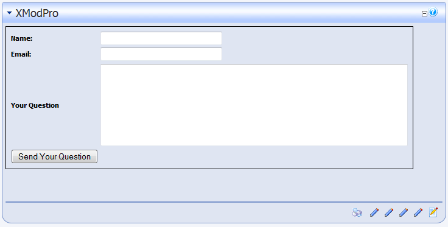
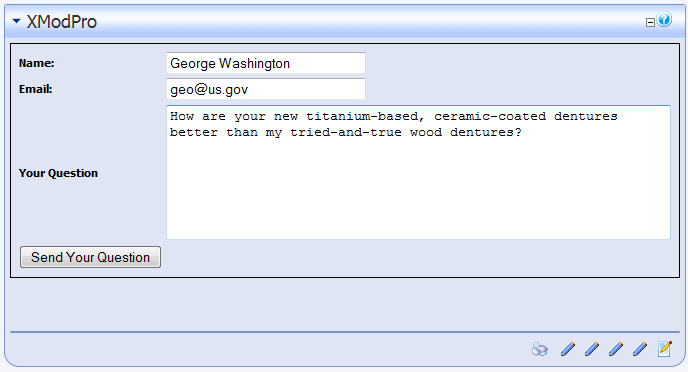
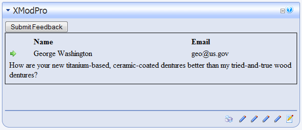

# Walkthrough Five:  
Displaying The Feedback Form Data

This walkthrough assumes you have successfully completed [Walkthrough Four "Saving Data From The Feedback Form"](Walkthrough3.html).

In the last walkthrough, we modified our feedback form so that it now saves data to the database. Now we'll create a template to display that data.

1.  In Walkthrough 3 and 4, we used the **FormView** module. This is useful if we just want to display a form. However, since we'll be displaying the data from that form as well, we'll need to use the main XMod Pro module. So, open a page on your site and place an XMod Pro module instance on that page, configuring it to use the "Feedback Form" form.
2.  Ensure you're logged-in as Host or SuperUser.
3.  We're going to create a new template. So, from the Actions menu, select **Manage Templates**:  
    
4.  Click the **New Template** button to create a new template.
5.  For the Template Name, type in "CustomerFeedback" (without quotes). The Content editor will contain some boilerplate code that can help you get a jump-start creating your template. We don't need it for this example, so just delete all the text.
6.  Enter the following template definition into the Content editor area and save the template:  

    <pre xml:space="preserve"><xmod:addbutton text="Submit Feedback" />
    <xmod:template>
      <ListDataSource 
        CommandText="SELECT FeedbackId, Name, Email, Question 
                     FROM XMP_Feedback"/>
      <DetailDataSource 
        CommandText="SELECT Name, Email, Question 
                     FROM XMP_Feedback 
                     WHERE FeedbackId = @FeedbackId">
        <parameter name="FeedbackId" />
      </DetailDataSource>

    <HeaderTemplate>  
      <table style="border: 1px solid black; padding: 5px;">  
        <tr>
          <td>&nbsp;</td>
          <td>  
            <strong>Name</strong>  
          </td>  
          <td>  
            <strong>Email</strong>  
         </td>  
        </tr>
      </HeaderTemplate>
      <ItemTemplate>  
        <tr>
          <td>
            <xmod:detailimage imageurl="~/images/rt.gif">
              <parameter name="FeedbackId" value='[[FeedbackId]]'/>
            </xmod:detailimage>
          </td>
          <td>[[Name]]</td>  
          <td>[[Email]]</td>
        </tr>
        <tr>
          <td colspan="3">[[Question]]</td>  
        </tr>  
      </ItemTemplate>
      <FooterTemplate>  
        </table>  
      </FooterTemplate>

      <DetailTemplate>
        <h1>Feedback Details</h1>
        <strong>Name:</strong> [[Name]] 
        <strong>Email:</strong> <a href="mailto:[[Email]]">[[Email]]</a> 
        <strong>Question:</strong> 
        [[Question]]  
        <xmod:returnbutton text="Back" />
      </DetailTemplate>
    </xmod:template>
    </pre>

    Most of the template should be familiar from previous walkthrough's. We've highlighted some areas of interest:.

    **Add Button**

    We have added an `<xmod:addbutton>` tag _outside_ the `<xmod:template>` tag. At run-time, this will render as an HTML push-button that will cause the AddForm to be displayed. It's useful to note that the tag is outside the template tag - something we haven't seen before. When used this way, you need to configure the module to tell it which DNN security roles are allowed to add records. This is done via the Configure page for the module which we'll cover later.

    **Displaying the List of Records**

    As for the rest of the display, we've used the `<xmod:template>` tag to define our template; placed a `<ListDataSource>` tag in the template tag to tell XMod Pro what data to retrieve; used the `<HeaderTemplate>`, `<ItemTemplate>` (`<AlternatingItemTemplate>` is optional and not used here), and `<FooterTemplate>` to define the non-repeating Header and Footer areas of an HTML table and the repeating area (`<ItemTemplate>`) where our data is contained. Finally, we have added field tokens for each of the columns in our data source: `[[Name]]`, `[[Email]]`, and `[[Question]]`.

    One of the nice aspects of using your own HTML is that we were able to add a second row to be displayed for each record in the `<ItemTemplate>` section. The second row spans all the columns in the table, making it easier to display the Question values which will typically much more text than can be contained in a single column. With most ASP.NET controls, having two rows per record often requires special handling, if it's available at all. With XMod Pro, you simply add another row as we've done.

    **Providing A Detail View**

    For this example, a detail view really isn't necessary. However, it has been added to show how it's done.

    There are four necessary components for creating the detail view:

    1.  **Detail Data Source**: This tag tells XMod Pro what data to retrieve when a detail button (or link or image) is clicked. Its command text should retrieve one record. Typically this is done by passing in one or more parameters. In our case, we're looking for the record WHERE FeedbackId = @FeedbackId. So, we define a <parameter> tag that tells XMod Pro about that parameter: <parameter name="FeedbackId"/>

    2.  **Detail Button**: There are three forms of detail buttons in XMod Pro - <xmod:detailbutton>, which renders as a push-button; <xmod:detaillink>, which renders as a hyperlink; and <xmod:detailimage> which renders as a clickable image. For this example we chose the image. We have specified an ImageUrl property, pointing to an image which *should* be in most default DNN installations Feel free to choose a different image. Notice the "~" - the tilde character. This is a handy shortcut. It stands for "Application Root Directory". So, when developing on localhost/DNN50Test, the rendered URL would be "/DNN50Test/images/rt.gif". When you go live on http://mysite.com the URL would be "/images/rt.gif".

        More importantly, notice the <parameter> tag in the detail image button:

        <pre xml:space="preserve"><parameter name="FeedbackId" value='[[FeedbackId]]' /></pre>

        This is the same regardless of which form of button you're using. It defines the parameter we'll be passing to <DetailDataSource> and the name of the parameter must match the one we defined in the data source tag. Additionally, we need to specify a value for the parameter. In this case, we're passing the FeedbackId for the current record. Also remember that since we're using a field token inside a tag's attribute, we must use single-quotes instead of double-quotes to delimit that value.

    3.  **Detail Template**: Finally, if you're going to show a detail view, you need to define it. That's where the <DetailTemplate> tag comes in. In our example, we're using HTML and field tokens to display the details of the record and we're also using the [[Email]] value to set up a "mailto" link that, when clicked, will pop-up the user's mail client so an email can be sent to the customer.

    4.  **Return Button**:Once the user has viewed the details of a record he/she needs a way to get back to the list of records. That's where the <xmod:returnbutton> plays its role. As with most XMod Pro buttons, the return button comes in several flavors: <xmod:returnbutton>, <xmod:returnlink> and <xmod:returnimage>.

7.  Open the XMod Pro Configure page  

    

8.  On the configuration page, select "CustomerFeedback" from the Template drop-down list.and configure the module to use the template. The module should already be configured to use the "FeedbackForm" form.

9.  Click the **Security** tab and select the roles that should be allowed to add records. If you are logged-in as Host or an Administrator you will be able to see the AddButton. For other roles, the button will be hidden unless you select those roles on the Security tab.

    

10.  Click the Close button to save your changes.
11.  Your module should look something like this:

    

    Notice that the table does not appear, nor does any of the static text we placed in the table. When there are no records to display, the Header and Footer will not be rendered (nor will the Item and AlternatingItem templates). This is the expected behavior for most solutions you'd want to create. If you want something to display when there are no records, you can use the `<NoItemsTemplate>` tag in your `<xmod:template>` tag. This works in much the same way as the `<HeaderTemplate>` and other "template" tags. Simply put the HTML and text in there that you want to render when there are no records and that will be displayed.

12.  Clicking the Submit Feedback button displays the form for adding a new record:

    

13.  Fill the form in with some sample information like so:

    

14.  Click the Send Your Question button and the following results (or something similar) should be displayed:

    

15.  Now, click the detail image button (the right-pointing arrow in this example) and you should see a detail view similar to this:

    