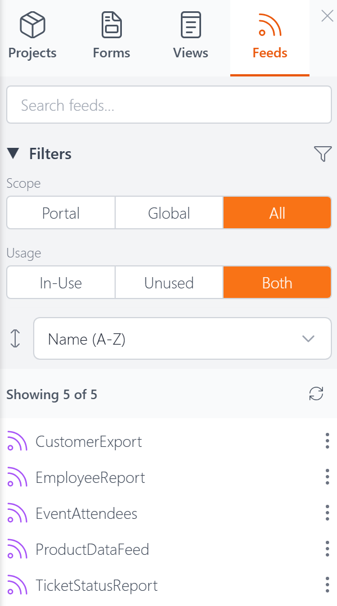

# Explorer: Feeds Tab

The Feeds tab in the [Explorer](explorer.md) lists all your feed definitions. Click any feed's name to open it in the [Code Editor](code-editor.md).

## Search

Type in the search box to instantly filter the list by name. The count below updates to show how many feeds match (e.g., "Showing 3 of 5").

## Filters

The Feeds tab has two filter groups, each with toggle buttons:

**Scope** — Filter by where the feed is stored:
- **Portal** — Feeds belonging to the current DNN portal
- **Global** — Feeds shared across all portals
- **All** — Show all

**Usage** — Filter by whether the feed is actively referenced:
- **In-Use** — Feeds currently in use
- **Unused** — Feeds not in use
- **Both** — Show all

You can collapse the Filters section by clicking its heading.

## Sorting

A dropdown below the filters lets you sort the list:

- **Name (A–Z)** — Alphabetical order (default)
- **Modified (Newest)** — Most recently edited first
- **Created (Newest)** — Most recently created first

## Actions Menu

Click the three-dot menu (**⋮**) on any feed to see the available actions:

- **Open** — Open the feed in the Code Editor
- **Pin / Unpin** — Pin the feed to the top of the list for quick access. Pins persist across sessions.
- **Rename** — Change the feed's name
- **Duplicate** — Create a copy of the feed with a new name
- **Add to Project** — Add the feed to one or more [projects](projects.md)
- **Delete** — Permanently remove the feed

Unlike forms and views, feeds don't have a **View Usage** action because feeds aren't assigned to modules — they're accessed directly by URL.

## Next Steps

- **[The Explorer](explorer.md)** — Overview of the Explorer panel
- **[Feeds](feeds.md)** — What feeds are and how they work
- **[Code Editor](code-editor.md)** — Hand-code forms, views, and feeds
