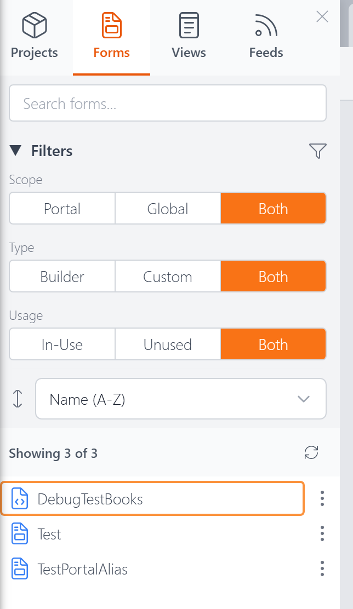
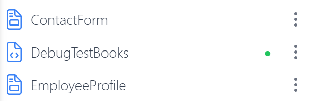
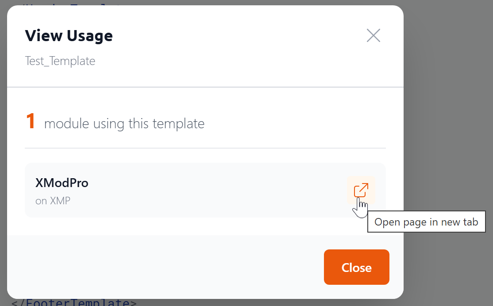

# Explorer: Forms Tab <Badge type="info" text="v5.0" />

The Forms tab in the [Explorer](explorer.md) lists all your form definitions. Click any form's name to open it in its editor — the visual [Form Builder](form-builder.md) or the [Custom Form Editor](custom-form-editor.md) for custom forms.

## Search

Type in the search box to instantly filter the list by name. The count below updates to show how many forms match (e.g., "Showing 2 of 8").

## Filters

The Forms tab has three filter groups, each with toggle buttons:

**Scope** — Filter by where the form is stored:
- **Portal** — Forms belonging to the current DNN portal
- **Global** — Forms shared across all portals
- **Both** — Show all

**Type** — Filter by how the form was created:
- **Builder** — Forms created with the visual [Form Builder](form-builder.md)
- **Custom** — Forms written by hand in the [Custom Form Editor](custom-form-editor.md)
- **Both** — Show all

**Usage** — Filter by whether the form is assigned to a module on a page:
- **In-Use** — Forms currently assigned to a module
- **Unused** — Forms not assigned to any module
- **Both** — Show all

You can collapse the Filters section by clicking its heading.

## Sorting

A dropdown below the filters lets you sort the list:

- **Name (A–Z)** — Alphabetical order (default)
- **Modified (Newest)** — Most recently edited first
- **Created (Newest)** — Most recently created first

## Form Icons

Forms created with the Form Builder show a different icon than custom (hand-coded) forms, making it easy to tell them apart at a glance.

## In-Use Indicator

Forms that are currently assigned to a module on a page show a small green dot next to their name.

## Actions Menu

Click the three-dot menu (**⋮**) on any form to see the available actions:

- **Open** — Open the form in its editor
- **Pin / Unpin** — Pin the form to the top of the list for quick access. Pins persist across sessions.
- **Rename** — Change the form's name. If the form is in use, XMod Pro shows you where it's referenced so you're aware of the impact.
- **Duplicate** — Create a copy of the form with a new name
- **Add to Project** — Add the form to one or more [projects](projects.md)
- **View Usage** — See which modules and pages reference this form. You can click through to open any listed page directly.
- **Revert to Original** — Restore a Form Builder form to its original generated state. This only appears on Builder forms that have been modified.
- **Delete** — Permanently remove the form. If the form is assigned to a module, XMod Pro blocks the deletion and tells you where it's in use.

## Next Steps

- **[The Explorer](explorer.md)** — Overview of the Explorer panel
- **[Forms](forms.md)** — What forms are and how they work
- **[Form Builder](form-builder.md)** — Visually design forms
- **[Custom Form Editor](custom-form-editor.md)** — Hand-code forms with full control
