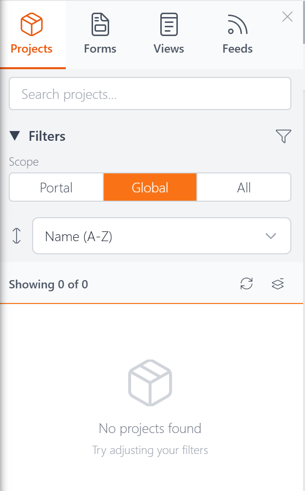

# Explorer: Projects Tab <Badge type="info" text="v5.0" />

The Projects tab in the [Explorer](explorer.md) lists your [projects](projects.md) — organizational containers that group related views, forms, and feeds together.

## Search

Type in the search box to instantly filter the list by name. The count below updates to show how many projects match.

## Filters

The Projects tab has one filter group:

**Scope** — Filter by where the project is stored:
- **Portal** — Projects belonging to the current DNN portal
- **Global** — Projects shared across all portals
- **All** — Show all

You can collapse the Filters section by clicking its heading.

## Sorting

A dropdown below the filters lets you sort the list:

- **Name (A–Z)** — Alphabetical order (default)
- **Modified (Newest)** — Most recently edited first
- **Created (Newest)** — Most recently created first

## Expanding Projects

Click the arrow next to a project name to expand it and see its contents. Forms, views, and feeds are grouped into collapsible sections with counts (e.g., "Forms (2)"). Use the **collapse/expand all** button next to the item count to toggle all projects open or closed at once.

## Opening Resources

You can click any resource name within an expanded project (like "ContactForm" or "ContactDirectory") to open it in its editor. The Projects tab also has **Open All** buttons at two levels:

- The **Open All** button on a **project row** (e.g., next to "Customer Portal") opens every resource in that project — all its forms, views, and feeds — as editor tabs.
- The **Open All** button on a **resource type row** (e.g., next to "Forms (2)") opens just the resources of that type within the project.

This is handy when you want to work on an entire project or a group of its resources without clicking each one individually.

## Actions Menu

Click the three-dot menu (**⋮**) on any project to see the available actions:

- **Pin / Unpin** — Pin the project to the top of the list for quick access. Pins persist across sessions.
- **Duplicate** — Create a copy of the project with a new name
- **Delete** — Permanently remove the project. See [Deleting a Project](projects.md#deleting-a-project) for details on how XMod Pro handles the resources inside it.

## Next Steps

- **[The Explorer](explorer.md)** — Overview of the Explorer panel
- **[Projects](projects.md)** — What projects are and how they work
