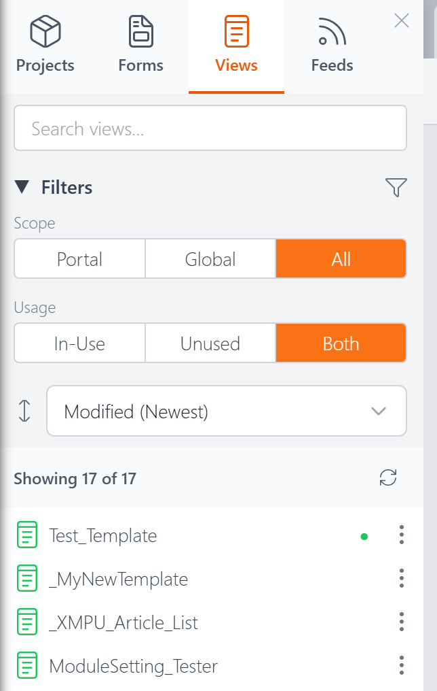

# Explorer: Views Tab

The Views tab in the [Explorer](explorer.md) lists all your view definitions. Click any view's name to open it in the [Code Editor](code-editor.md).

## Search

Type in the search box to instantly filter the list by name. The count below updates to show how many views match (e.g., "Showing 5 of 17").

## Filters

The Views tab has two filter groups, each with toggle buttons:

**Scope** — Filter by where the view is stored:
- **Portal** — Views belonging to the current DNN portal
- **Global** — Views shared across all portals
- **All** — Show all

**Usage** — Filter by whether the view is assigned to a module on a page:
- **In-Use** — Views currently assigned to a module
- **Unused** — Views not assigned to any module
- **Both** — Show all

You can collapse the Filters section by clicking its heading.

## Sorting

A dropdown below the filters lets you sort the list:

- **Name (A–Z)** — Alphabetical order (default)
- **Modified (Newest)** — Most recently edited first
- **Created (Newest)** — Most recently created first

## In-Use Indicator

Views that are currently assigned to a module on a page show a small green dot next to their name.

## Actions Menu

Click the three-dot menu (**⋮**) on any view to see the available actions:

- **Open** — Open the view in the Code Editor
- **Pin / Unpin** — Pin the view to the top of the list for quick access. Pins persist across sessions.
- **Rename** — Change the view's name. If the view is in use, XMod Pro shows you where it's referenced so you're aware of the impact.
- **Duplicate** — Create a copy of the view with a new name
- **Add to Project** — Add the view to one or more [projects](projects.md)
- **View Usage** — See which modules and pages reference this view. You can click through to open any listed page directly.
- **Delete** — Permanently remove the view. If the view is assigned to a module, XMod Pro blocks the deletion and tells you where it's in use.

## Next Steps

- **[The Explorer](explorer.md)** — Overview of the Explorer panel
- **[Views](views.md)** — What views are and how they work
- **[Code Editor](code-editor.md)** — Hand-code forms, views, and feeds
