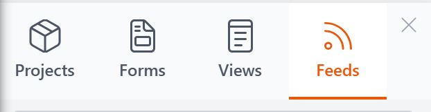
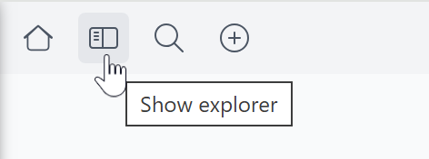
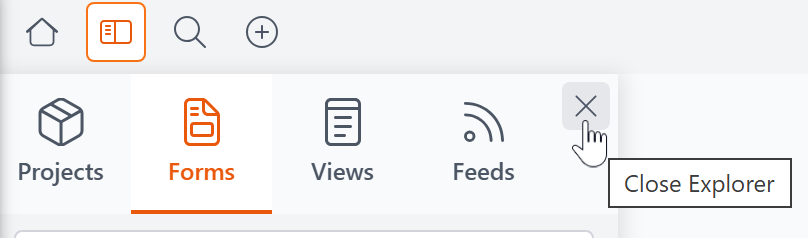
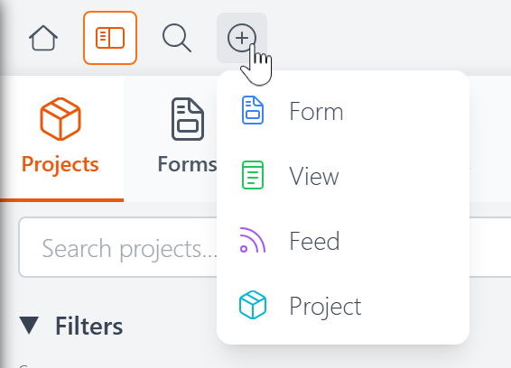

# The Explorer <Badge type="info" text="v5.0" />

The Explorer is a slide-out panel in the [Control Panel](control-panel.md) where you browse, manage, and organize your views, forms, feeds, and projects. It's organized into four tabs — one for each resource type.

## Opening and Closing

Click the **Show explorer** button in the Control Panel's top toolbar to open the panel. It slides in from the left side of the screen.

To close the Explorer, click the **X** in its top-right corner.

## Creating New Resources

To create a new resource, click the **+** button in the Control Panel's top toolbar and choose what you'd like to create.

## The Tabs

Each tab lets you search, filter, sort, and manage a specific type of resource. Click a resource name to open it in its editor.

- **[Forms](explorer-forms.md)** — Browse and manage your form definitions
- **[Views](explorer-views.md)** — Browse and manage your view definitions
- **[Feeds](explorer-feeds.md)** — Browse and manage your feed definitions
- **[Projects](explorer-projects.md)** — Browse and manage your project containers
