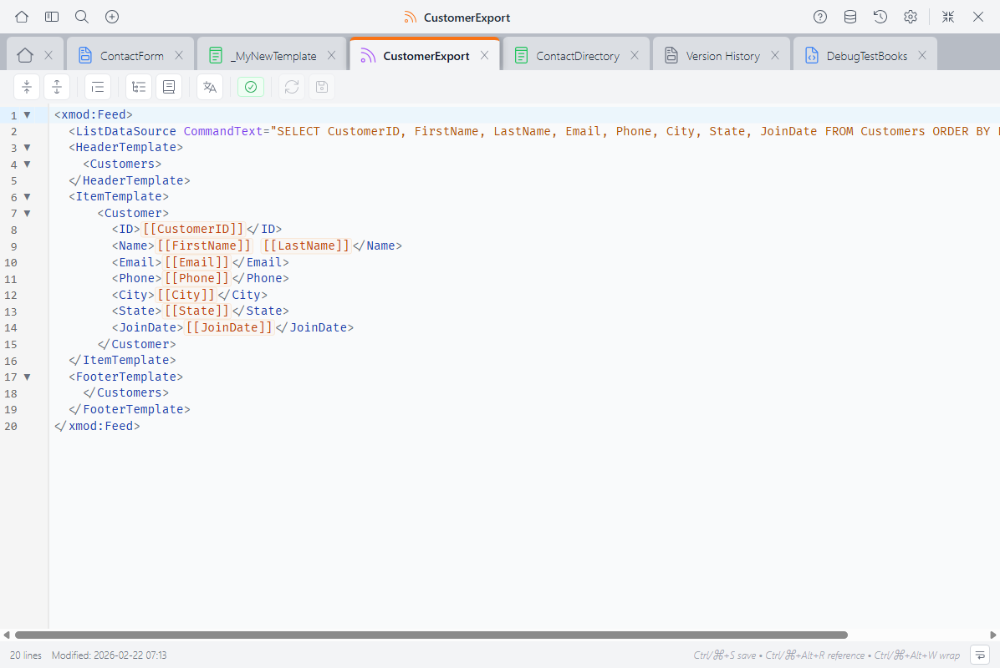

# Feed Editor <Badge type="info" text="v5.0" />

The Feed Editor is where you create and edit feeds — resources that return data in formats like JSON, RSS, CSV, or HTML. It's a professional-grade code editor built into the Control Panel, designed specifically for writing XMod Pro feed definitions.



In the Feed Editor, you write `<xmod:Feed>` or `<xmod:JsonFeed>` definitions that include data sources and output templates — all with XMP-aware syntax highlighting, autocomplete, and real-time validation.

## What You Write Here

A feed definition uses one of two root tags:

- **`<xmod:Feed>`** — A general-purpose feed where you define the output format with templates (RSS, CSV, HTML, XML, etc.)
- **`<xmod:JsonFeed>`** — A specialized tag that automatically outputs JSON, with no template markup needed

### xmod:Feed Example

```xml
<xmod:Feed>
  <ListDataSource CommandText="SELECT CustomerID, FirstName, LastName,
    Email, Phone FROM Customers ORDER BY LastName" />

  <HeaderTemplate>
    <Customers>
  </HeaderTemplate>

  <ItemTemplate>
    <Customer>
      <ID>[[CustomerID]]</ID>
      <Name>[[FirstName]] [[LastName]]</Name>
      <Email>[[Email]]</Email>
      <Phone>[[Phone]]</Phone>
    </Customer>
  </ItemTemplate>

  <FooterTemplate>
    </Customers>
  </FooterTemplate>
</xmod:Feed>
```

### xmod:JsonFeed Example

```xml
<xmod:JsonFeed>
  <ListDataSource CommandText="SELECT ProductID, ProductName, Price
    FROM Products ORDER BY ProductName" />
</xmod:JsonFeed>
```

With `<xmod:JsonFeed>`, the output is generated automatically from the query results — no templates needed.

## The Toolbar

The toolbar runs along the top of the editor:

<!-- TODO: screenshot of feed editor toolbar -->

- **Fold All / Unfold All** — Collapse or expand all foldable sections
- **Format Code** — Clean up indentation (selected code, or all code if nothing is selected)
- **Structure Navigator** — Toggle a sidebar showing the feed structure and regions ([details below](#structure-navigator))
- **Reference Panel** — Toggle a sidebar with tag and token reference ([details below](#reference-panel))
- **Localization** — Edit localization strings for this feed
- **Validation** — Shows the count of errors and warnings ([details below](#validation))
- **Reload** — Discard unsaved changes and reload from the server
- **Save** — Save your changes (**Ctrl+S** / **Cmd+S**)

The status bar at the bottom shows the line count, last modified date, keyboard shortcuts, and a word wrap toggle.

## Autocomplete

The editor understands the feed context and offers suggestions as you type:

<!-- TODO: screenshot of feed editor autocomplete -->

- **Feed tags** — `<xmod:Feed>`, `<xmod:JsonFeed>`, `<HeaderTemplate>`, `<ItemTemplate>`, `<FooterTemplate>`, and more
- **Data source tags** — `<ListDataSource>`, `<Parameter>`, and related tags
- **Tag attributes** — Context-aware suggestions including `ContentType`, `ViewRoles`, `Encoding`, etc.
- **Attribute values** — Known values for feed-specific attributes
- **Tokens** — `[[FieldName]]`, `[[User:...]]`, `[[Portal:...]]`, and other token types
- **Database columns** — Column names from your feed's data source
- **DNN roles** — Portal role names for `ViewRoles`
- **HTML/XML elements** — Standard HTML and XML tags for your output format
- **Snippets** — Your saved code [snippets](snippets.md), ready to insert

Autocomplete appears automatically as you type, or press **Ctrl+Space** to trigger it manually.

## Validation

The editor validates your feed structure in real time, catching problems before you save:

<!-- TODO: screenshot of feed editor validation -->

- **Errors** appear with red indicators in the gutter and wavy red underlines
- **Warnings** appear with orange indicators and orange underlines
- **Info messages** appear with blue indicators

The validation badge in the toolbar shows a count of current errors and warnings. Click it to open the validation panel, which lists all issues with line numbers — click any issue to jump to that line.

When your feed is structurally valid, you'll see a green checkmark in the validation badge.

::: info What Gets Validated
The editor runs two levels of checks. **Structural checks** run automatically as you type:

- Missing `<ListDataSource>` — a feed without a data source will have no data to output

**Database checks** run when you click the validation button and verify your SQL against the actual database:

- Tables or stored procedures referenced in your SQL that don't exist
- `[[FieldName]]` tokens that don't match columns in the `<ListDataSource>`

Validation is advisory — it highlights issues but never blocks saving.
:::

## Shared Editor Features

The Feed Editor shares these features with the [Custom Form Editor](custom-form-editor.md) and [View Editor](view-editor.md):

### Syntax Highlighting

- **XMP tokens** like `[[FieldName]]` and `[[User:ID]]` are highlighted in orange
- **XMP tags** like `<xmod:Feed>` and `<xmod:JsonFeed>` are highlighted
- **Comments** using `[-- ... --]` syntax are dimmed
- **HTML/XML tags**, attributes, and strings each get their own colors
- **Regions** (`#region` / `#endregion`) are visually marked

The editor supports light and dark themes — switch between them in [Settings](control-panel.md).

### Code Folding

Collapse sections to focus on what you're working on. Click the fold indicator in the gutter, or use **Fold All** / **Unfold All** in the toolbar.

Foldable sections include template areas (`<HeaderTemplate>`, `<ItemTemplate>`, etc.), `#region` / `#endregion` blocks, and any multi-line XML/HTML tags.

### Structure Navigator

Click **Structure Navigator** in the toolbar to see an outline of your feed: the feed root tag, template areas, and any regions. Click an item to jump directly to it.

### Reference Panel

Click **Reference Panel** (or press **Ctrl+Alt+R** / **Cmd+Alt+R**) to open a searchable sidebar with:

- **Feed tags & attributes** — Every available feed tag and its properties
- **Tokens** — All token types and their syntax
- **Snippets** — Your saved snippets, ready to insert with a click

The panel automatically shows feed-context content when you're editing a feed.

## Keyboard Shortcuts

| Shortcut | Action |
|----------|--------|
| **Ctrl+S** / **Cmd+S** | Save |
| **Ctrl+Z** / **Cmd+Z** | Undo |
| **Ctrl+Shift+Z** / **Cmd+Shift+Z** | Redo |
| **Ctrl+F** / **Cmd+F** | Find |
| **Ctrl+Space** | Trigger autocomplete |
| **Ctrl+Alt+W** / **Cmd+Alt+W** | Wrap selection with a tag |
| **Ctrl+Alt+R** / **Cmd+Alt+R** | Toggle Reference Panel |
| **Tab** / **Shift+Tab** | Indent / outdent selected lines |

## Next Steps

- **[Feeds Concept Guide](feeds.md)** — Learn about feeds and when to use them
- **[Feed Tag Reference](template-controls/feed.md)** — `<xmod:Feed>` tag documentation
- **[JSON Feed Tag Reference](template-controls/json-feed.md)** — `<xmod:JsonFeed>` tag documentation
- **[Snippets](snippets.md)** — Create reusable code snippets
- **[Version History](version-history.md)** — Browse, compare, and restore previous versions
