# Form Builder

The Form Builder lets you create data entry forms visually — without writing any code. You add controls by name, configure their properties in a sidebar panel or directly inline, connect the form to a database table, and apply a theme. XMod Pro handles the rest.

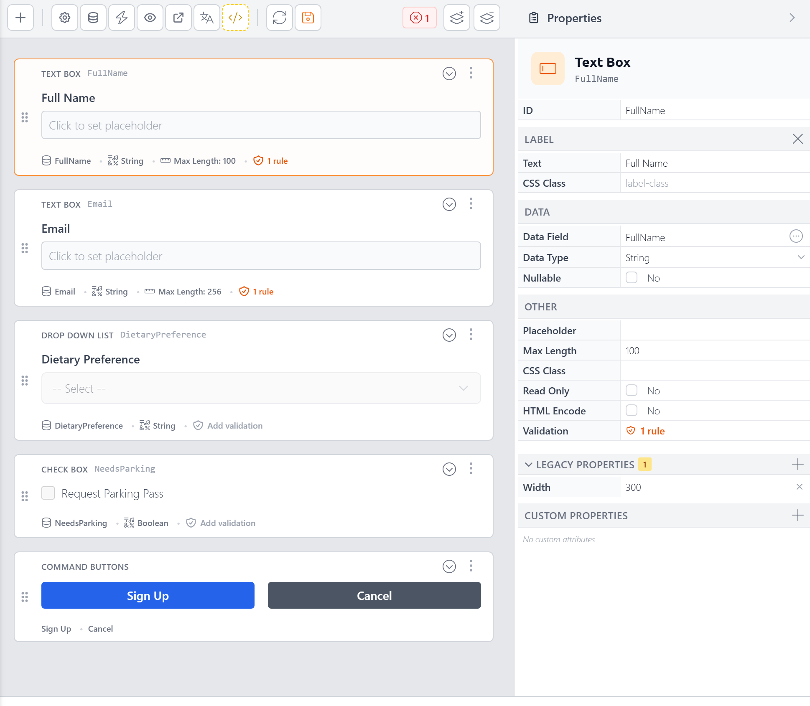

In v5, the Form Builder has been completely redesigned. It's more capable, more efficient, and built around a keyboard-friendly workflow. You can build a fully functional, styled, data-bound form in minutes — and if you ever need more control, you can switch to the [Code Editor](code-editor.md) at any time.

::: info Host Access Only
The Form Builder is only available to Host (SuperUser) accounts, accessed through the [Control Panel](control-panel.md).
:::

## Creating a New Form

To create a new form, click the **+** button in the [Control Panel](control-panel.md) toolbar and choose **Form**.

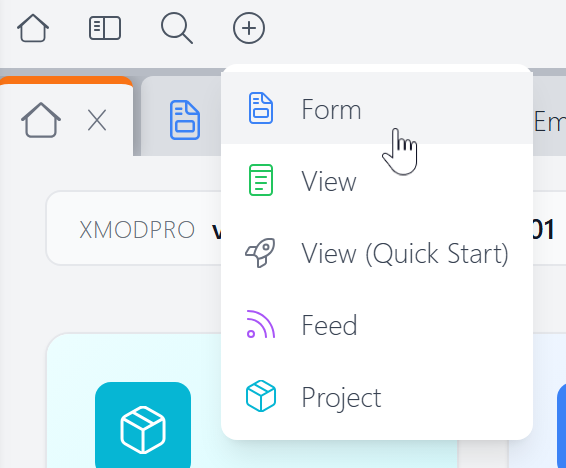

This opens the **Create New Form** dialog:

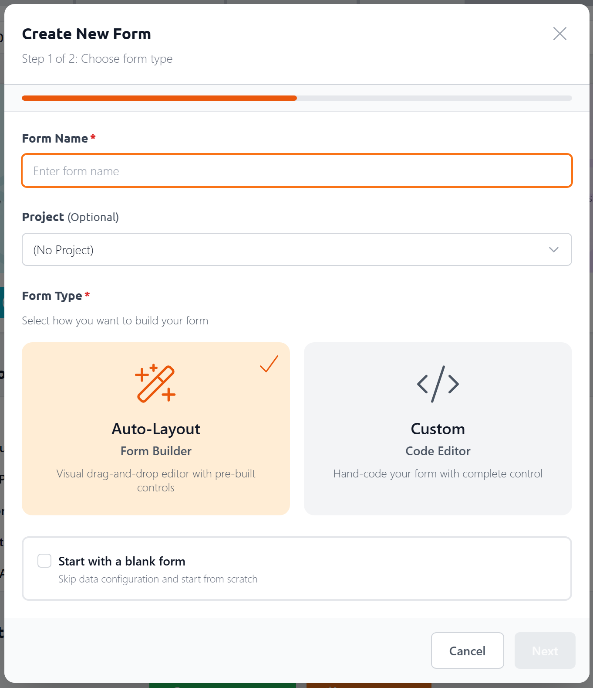

In the first step, you'll:

- **Name your form** — give it a descriptive name. Since this also serves as the file's name, it can only contain letters (uppercase and lowercase), numbers, underscores and dashes.
- **Assign it to a project** (optional) — keep related forms, views, and feeds organized together
- **Choose a form type** — **Auto-Layout** opens the Form Builder; **Custom** opens the [Code Editor](code-editor.md) for hand-coded forms
- **Start with a blank form** — check this to skip the data configuration step and start with an empty canvas

If you leave "Start with a blank form" unchecked, the next step lets you configure a data source:

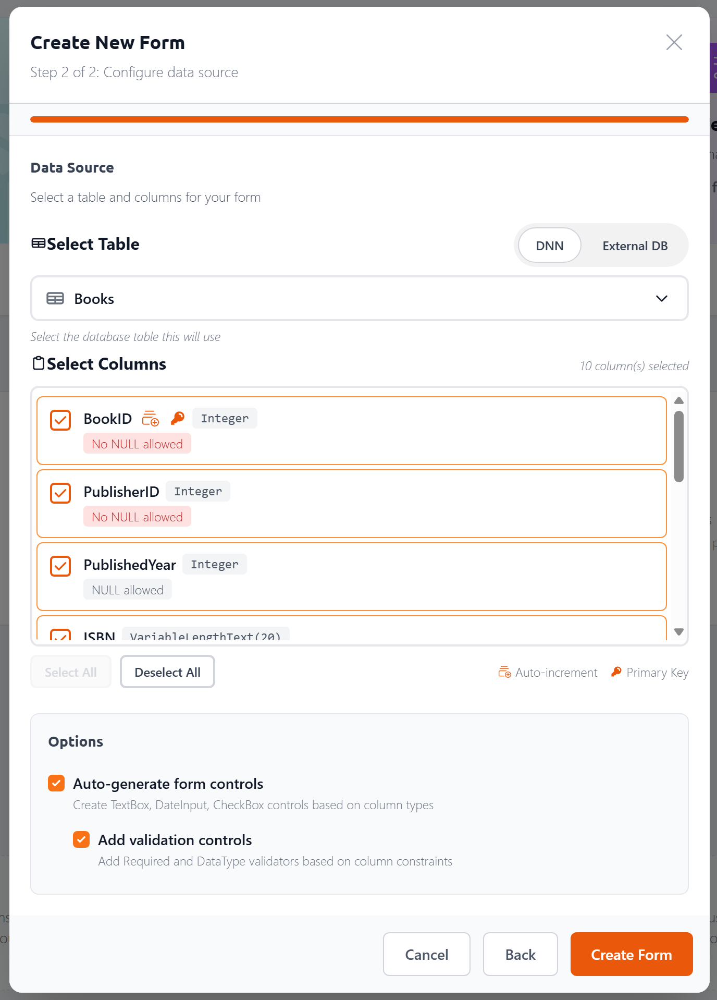

Here you can:

- **Choose your database** — toggle between your **DNN** database and an **External DB**. For external databases, enter a SQL Server connection string (or use a `[[ConnectionString:Name]]` [token](tokens/connectionstring.md) to reference one from your `web.config`) and click **Load Tables**.

  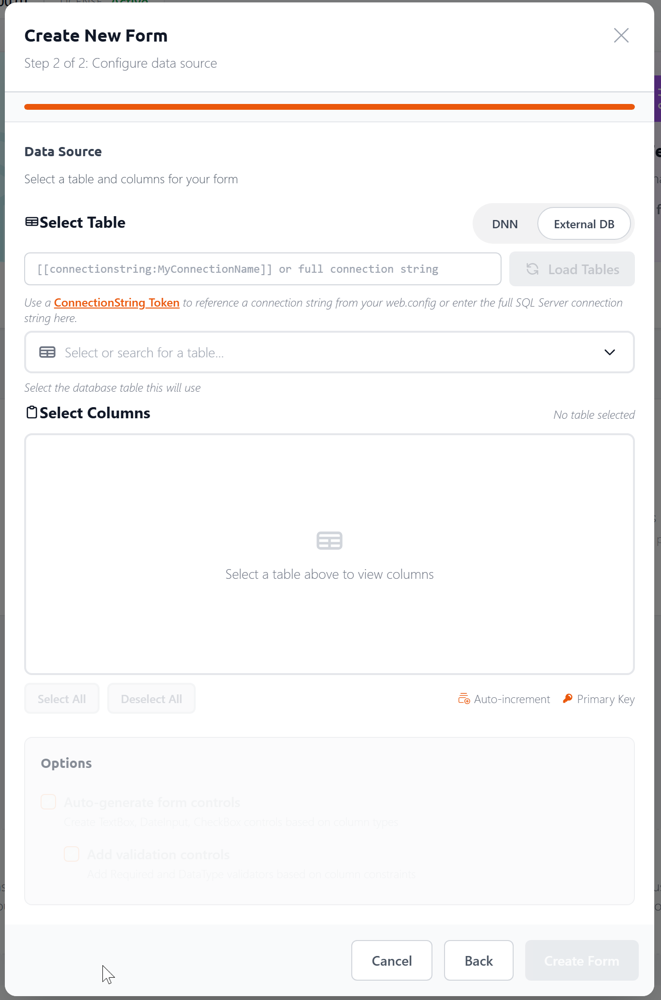
- **Select a table** — pick from a list of available tables
- **Choose columns** — each column shows its data type, nullability, and whether it's a primary key or auto-increment field. Use **Select All** / **Deselect All** to work quickly.
- **Auto-generate form controls** — when checked, the Form Builder creates the appropriate controls for each selected column (TextBox for text, DateInput for dates, CheckBox for booleans, etc.)
- **Add validation controls** — when checked, adds Required and DataType validators based on column constraints

Click **Create Form** and the Form Builder generates everything — controls, data commands, and layout — ready for you to customize.

## Adding Controls

There are two ways to add a control:

- **Press `/`** (the slash key) anywhere in the Form Builder to open the Control Palette
- **Click the `+` button** in the toolbar

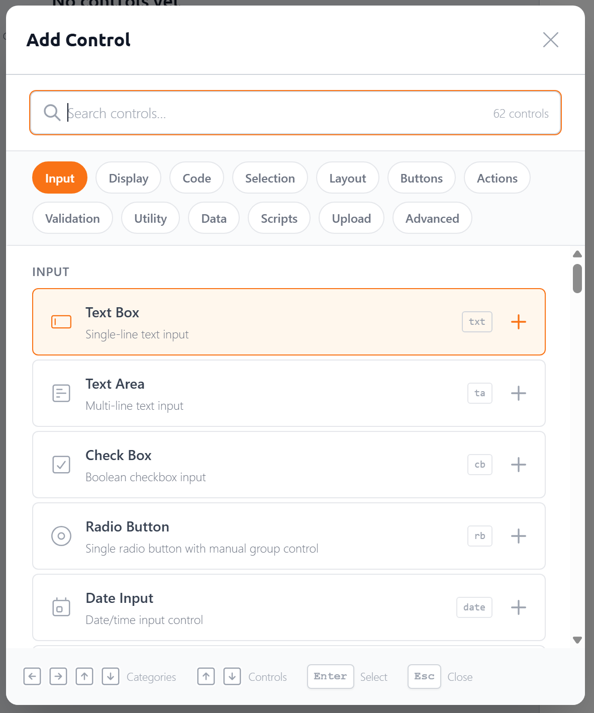

The Control Palette is a searchable menu of all available controls, organized into categories like Input, Selection, Layout, Buttons, Validation, and more. Use the category pills at the top to quickly scroll to that group, or start typing to search.

Each control in the list shows a **shortcode badge** — a quick alias you can type to jump straight to that control. For example, `txt` for TextBox, `cb` for CheckBox, `date` for DateInput. When your search text matches a shortcode, it highlights to confirm the match:

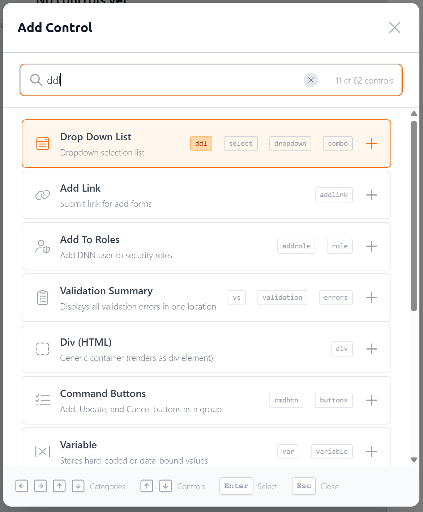

You don't have to type a shortcode. Often the fuzzy matching will find what you need after one or two keystrokes. `ta` will get you to TextArea, `c` will get you to CheckBox. In fact, the most frequently used control, the TextBox, doesn't even need any typing — it's pre-selected when you open the palette, so you can just hit Enter to insert it into your form.

Select a control and it's added to your form immediately. The control's label becomes editable right away, so you can name it without an extra click.

::: tip
The `/` shortcut works like the slash commands in tools like Notion or Slack. It's the fastest way to build a form — just type `/ddl` for a DropDownList, `/txt` for a TextBox, and so on.
:::

## The Canvas

The canvas is the main area where your form takes shape. Each control appears as a row showing its label, an approximation of the control's appearance, and a drag handle.

You can:

- **Select a control** by clicking it — this opens its properties in the Property Panel
- **Edit inline** by clicking into the control block itself. Properties like control ID, Label, placeholder text (for text controls) are editable. Plus, key attributes are displayed below the control and can be edited directly on the canvas — control ID, label, placeholder text, data field, data type (read-only — set automatically based on the column's data type), and max length. The attributes shown vary by control type.
- **Reorder controls** by dragging the handle on the left side
- **Nest controls** by dragging them into container controls like Rows, Panels, or TabStrips
- **Navigate with the keyboard** — use the up/down arrow keys to move between controls and `Tab` to navigate within a control block.

Click a control's **More Options** button to access additional functionality:

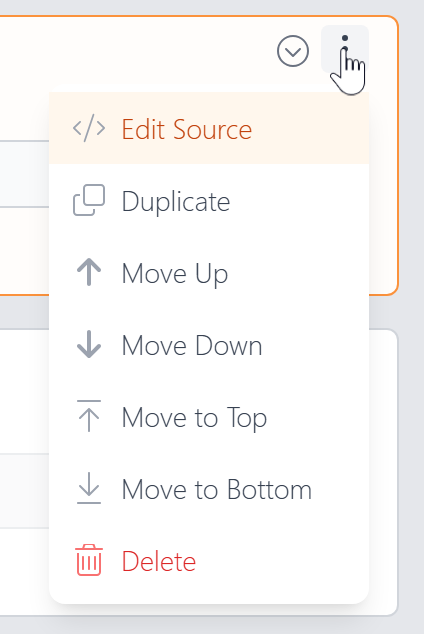

- **Edit Source** — opens an inline code editor where you can directly edit the control's XMP markup, including its label and validation tags
  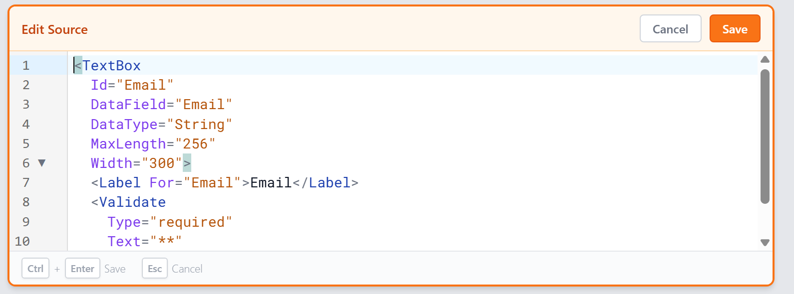
- **Duplicate** — create a copy of the control
- **Move Up / Down / Top / Bottom** — reposition the control
- **Delete** — remove the control from the form

The Edit Source editor gives you full access to the control's tag and any child tags (like `<Label>` and `<Validate>`). Press **Ctrl+Enter** to save or **Esc** to cancel.

## The Property Panel

When you select a control on the canvas, its properties appear in a collapsible sidebar on the right. This is where you configure everything about the control.

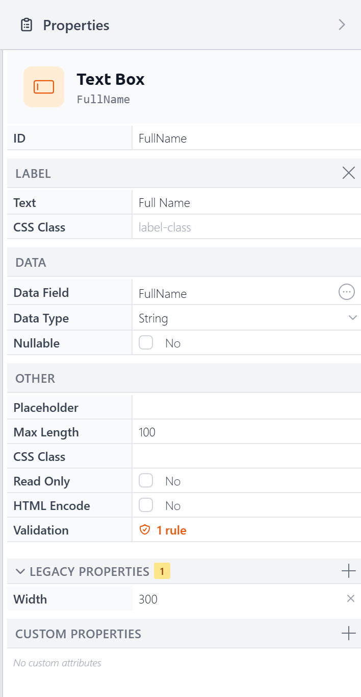

Properties are organized into collapsible sections:

- **Label** — The label text and its CSS class. You can remove the label by clicking the "X" button in its header.
- **Data** — Data Field, Data Type, and Nullable. Change the DataField by clicking the circle with 3 dots in it. The Data Type will automatically change based on the column type, though you can override the data type by selecting one from the dropdown. Nullable determines whether empty values in the control are sent to the database as the special NULL value, representing nothing/not set typically.
- **Other** — Properties that vary by control type. For a TextBox: Placeholder, Max Length, CSS Class, Read Only, HTML Encode, and Validation. A DropDownList would show properties for configuring its list items and data source instead.
- **Legacy Properties** — Older ASP.NET style properties (like Width, shown above) that still work but are better handled with CSS. A badge shows how many are set and you can add more by clicking the "+" button in its header.
- **Custom Properties** — Add arbitrary attributes to the control's tag for advanced scenarios.

The panel is resizable — drag its left edge to make it wider or narrower:

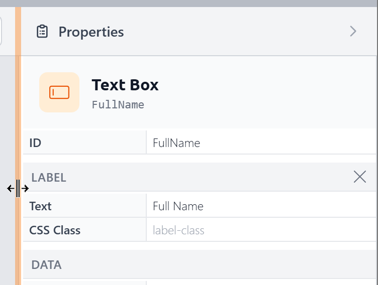

You can also collapse the panel entirely to maximize your canvas space:

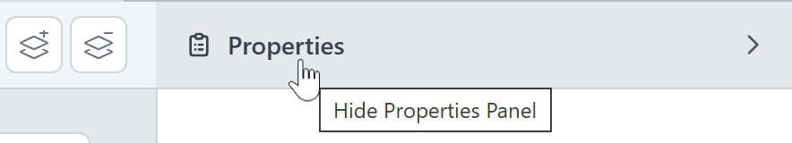

and reopen it when needed:

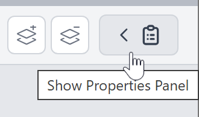

## Connecting to a Database

If you configured a data source when [creating the form](#creating-a-new-form), your form is already connected. You can change the data source at any time by clicking the **Data Sources** button in the toolbar:

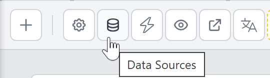

This opens the **Form Data** dialog, which has two sections:

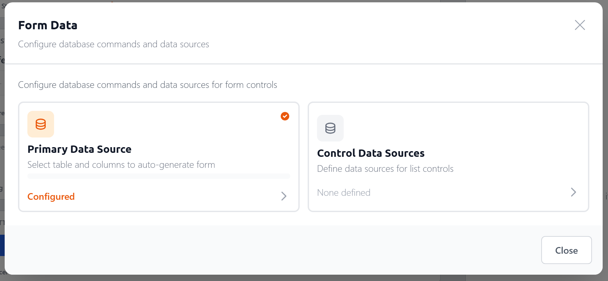

- **Primary Data Source** — the main table your form reads from and writes to. This is the same table and column picker shown in the creation dialog. Once configured, the Form Builder auto-generates the SQL commands to insert, update, and retrieve records, and maps columns to form controls — setting `DataField`, `DataType`, and `MaxLength` automatically.

- **Control Data Sources** — reusable data sources that feed list controls like DropDownList, CheckBoxList, and RadioButtonList. Each control data source has an ID you can reference from multiple controls.

### Control Data Sources

When you create a control data source, you choose between two source types:

- **Database Table** — select a table and columns, just like the primary data source. You can also configure optional sorting.

  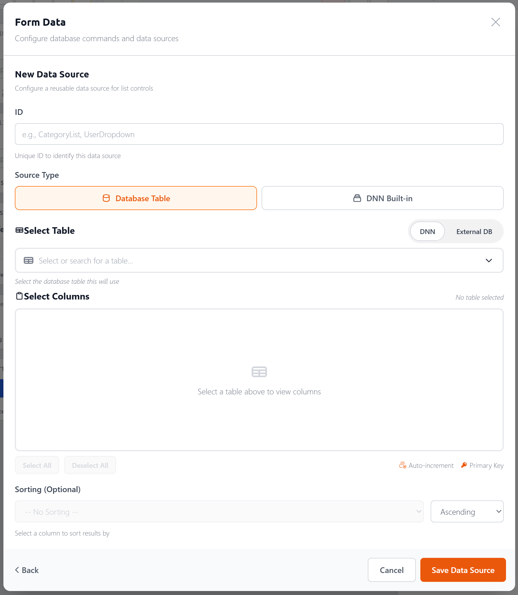

- **DNN Built-in** — pre-configured sources for common DNN data: Portal Users, Security Roles, Portal Pages, and Countries.

  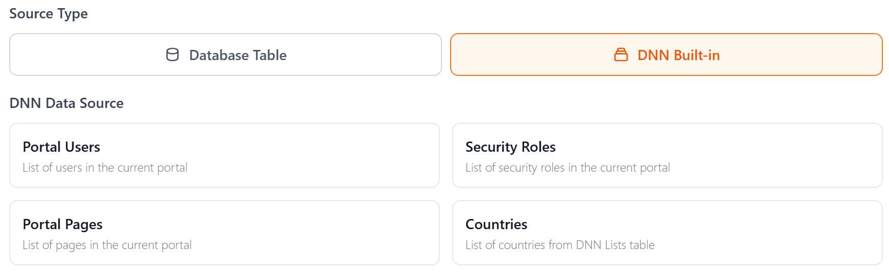

## Validation

There are two ways to add validation to a control. On the canvas, each control shows an **Add validation** link in its attribute bar:

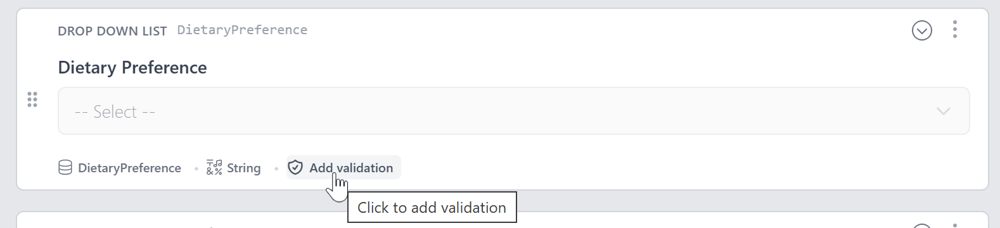

You can also click the **Validation** link in the Property Panel's Other section:

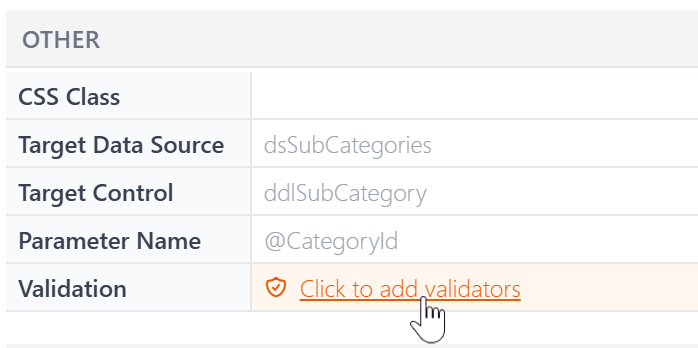

Either way opens the **Validation Rules** dialog, where you can add one or more rules:

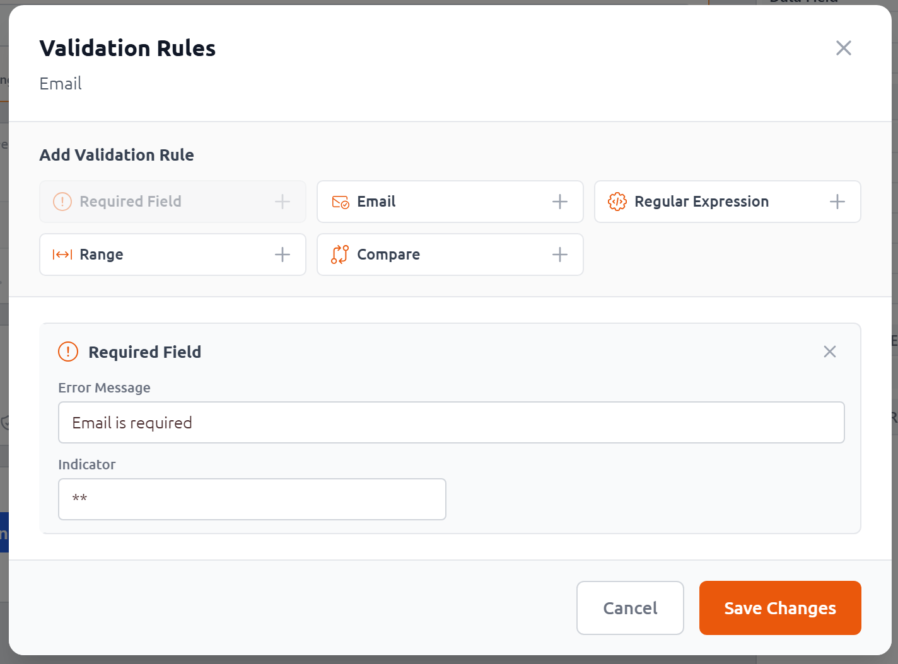

- **Required Field** — The field must have a value
- **Email** — The value must be a valid email address
- **Regular Expression** — The value must match a pattern
- **Range** — The value must fall within a min/max range
- **Compare** — The value must match another field

Each rule has a custom **Error Message** and an optional **Indicator** (text displayed inline next to the control when validation fails, like `**`). The configuration fields vary by rule type — for example, the Range validator asks for minimum/maximum values and data type, while Compare asks for the control to compare against. Once a control has validation rules, the canvas shows a count badge:

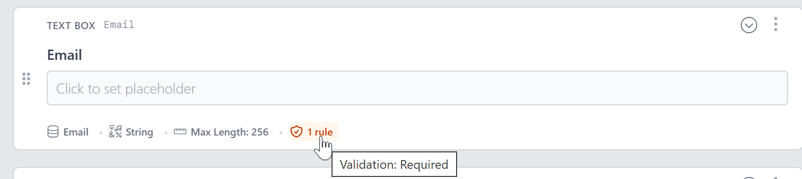

Hover over the badge to see which rules are applied.

## Layout and Containers

For more complex form layouts, you can use container controls to organize your form into sections:

- **Row** — Arrange controls in a multi-column grid layout (based on a 12-column grid)
- **Panel** — Group controls inside a bordered container
- **TabStrip** — Organize controls into tabbed sections
- **FieldGroup** — Group related fields with a legend/heading
- **Section** — A collapsible section

Drag controls into a container to nest them, or drag them out to move them back to the root level.

## Themes and Styling

The Form Builder includes a theming system that lets you style your forms without writing CSS.

<!-- SCREENSHOT: form-builder-themes — Form settings dialog showing theme selection and CSS variable customization -->

Open the **Form Settings** dialog to configure:

- **Theme** — Choose from a library of built-in themes, or create your own
- **Label Position** — Top (above the control), Left (beside it), Inside (floating placeholder), or None
- **CSS Variable Customization** — Fine-tune the theme by adjusting variables for spacing, typography, borders, button colors, and more
- **Live Preview** — See your changes in real time as you adjust settings

You can save custom themes for reuse across your forms.

## Previewing Your Form

To see how your form will look and behave at runtime, use the **Preview** button. This opens a live preview that renders the form exactly as it would appear on your DNN page — including validation, styling, and data source connections.

## Converting to a Custom Form

The Form Builder is designed for the most common form-building scenarios. When you need more control — custom HTML layout, JavaScript interactivity, or advanced tag configurations — you can convert your form to a **custom form** and continue working in the [Code Editor](code-editor.md).

This is a one-way conversion that gives you full control over the form's markup and styling. The Form Builder generates clean, well-structured code as a starting point.

## Keyboard Shortcuts

| Shortcut | Action |
|----------|--------|
| **/** | Open the Control Palette |
| **Arrow Up / Down** | Navigate between controls |
| **Enter** | Edit the selected control's label |
| **Alt+Enter** | Toggle focus between canvas and property panel |
| **Ctrl+S** / **Cmd+S** | Save the form |
| **Escape** | Close dialogs and menus |

## Next Steps

- **[Forms](forms.md)** — Learn about XMod Pro forms as a concept
- **[Code Editor](code-editor.md)** — Edit forms as code for maximum flexibility
- **[The Explorer](explorer.md)** — Browse and manage all your resources
- **[Control Panel](control-panel.md)** — Overview of the XMod Pro Control Panel
