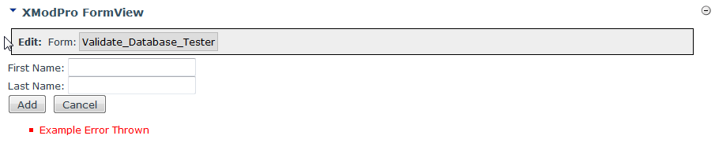

# `<Validate Type="Database">`

The Validate tag whose type is set to "Database" is referred to as a Database Validator and is used to display error messages thrown from the database.

## Syntax
```html
<Validate 
    CssClass="string"
    Text="string"
    Type="Database" 
/> 
```
 

## Remarks

The database validator is a special type of `<Validate>` tag. When the "type" attribute is set to **Database**, the control prevents the form from being submitted if the database throws an error or a value is returned via a specially-named output parameter. Unlike other `<Validate>` tags, the database validator is not associated with a specific form control and only one is allowed per form. The database validator is used to display error messages returned from the database. These can be actual errors thrown by the database or a friendly error message returned using the specially named ERROR output parameter.

*   **CssClass**: Name of the Cascading Style Sheets (CSS) class used to style this control.  

*   **Text**: This text that will be displayed where your validation fails. If you have a `<ValidationSummary>` tag on your form then the error message will be displayed there. If this validator has not been placed in your form, the message will still be displayed using the default error reporting mechanism.  

*   **Type**: When the "type" attribute is set to **Database**, the control prevents the form from being submitted if the database throws an error or a value is returned via a specially-named output parameter. Unlike other `<Validate>` tags, the database validator is not associated with a specific form control and only one is allowed per form.

**Passing a friendly error message back to the form**: In some cases your stored procedure may want to inform the user that the data they submitted is invalid in some way. A good example is if a user is choosing a Team Name for a sports league and you want to ensure that no two Team Names are the same. If the user submits a name that already exists, you'd want to inform them of that, allowing them to choose a different name. Here's how you'd do that:

1.  Set the `<SubmitCommand>` tag's `CommandType` property to: `StoredProcedure`  

2.  Add an OUTPUT parameter to the `<SubmitCommand>`. It **_must_ be named ERROR** and **its direction must be set to Output** like so:  
    
    ```html
    <Parameter Name="ERROR" DataType="String" Size="250" Direction="Output" />
    ```

3.  Optionally (though you will usually do this), add a `<Validate Type="Database" />` tag to your form.  

4.  Optionally add a `<ValidationSummary>` tag to your form if you don't already have one.  

5.  If you don't use the Validate/ValidationSummary combination of tags, the error will be reported to the end user using the standard XMod Pro reporting mechanisms.  

6.  In your stored procedure, set the @ERROR parameter to be an OUTPUT parameter and set its value to whatever message you want to return.  


## Example
```html {22-23}
<AddForm>
  <SubmitCommand CommandText="XMP_ReturnValueTester" CommandType="StoredProcedure">
    <Parameter Name="FirstName" DataType="String" Size="25" />
    <Parameter Name="LastName" DataType="String" Size="25" />
  </SubmitCommand>
 
  <div class="xmp-Authors xmp-form">
    <div class="xmp-form-row">
      <Label For="FirstName" Text="First Name" CssClass="NormalBold xmp-form-label" />
      <TextBox id="FirstName" DataField="FirstName" DataType="string" MaxLength="25" Width="165" />
    </div>
    <div class="xmp-form-row">
      <Label For="LastName" Text="Last Name" CssClass="NormalBold xmp-form-label" />
      <TextBox Id="LastName" DataField="LastName" DataType="Decimal" MaxLength="25" Width="165" />
    </div>
    <div class="kbxmFormRow">
      <span class="xmp-form-label">&nbsp;</span>
      <AddButton Text="Add" CssClass="CommandButton xmp-button"  /> 
      <CancelButton Text="Cancel" CssClass="CommandButton xmp-button" />
      <br />
    </div>
    <Validate Type="Database" />
    <ValidationSummary DisplayMode="BulletList"  CssClass="NormalRed xmp-validation-summary" />
  </div>
</AddForm>
```

Here's a sample stored procedure that is guaranteed to throw an error:
```sql
CREATE PROCEDURE [dbo].[XMP_DBThrownError_Tester]
  @FirstName nvarchar(255),
  @LastName nvarchar(255)
AS
BEGIN
  RAISERROR('Example Error Thrown',18,1)
END
```

Here's what the example form looks like after the user has submitted the form and the stored procedure has thrown the error:


