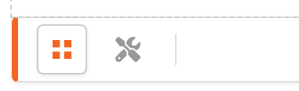
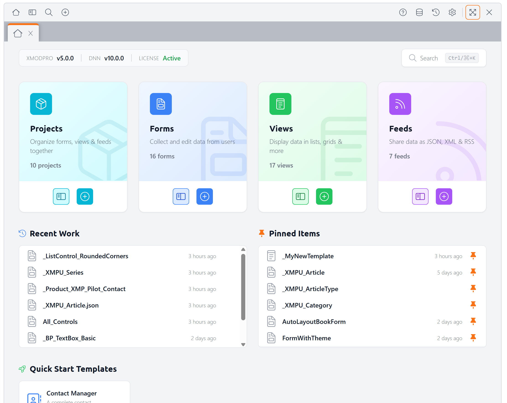

# Getting Started

XMod Pro lets you build powerful, data-driven solutions on your DNN site without programming. Most XMod Pro solutions work with a database, but they don't have to — and even when they do, XMod Pro can generate much of the HTML and SQL for you. You can start simple with the built-in tools and take as much manual control as you need.

## Key Concepts

XMod Pro solutions are built from a few core pieces:

### Views: Display Data

A **view** is how you display data to your visitors. It can be a list of records, details for a single record, or both. You write standard HTML and sprinkle in **field tokens** — placeholders like `[[FirstName]]` — wherever you want to show a value from your database. At runtime, XMod Pro replaces those tokens with real data. You tell XMod Pro where to get the data using built-in wizards or your own SQL.

### Forms: Add and Edit Data

A **form** is how your users add and edit data. XMod Pro includes a **Form Builder** that lets you visually design forms — just click a button or type `/` to pick from a library of controls (text fields, dropdowns, date pickers, file uploads, and many more), then drag and drop to reorder as needed. For full control, there's also a powerful **code editor** where you can hand-craft every detail. You can even generate a complete form from a database table — just pick the table, select the fields, and XMod Pro builds the form and data commands for you.

Forms support validation (required fields, email format, value ranges, etc.) so you can ensure data quality before anything is saved.

### Feeds: Supply Dynamic Data

**Feeds** return data as JSON, RSS, CSV, HTML, or other formats. They're commonly used to supply dynamic data to views and forms via AJAX, and can also expose data to external applications and services or create downloadable files.

### Projects: Organize Your Work

A **project** groups related views, forms, and feeds together. If you're building a blog, for example, you can create a "Blog" project that contains all the pieces of that solution in one place. Projects are searchable by name and description, making it easy to find what you need — even across dozens of solutions.

### Security: Built-In Role-Based Access

XMod Pro has built-in, role-based security. You can control who can view, add, edit, and delete data — all the way down to individual views and forms — using DNN's security roles.

## Multiple Views in One Module

Each XMod Pro module instance on a page can have one form and one view — but a single view can contain **multiple areas** that work together. This is one of XMod Pro's most powerful features.

For example, imagine a news page. One area displays a list of headlines. When a visitor clicks a headline, a second area shows the full article, and a third shows a list of related stories. All of this happens within a single module instance — no page navigation required.

Or consider a customer invoice. One area shows the customer's name and address (from a Customers table). Below it, another area lists their orders (from an Orders table, filtered by the customer's ID). A third area shows their payment history. Three different tables, one unified display.

## The Control Panel

You manage everything in XMod Pro through the **Control Panel** — a modern interface where you create and edit views, forms, and feeds, manage your database tables, and configure module settings.

To open the Control Panel, navigate to any page with an XMod Pro module and enter **Edit Mode** using the DNN Persona Bar. From there, you can either select **Control Panel** from the module's actions menu, or click the **Control Panel** icon in the quick-edit bar that appears at the top of the module.

::: warning
XMod Pro gives you direct access to your database. With that power comes responsibility — **always validate user input** (XMod Pro provides tools to help) and **maintain regular backups of your data**. A poorly written DELETE command, for example, could remove all records in a table. This is true of any database application, not just XMod Pro. **The developers and owners of XMod Pro are not responsible for any data loss, data corruption, or related costs or damages resulting from use of XMod Pro.**
:::

## Next Steps

Ready to dive in? Here's where to go next:

- **[How XMP Works](how-xmp-works.md)** — Understand how data flows from your database to the page
- **[Tutorial 1: Listing Users](tutorials/1_listing-users.md)** — Build your first view step by step
- **[Form Builder](form-builder.md)** — Visually design a form in minutes
- **[Control Panel](control-panel.md)** — Learn your way around the management interface
- **[Tokens](tokens/field.md)** — Learn about field tokens and other data placeholders
