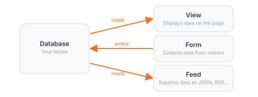

# How XMP Works

XMod Pro connects your database to your DNN pages. You tell it where to find the data, how to display it, and how to collect new data from your visitors. XMod Pro handles the rest — fetching records, filling in values, saving changes, and keeping everything secure.

This page gives you the big picture. Once you understand how the pieces fit together, the rest of the documentation will make a lot more sense.

## Your Data Lives in the Database

XMod Pro doesn't store data on its own — it works with the database tables that already exist on your DNN site (or new ones you create). Whether you're building a staff directory, a product catalog, or a feedback form, your data lives in database tables with rows and columns, just like a spreadsheet.

XMod Pro includes [database tools](database-tools.md) that let you create and modify tables right from the control panel — no need to open a separate tool. You can also work with tables that already exist in your database.

<!-- TODO: screenshot of a simple database table in DB Tools, showing rows and columns -->

## Data Commands: Telling XMP What to Do

Every time XMod Pro needs to retrieve or save data, it uses a **data command** — an instruction that tells it exactly what to do. There are different kinds of data commands for different situations:

- **Retrieving data** — "Get all the products in the Electronics category"
- **Adding a record** — "Insert a new customer with this name and email"
- **Updating a record** — "Change this product's price to $29.99"
- **Deleting a record** — "Remove the order with this ID"

Data commands are typically written in SQL (Structured Query Language), which is the standard language for talking to databases. But don't worry — XMod Pro can **generate data commands for you** when you use the Form Builder or auto-generate forms from a database table. You only need to write SQL by hand if you want to.

## Field Tokens: Placeholders for Real Data

A **field token** is a placeholder that XMod Pro replaces with a real value when the page loads. Field tokens look like this: `[[FirstName]]`, `[[Price]]`, `[[Email]]`. The name inside the brackets matches a column in your database table.

You use field tokens in your HTML wherever you want a data value to appear. For example, if your database has a `Products` table with columns named `ProductName` and `Price`, you might write:

```html
<h3>[[ProductName]]</h3>
<p>Price: $[[Price]]</p>
```

When a visitor views your page, XMod Pro replaces those tokens with actual values from the database:

```html
<h3>Wireless Keyboard</h3>
<p>Price: $49.99</p>
```

Field tokens are the bridge between your database and your HTML. You write standard HTML and sprinkle in tokens wherever you need dynamic content.

::: tip Other Token Types
Field tokens are the most common, but XMod Pro also provides tokens to work with data for the current user (`[[User:DisplayName]]`), the page URL (`[[Url:id]]`), portal settings, cookies, and more. See the [Tokens reference](tokens/field.md) for the full list.
:::

## Displaying Data: The View Cycle

A [**view**](views.md) displays data from your database on the page. Here's what happens when a visitor loads a page with an XMod Pro view:

1. **XMod Pro runs your data command** to retrieve records from the database
2. **For each record**, it takes your HTML and replaces the field tokens with that record's values
3. **The final HTML** is sent to the visitor's browser

If your data command returns 10 products, your HTML repeats 10 times — once for each product, with the correct values filled in each time. If it returns one record (like a detail page for a single product), the HTML renders once.


You control everything about how the data looks — the HTML structure, the CSS styling, and which fields appear where. XMod Pro just fills in the values.

## Collecting Data: The Form Cycle

A [**form**](forms.md) works in the opposite direction — it collects data from your visitors and saves it to the database:

1. **XMod Pro displays your form** with input fields (text boxes, dropdowns, checkboxes, etc.)
2. **The visitor fills in the form** and clicks a submit button
3. **XMod Pro validates the input** (required fields, email format, etc.)
4. **If everything passes**, XMod Pro runs a data command to save the values to the database

Forms can also **load existing data** for editing. When a visitor clicks an "Edit" button in a view, XMod Pro fetches the record and fills in the form fields with the current values. The visitor makes changes and saves — XMod Pro runs an update command with the new values.


## Supplying Data: Feeds

A [**feed**](feeds.md) retrieves data just like a view does, but instead of rendering HTML on the page, it returns the data in a specific format — JSON, RSS, CSV, HTML, or others. Feeds are most commonly used to supply dynamic data to views and forms via AJAX (for example, loading a dropdown's options based on another field's selection), but they can also make data available to external applications or generate downloadable files. 

You probably won't need feeds while you're getting started, but they become an important part of more complex solutions you'll build later.

## Tying It All Together

A typical XMod Pro solution combines these pieces:



- **A database table** holds the data (customers, products, events — whatever you're building for)
- **A view** displays that data on the page using HTML and field tokens
- **A form** lets visitors add new records or edit existing ones
- **A feed** supplies dynamic data where needed (optional — not every solution needs one)

For example, imagine building a staff directory:

- The `Staff` table holds names, titles, departments, and photos
- A **view** displays the list of staff members, and shows full details when you click a name
- A **form** lets administrators add new staff members or update existing ones
- A **feed** returns staff data as JSON so a dropdown can filter by department without reloading the page

All of these pieces are managed through the [Control Panel](control-panel.md), organized into [Projects](projects.md), and protected by [role-based security](security.md).

## Next Steps

- **[Views](views.md)** — Learn more about displaying data
- **[Forms](forms.md)** — Learn more about collecting data
- **[Feeds](feeds.md)** — Learn more about supplying data in different formats
- **[Tutorial 1: Listing Users](tutorials/1_listing-users.md)** — Build your first view step by step
- **[Tokens Reference](tokens/field.md)** — See all available token types
