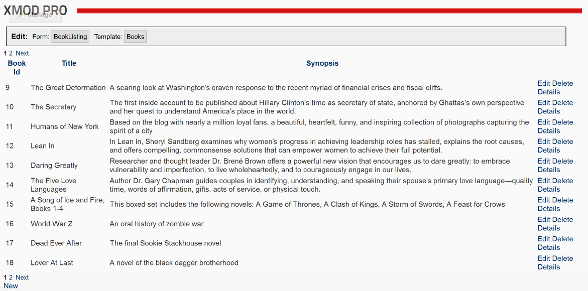
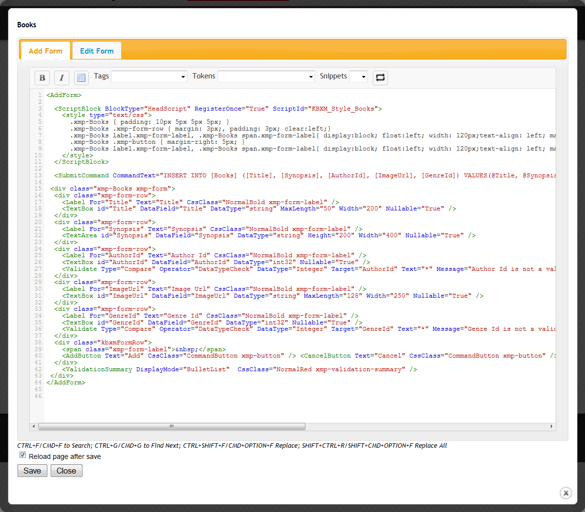

# Inline Editor 

_Editing Your Forms and Templates with the Inline Editor_

Beginning in version 1.4, XMod Pro includes a quick and easy way to edit the templates and forms configured for a given module. It is available only to Host or SuperUser accounts and is accessed via the new Host Options Panel that appears to Hosts and SuperUsers when working with XMod Pro modules.

If your modules hasn't yet been configured with a form or template, the Host Options Panel will not appear.

**IMPORTANT**: The Host Options Panel and the Inline Editor **REQUIRE jQuery 1.3.2 or later** to be registered in the page.

**For DNN 5** and later, jQuery is usually automatically included. To ensure that you are using version 1.3.2 or later, go to the Host Settings/jQuery section. From there you can specify the URL to use for jQuery.

**For DNN 4**, jQuery is not included by default. Because of this, XMod Pro cannot provide the Host Panel to every module instance. For each module you want to use the panel on, you will need to go to the Configure page for the module (make sure you're logged in as Host/SuperUser) and check the box to enable the panel. Also, specify a URL to use for the jQuery 1.3.2 library. You should only specify the URL in one module per page because that will include the library for every module on the page.

Once you have successfully included the jQuery library and configured your module to use a form and/or template, you can click on the form/template name and the Inline Editor will be displayed, giving you one-click access to edit the current template/form (note: if you are using Internet Explorer, you editor may look slightly different).

Beyond giving you one-click access for editing, the included editor also makes it easier to add tokens, controls, and tags to your form/template through easy-to-use lists available from the toolbar (number 3 below).

1.  **Form/Template Name**: The name of the form/template you're editing is displayed above.  

2.  **Tabstrip**: When editing forms, you can choose whether to edit the Add form - the form used when creating new records - or the Edit form - used when updating records - simply by clicking its tab.  

3.  **Toolbar**:
    *    Select some text in the editor and click these buttons to wrap the text in Bold or Italic HTML tags.
    *    Inserts the skeleton structure of an HTML table.  

    *   **Tags Dropdown**: For Forms, this button will display a list of form controls you can choose to use when working with your form. For Templates, this will list the tags that are available for use in your template.  

    *   **Tokens Dropdown**: Allows you to select from a list of XMod Pro tokens such as Field tokens ([[FieldName]]), Portal tokens (e.g. [[Portal:ID]]), User tokens ([[User:DisplayName]]) and others.The token will then be inserted into your code.
    *   **Snippets Dropdown**: Allows you to select from and insert a snippet from a list of your available code snippets that you have created.   

4.  **Editing Area**: New to version 4, the editor now has colored syntax highlighting, line numbers, auto-complete of XMod Pro tags, search and replace, auto-indent, and block indent/outdent. Note in the image that </HeaderTemplate>, </ul>, and </FooterTemplate> are highlighted in red. This indicates invalid HTML syntax. However, since templates dynamically build the HTML at run-time, these error indicators can be ignored.
5.  **Reload Page**: If you want your changes to be visible immediately, tick this box. This will instruct XMod Pro to save your form/template changes and then reload the DNN page you were viewing. If this box is not ticked, the changes will still be saved and any page that uses the form/template will see those changes when they're reloaded.
6.  **Save/Cancel Buttons**: Click the Save button to save your changes and return to the Edit Form/Template screen or click Cancel to abandon your changes and return to the Edit Form/Template screen.