# Managing Feeds

NEW TO VERSION 3.0: Feeds are a new feature as of XMod Pro 3\. They greatly expand what you can do with XMod Pro. With them, you can create RSS feeds, export data as CSV files, convert SQL data to XML files, even use them to display printer-friendly HTML files -- all using the same types of techniques you use to create templates.

Feeds are created, edited, copied, and deleted within the Manage Feeds page. The Manage Feeds page is only available to Hosts or SuperUser accounts. To get there, select "Control Panel" from the module's Actions/Manage Menu:

On the Control Panel Page, select "Manage Feeds":

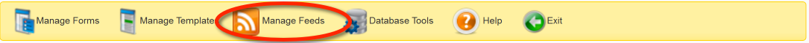

As you can see in the image below, any feeds you've already created will be displayed within the Feed Manager grid:

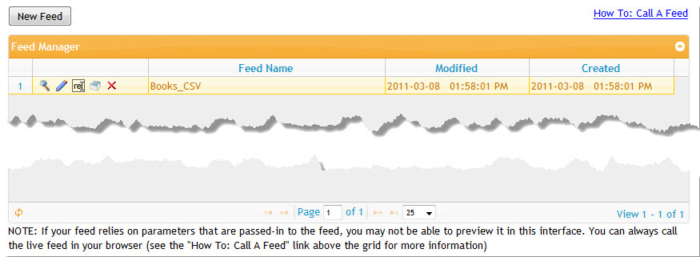

Buttons to Preview , Edit , Rename , Copy , or Delete each feed are listed in the left column, followed by the feed's name. The right-most columns list the date and time the feed was last Modified and when it was originally created. You can sort your forms by clicking the header of each column. Click it a second time to reverse the sort order.

## Calling a Feed

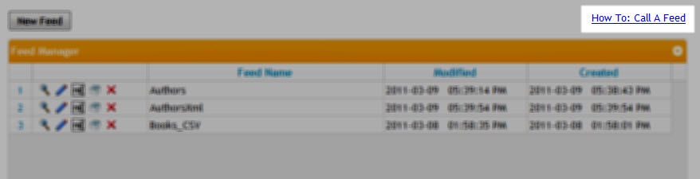

Feeds aren't very useful if you can't use them. So, we've given you a quick link on the main page to find out how to call your feed. Clicking the link will pop-up a dialog similar to this:

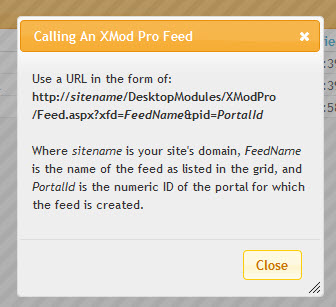

As the dialog explains, basically you're calling Feed.aspx in the XMod Pro directory and supplying it with the name of your feed and the portal ID where the feed resides.

::: warning
Feeds are assumed to be public. There is no special precaution that XMod Pro makes to secure your feed. Should you wish to limit who can view your data, take care in how you formulate your ListDataSource to avoid letting un-authorized users from viewing your data.
:::

## Listing Feeds

To enhance performance , XMod Pro caches the list of feeds. If you have added a feed via the Database Tools page via some other means, your new feed may not appear in the list. You can rectify this by clicking the Reload button found on the left side of the grid's navigation bar.

Also on the navigation bar, you'll find the usual elements: buttons to page to the first page, previous page, next page, and last page. You can type the number of the page into the text box and go directly to that page. You can also select how many items to show by selecting an appropriate number from the drop-down list box.

## Previewing a Feed

Click the magnifying glass icon  on the row of the feed you want to preview. NOTE: This is a Live preview, with actual data from your site. 

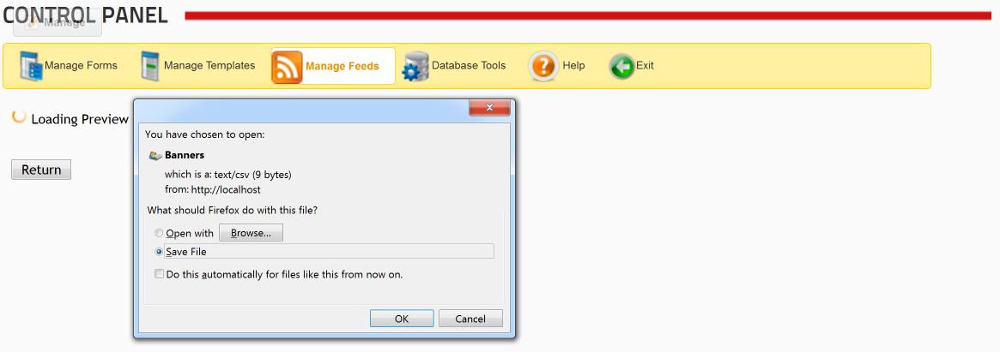

If you have an application installed to load a CSV (comma-separated-values) file, then you may be prompted to open it in that program, just like your user would.

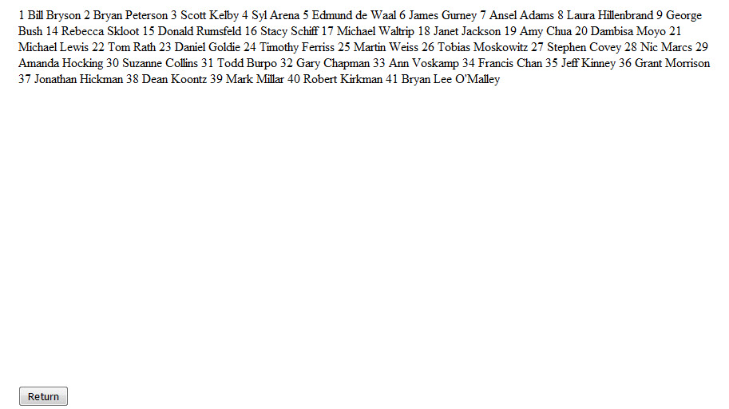

Note that when previewing a feed, the display may not look how you intend it. That is because you are previewing it in a browser -- as HTML. In the example above, we've created an XML feed, but you can't see any XML tags in the preview. To do so, in most browsers, right-click inside your preview and select Inspect Element. This will show the underlying code as here (Firebug is being used):

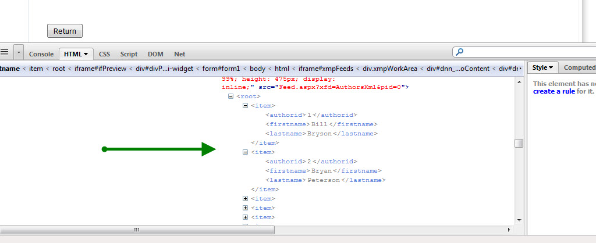

When you are done with the preview, click the Return button to return to the Manage Feeds grid.

## Renaming a Feed

Click the Rename image  next to the name of the feed you want to rename. The row will change to look similar to this:

Change the name to the desired text and click the green Save  icon to save your changes. If you wish to cancel out of the operation and keep the name, click the red Cancel  icon.

## Copying a Feed

Click the Copy image  on the row of the feed you want to copy. XMod Pro creates a duplicate of the feed, gives it a new name, appending a number to the end of the name, and places it just below the row of the feed you're copying. From there you can rename it to whatever name you'd like.

## Deleting a Feed

Click the Delete image  on the row of the feed you want to delete. XMod Pro prompts you to confirm you want to delete the feed. Click the Delete button on the dialog and your feed will be deleted. Click the Cancel button if you do not want to delete the feed.

## Editing a Feed

Click the Edit icon  on the row of the feed you want to edit. The feed editor is displayed and loaded with the selected feed.

::: tip
Feeds are very similar to templates, but they serve a different purpose. Not all tags that work in templates will work in feeds.
:::

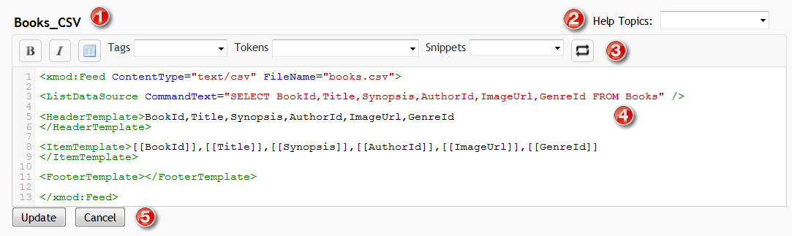

1.  **Feed Name**: The name of the feed you're editing is displayed above the editor
2.  **Help Topics**: XMod Pro provides online help for feed controls and tokens. You can access it by selecting a topic from the drop-down list.
3.  **Toolbar**:
    *    Select some text in the editor and click these buttons to wrap the text in Bold, Italic, or Strikethrough HTML tags.
    *    Inserts the skeleton structure of an HTML table.
    *   **Tags Dropdown**: Allows you to select from and insert a feed tag from a list of available tags.
    *   **Tokens Dropdown**: Allows you to select from and insert an XMod Pro token from a list of available tokens you can insert (such as [[Module:ID]], [[Portal:ID]], [[User:DisplayName]], etc.)
    *   **Snippets Dropdown**: Allows you to select from and insert a snippet from a list of your available code snippets that you have created.  

4.  **Editing Area**: New to version 4, the editor now has colored syntax highlighting, line numbers, auto-complete of XMod Pro tags, search and replace, auto-indent, and block indent/outdent.
5.  **Update/Cancel Buttons**: Click the Update button to save your changes and return to the main Manage feeds screen or click Cancel to abandon your changes and return to the Manage feeds screen.

### Creating A New Feed With the Quick Feed Creator

The Quick Feed Creator is a fast way to generate the skeleton code for a feed or to generate a list and detail feed from a table in your DNN database. When you choose this option, XMod Pro will not only generate a feed of your choice but will also create the data commands and controls to link your list and detail feeds.

To start, click the New Feed button at the top of the grid.

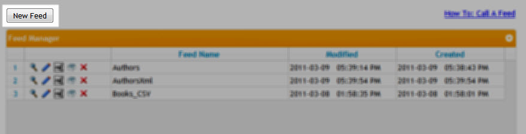

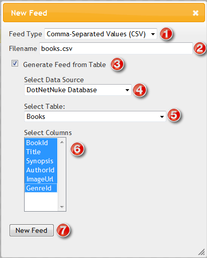

1.  To create a new feed, first choose the type of feed you'd like to create. There are a few pre-defined options like Comma-Separated Values and XML, but you can choose Custom and put in whatever you'd like.
2.  Optionally, specify a file name for your feed. Doing so enables your user to download the output as a file. This allows them to save it on their hard drive and/or open it with another program.
3.  At its simplest, you can create a basic skeleton of a feed, simply by clicking the New feed button. However, to get a jump-start on your feed development, tick the "Generate Feed from Table" checkbox.
4.  This presents you with a drop-down list where you can specify where your table is located. You can work with a table in your DNN database, as shown here. Or you can use a table in an External SQL Server database. If you choose the latter option, simply specify the connection string and click the Load Tables button to continue.
5.  Once your data source has been specified, XMod Pro will load a list of tables for you to choose from. Choose the one you're interested in.
6.  Next, select the columns from the table that you'd like to include in your feed. SHIFT-Click or CTRL-Click to select multiple columns.
7.  Finally, click the "New Feed" button and your feed will be generated and placed into the feed editor, ready for editing. Once you are satisfied with your edits, type a name for your new feed into the "Feed Name" text box and click the Save button.

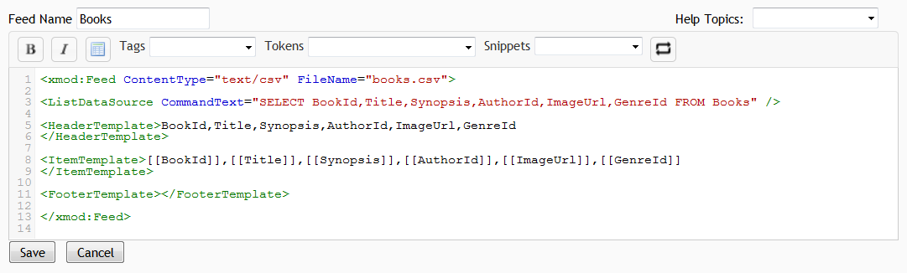
