# Managing Forms

Don't Feel Like Reading? **Watch the videos** instead:

*   [Form Manager Grid](http://dnndev.com/Learn/Videos/vid/13/video/XMod-Pro-3-Form-Manager-Grid.aspx): Takes you on a tour of the Form Manager grid on the Manage Forms page and describes the difference between Custom and Auto-Layout forms.
*   [Form Builder Tour](http://dnndev.com/Learn/Videos/vid/5/video/XMod-Pro-Form-Builder-Tour-Contact-Us-Form.aspx): Creating a Contact Us form with Email notification.
*   [Creating A Data-Bound Form](http://dnndev.com/Learn/Videos/vid/12/video/XMod-Pro-3-Creating-A-DataBound-Form-with-the-Form-Builder.aspx): Shows how to use the Form Builder to create forms that add and edit records in your database.
*   [Creating Picker Lists](http://dnndev.com/Learn/Videos/vid/4/video/Creating-Picker-Lists-in-Your-Forms.aspx): Builds on the data-bound form video and shows you how to setup drop-down lists that are populated from your database.

Data entry forms are created, edited, copied, renamed, and deleted within the Control Panel's Manage Forms page. The Manage Forms page is only available to Hosts or SuperUser accounts. To get there, select "Control Panel" from the module's Actions/Manage Menu:

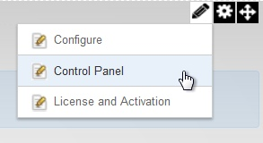

On the Control Panel Page, select "Manage Forms":

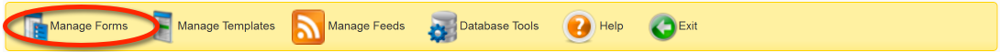

As you can see in the image below, any forms you've already created will be displayed within a six-column grid

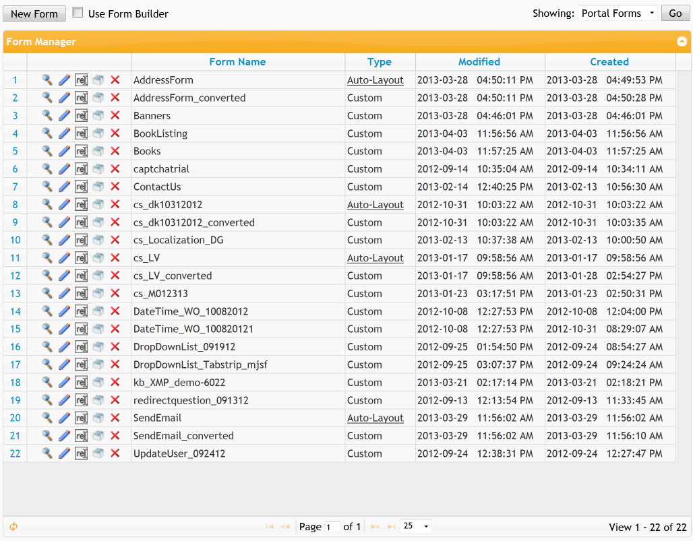

Buttons to Preview , Edit , Rename , Copy , or Delete  each form are listed in the left column, followed by the Form's Name and whether the form was built with the form builder (Auto-Layout) or is a custom HTML layout (Custom). The right-most columns list the date and time the form was last Modified and when it was originally created. You can sort your forms by clicking the header of each column. Click it a second time to reverse the sort order.

## Form Types

Under the Type column, you can see if the form is a Custom HTML layout form or an Auto-Layout form (added in version 3.0). An Auto-Layout form has been created by and is editable by the Form Builder. You can edit an Auto-Layout form by converting it to a Custom HTML Layout form. This is done by clicking the "Auto-Layout" link for the form in the Type column. Once you do this, XMod Pro will convert the form as a new form. This allows you to convert a form non-destructively.

## Listing Forms

To enhance performance, XMod Pro caches the list of forms. If you have added a form via the Form Builder or via some other means, your new form may not appear in the list. You can rectify this by clicking the Reload button found on the left side of the grid's navigation bar.

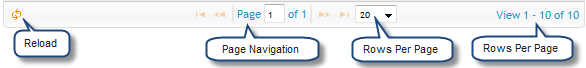

Also on the navigation bar, you'll find the usual elements: buttons to page to the first page, previous page, next page, and last page. You can type the number of the page into the text box and go directly to that page. You can also select how many items to show by selecting an appropriate number from the drop-down list box.

## Previewing a Form 

Click the magnifying glass icon  on the row of the form you want to preview.

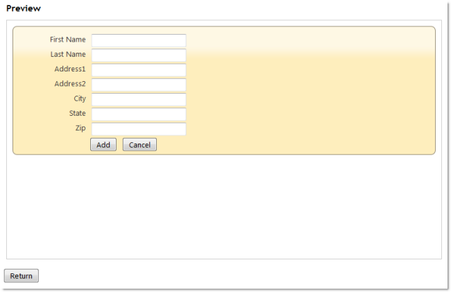

The Add Form will be displayed. If you have added validation to your form, you can click the Add button to show the validation messages:

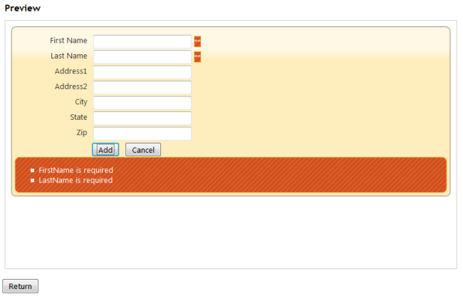

**NOTE**: While the preview does not allow you to submit data, since it is a live preview, some form controls like the FileUpload control may be functional. Additionally, the preview is intended to give you a sense for how a form will look at run-time. Because it doesn't save data, it also does not process tokens like User and other tokens. Depending on how you've setup your form, this may affect the display.

## Renaming a Form 

Click the Rename image  next to the name of the form you want to rename. The row will change to look similar to this:

Change the name to the desired text and click the green Save  icon to save your changes. If you wish to cancel out of the operation and keep the name, click the red Cancel  icon.

## Copying a Form 

Click the Copy image  on the row of the form you want to copy. XMod Pro creates a duplicate of the form, gives it a new name, appending a number to the end of the name, and places it just below the row of the form you're copying. From there you can rename it to whatever name you'd like.

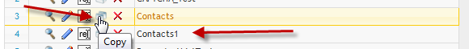

## Deleting a Form 

Click the Delete image  on the row of the form you want to delete. XMod Pro prompts you to confirm you want to delete the form. Click the Delete button on the dialog and your form will be deleted. Click the Cancel button if you do not want to delete the form.

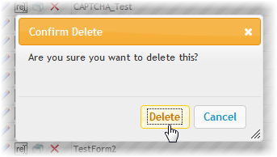

## Editing a Form 

Click the Edit icon  on the row of the form you want to edit. The form editor is displayed and loaded with the selected form.

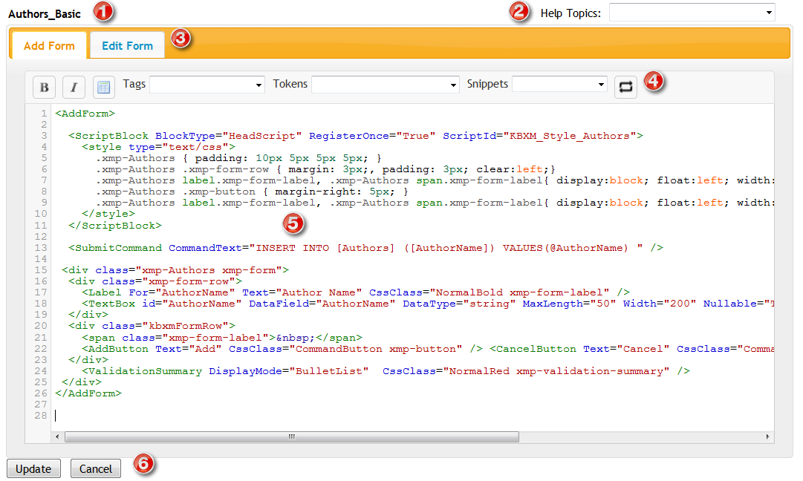

1.  **Form Name**: The name of the form you're editing is displayed above the editor.  

2.  **Help Topics**: XMod Pro provides online help for form controls and tokens. You can access it by selecting a topic from the drop-down list.  

3.  **Tabstrip**: New to version 2.7\. Easily switch between editing the Add form and Edit form by clicking on the appropriate tab.  

4.  **Toolbar**:
    *    Select some text in the editor and click these buttons to wrap the text in Bold or Italic HTML tags.
    *    Inserts the skeleton structure of an HTML table.  

    *   **Tags Dropdown**: Allows you to select from and insert a form control tag from a list of available controls. When you select a tag, a designer will pop-up enabling you specify the tag's properties. An example of the Checkbox List control's dialog is below:  
        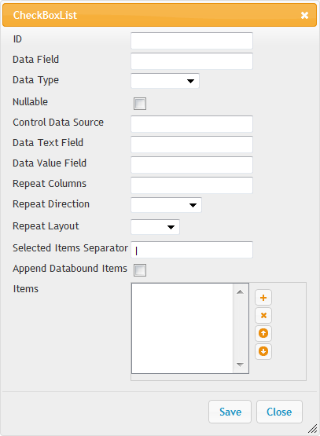  

    *   **Tokens Dropdown**: Allows you to select from a list of XMod Pro tokens. The token will then be inserted into your code.
    *   **Snippets Dropdown**: Allows you to select from and insert a snippet from a list of your available code snippets that you have created.  

5.  **Editing Area**: New to version 4, the editor now has colored syntax highlighting, line numbers, auto-complete of XMod Pro tags, search and replace, auto-indent, and block indent/outdent.  

6.  **Update/Cancel Buttons**: Click the Update button to save your changes and return to the main Manage Forms screen or click Cancel to abandon your changes and return to the Manage Forms screen.  

### Creating A New Form

There are two ways to create a new form in XMod Pro. The Form Builder and the Plain Text Editor. Rather than try to describe all the facets of the Form Builder, we've created some videos that show you instead. These videos are hosted on the internet and, thus, require internet access.

*   [Form Builder Tour](http://dnndev.com/Learn/Videos/vid/5/video/XMod-Pro-Form-Builder-Tour-Contact-Us-Form.aspx): Creating a Contact Us form with Email notification.
*   [Creating A Data-Bound Form](http://dnndev.com/Learn/Videos/vid/12/video/XMod-Pro-3-Creating-A-DataBound-Form-with-the-Form-Builder.aspx): Shows how to use the Form Builder to create forms that add and edit records in your database.
*   [Creating Picker Lists](http://dnndev.com/Learn/Videos/vid/4/video/Creating-Picker-Lists-in-Your-Forms.aspx): Builds on the data-bound form video and shows you how to setup drop-down lists that are populated from your database.

#### Creating a Custom HTML Layout Form

The Form Builder is a great way to create forms quickly and easily. Even if you plan to customize it later, we recommend looking at using the Form Builder to jump-start your form development and then converting that form to a Custom HTML Layout form. The Custom HTML Layout form type gives you the greatest flexibility and options when it comes to layout, styling, and interactivity. Of course, that additional power means you'll have to do some more work. The Plain Text Editor was created for that purpose. See the section above to see how the editor functions.

To create a new Custom HTML Layout form, un-tick the "Use Form Builder" checkbox and click the New Form button at the top of the Form Manager grid. You'll be presented with a screen similar to what you see below.

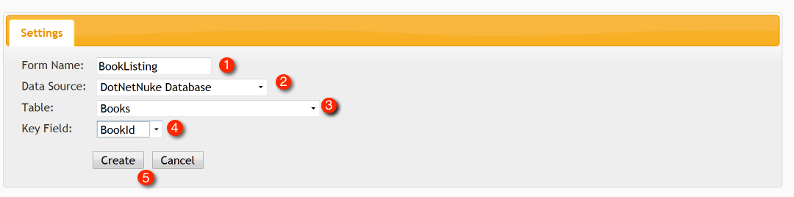

1.  Enter the name to use for the form. You can only use Letters, Numbers, hypens (-) and Underscores (_) in the form name. Special characters and spaces are not allowed.  

2.  If you want XMod Pro to auto-create a basic Add and Edit form for you, select a Data Source. You can choose a table in the DNN database or one in an External SQL Server database. If you choose the latter, you will need to supply a connection string. If you just want a bare-bones form skeleton, choose "None".  

3.  If you choose DotNetNuke Database as your Data Source or, if you've chosen External SQL Server Database, entered a connection string and clicked the Load Tables button, you'll see a drop-down list with tables in your datasource. Select the table you want to work with.  

4.  Once you've selected a table, you'll need to select a Key Field. This is the column in the table that uniquely identifies each record. It is required so that XMod Pro can set up editing for the record.  

5.  Finally, click the Create button to have your form generated (refer to the plain text form editor description earlier in this topic for usage details). Click the Cancel button to go back to the Form Manager grid.

If you click the Create button, your form will be generated and placed into the form editor, ready for editing. The generated form definition provides the Add and Edit forms, complete with the data commands to insert, retrieve, and update the record. It also provides a basic, CSS-based layout that you can alter or remove. It also makes educated guesses as to which controls to use for your form. Make any changes you want to the form. Once you are satisfied with your edits, click the Save button.

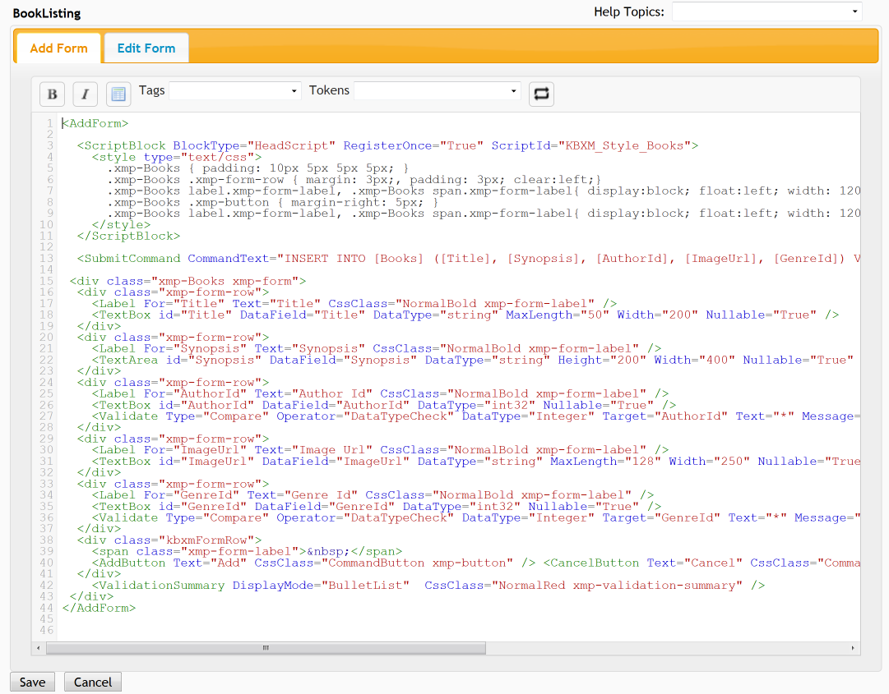
