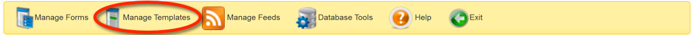
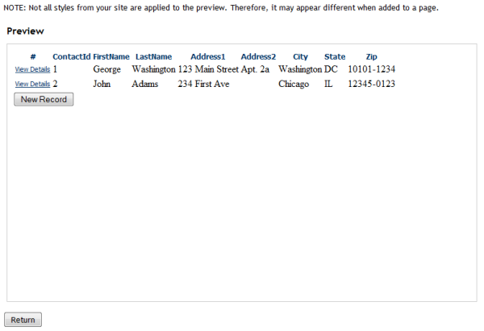
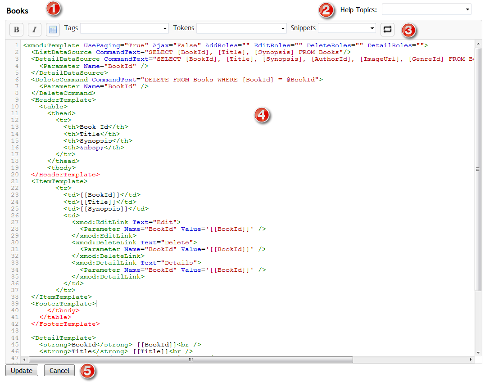
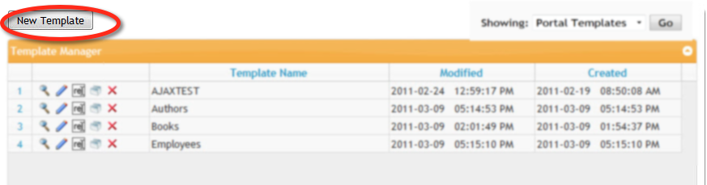
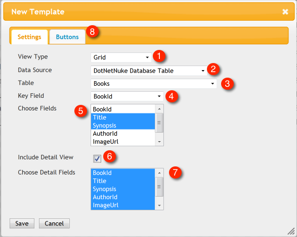
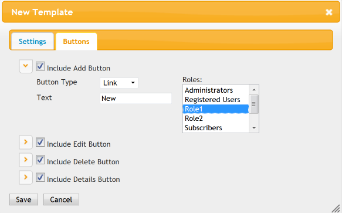
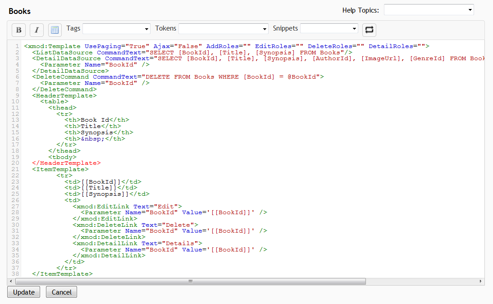

# Managing Templates

Data display templates are created, edited, copied, and deleted within the Manage Templates page. The Manage Templates page is only available to Hosts or SuperUser accounts. To get there, select "Control Panel" from the module's Actions/Manage Menu:

On the Control Panel Page, select "Manage Templates":

As you can see in the image below, any templates you've already created will be displayed within the Template Manager grid:

Buttons to Preview , Edit , Rename , Copy , or Delete each template are listed in the left column, followed by the template's name. The right-most columns list the date and time the template was last Modified and when it was originally created. You can sort your forms by clicking the header of each column. Click it a second time to reverse the sort order.

## Listing Templates

To enhance performance, XMod Pro caches the list of templates. If you have added a template via the Database Tools page via some other means, your new template may not appear in the list. You can rectify this by clicking the Reload button found on the left side of the grid's navigation bar.

Also on the navigation bar, you'll find the usual elements: buttons to page to the first page, previous page, next page, and last page. You can type the number of the page into the text box and go directly to that page. You can also select how many items to show by selecting an appropriate number from the drop-down list box.

## Previewing a Template

Click the magnifying glass icon  on the row of the template you want to Preview. NOTE: This is a Live Preview, with actual data from your site. Not all the styles of your skin are applied to the template for the preview. Therefore it may look different when viewed at run-time. Additionally, any Edit/Delete buttons will not appear in the preview. You can, however, click Detail buttons/links to see the detail template.

When you are done with the Preview, click the Return button to return to the Manage Templates grid.

## Renaming a Template

Click the Rename image  next to the name of the template you want to rename. The row will change to look similar to this:

Change the name to the desired text and click the green Save  icon to save your changes. If you wish to cancel out of the operation and keep the name, click the red Cancel  icon.

## Copying a Template

Click the Copy image  on the row of the template you want to copy. XMod Pro creates a duplicate of the template, gives it a new name, appending a number to the end of the name, and places it just below the row of the template you're copying. From there you can rename it to whatever name you'd like.

## Deleting a Template

Click the Delete image  on the row of the template you want to delete. XMod Pro prompts you to confirm you want to delete the template. Click the Delete button on the dialog and your template will be deleted. Click the Cancel button if you do not want to delete the template.

## Editing a Template

Click the Edit icon  on the row of the template you want to edit. The template editor is displayed and loaded with the selected template.

1.  **Template Name**: The name of the template you're editing is displayed above the editor
2.  **Help Topics**: XMod Pro provides online help for template controls and tokens. You can access it by selecting a topic from the drop-down list.
3.  **Toolbar**:
    *    Select some text in the editor and click these buttons to wrap the text in Bold or Italic HTML tags.
    *    Inserts the skeleton structure of an HTML table.  

    *   **Tags Dropdown**: Allows you to select from and insert a template tag from a list of available tags.
    *   **Tokens Dropdown**: Allows you to select from and insert an XMod Pro token from a list of available tokens you can insert (such as [[Module:ID]], [[Portal:ID]], [[User:DisplayName]], etc.)
    *   **Snippets Dropdown**: Allows you to select from and insert a snippet from a list of your available code snippets that you have created.   

4.  **Editing Area**: New to version 4, the editor now has colored syntax highlighting, line numbers, auto-complete of XMod Pro tags, search and replace, auto-indent, and block indent/outdent. Note in the image that </HeaderTemplate>, </tbody>, </table>, and </FooterTemplate> are highlighted in red. This indicates invalid HTML syntax. However, since templates dynamically build the HTML at run-time, these error indicators can be ignored.  

5.  **Update/Cancel Buttons**: Click the Update button to save your changes and return to the main Manage templates screen or click Cancel to abandon your changes and return to the Manage templates screen.

### Creating A New Template With the Quick Template Creator

The Quick Template Creator is a fast way to generate the skeleton code for a template or to generate a list and detail template from a table in your DNN database. When you choose this option, XMod Pro will not only generate a template of your choice but will also create the data commands and controls to link your list and detail templates.

To start, click the New Template button at the top of the grid.

1.  To create a New Template, first choose the type of view you'd like to create.  

2.  Choose the source for your data. Options include None, DotNetNuke database, or External SQL Server database.  

3.  If you select the "DotNetNuke" data source, you can select a table in the database. If you select External SQL Server database, you'll first need to input a connection string to the database. Then you'll be able to load a list of tables from the database.  

4.  Next, you are asked to select a column from that table to use as the Unique Identifier for records from that table. This column will be used when creating the Detail template and the controls to connect the list and detail templates, so that the proper record can be retrieved.  

5.  Next, choose the columns (fields) the builder should include in your list view.  

6.  If you'd like the builder to generate a basic detail starter template for you, check this box.  

7.  If you choose to include a detail view, select which fields you'd like to include in that view.  

8.  **Choosing Buttons and Setting Permissions**: By default, all buttons are created for you. However, you can choose which buttons to include by selecting the Buttons tab:  
      
    Tick the check box next to each button type you'd like to include. You can also click the arrow next to the checkbox to expand/collapse the settings section for each button.  

    Within each settings section, you can choose how the button will be displayed - as a hyperlink, a button, or a clickable image. You can specify the text to include on the button (or alternate text if the button is an image). If the button is an image you'll be able to specify a URL to the image.  

    Next, for each button, you can determine which DNN security roles will be able to see and use the buttons.  

9.  Finally, click the "Save" button and your template will be generated and placed into the template editor, ready for editing. The generated template definition provides the list and detail templates and their data commands along with some basic styling. If selected, it also provides a button to view the record's details, a button to Edit the record, and a button to create a new record. The Edit button is set to pass the record's unique identifier to a form. It is up to your form to use that ID when editing the record. Once you are satisfied with your edits, type a name for your new template into the "Template Name" text box and click the Save button.  

    
