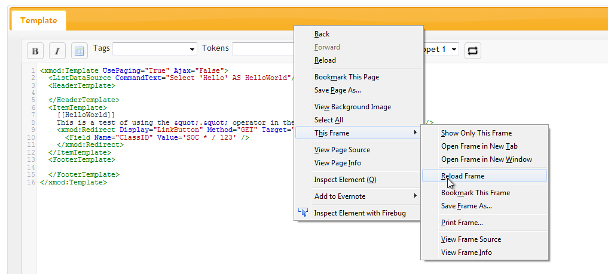

# Snippets

Beginning with version 4.3, XMod Pro introduced "snippets" to its text-based editors. If you're a programmer or web developer, you've probably run into snippets in various development environments and editors. Snippets are a quick and convenient way to store and leverage often used code or text. Snippets are available in the toolbar of the form, template, and feed text editors.


When you first install XMod Pro or after you upgrade from a version earlier than 4.3, the Snippets box will be empty. Snippets are a very personal thing for most developers. They're collections of often used code bits, script, styling, and more. Because of that we couldn't simply give you a list of snippets and expect you to be happy :) Rather, we've made it possible for you to easily create your own snippets.

Snippets are stored in a Javascript file in your website. However, you don't need to be a Javascript expert to create them. You can use the format we layout here and just customize it with your own text.

The file is called `snippets.js` and it's stored in `/Portals/_default/XModPro/`. So the first thing to do is fire up your favorite Javascript editor (or notepad if you're old-school).

Here's what a typical snippets file might look like:

```javascript
var xmp = {};
xmp.snippets = [
	{
		name: "Copyright",
		context: "all",
		desc: "This inserts the copyright symbol and company name",
		author: "Kelly Ford", 
		email: "support@dnndev.com", 
		website: "http://dnndev.com",
		snippet: '&copy; ' + new Date().getFullYear() + ' DNNDev.com'
	}, 
	{
		name: "Company Style",
		context: "template",
		desc: "An example of inserting a style block into the head of the page.", 
		author: "Kelly Ford", 
		email: "support@dnndev.com",
		website: "http://dnndev.com",
		snippet: '<xmod:ScriptBlock ScriptId="dnndev_style" BlockType="HeadScript" RegisterOnce="True">\n' +
			 '  <style type="text/css">\n' + 
			 '    h1 { background-color: orange; color: white; }' + 
			 '  </style>' + 
			 '</xmod:ScriptBlock>' 
	}, 
	{
		name: "Company Style",
		context: "form",
		desc: "An example of inserting a style block into the head of the page.", 
		author: "Kelly Ford", 
		email: "support@dnndev.com",
		website: "http://dnndev.com",
		snippet: '<ScriptBlock ScriptId="dnndev_style" BlockType="HeadScript" RegisterOnce="True">\n' +
			 '  <style type="text/css">\n' + 
			 '    h1 { background-color: orange; color: white; }' + 
			 '  </style>' + 
			 '</ScriptBlock>' 
	}, 
	{
		name: "Meta Redirect",
		context: "template",
		desc: "Inserts a Redirect <xmod:MetaTag>",
		author: "Kelly Ford",
		email: "support@dnndev.com",
		website: "http://dnndev.com",
		snippet: '<xmod:MetaTags>\n' +
			 '  <Redirect Delay="0" Url="http://dnndev.com" />' + 
			 '</xmod:MetaTags>' 
	}, 
	{
		name: "jQuery UI Calendar",
		context: "form",
		desc: "An example of enabling a pop-up calendar from jQuery UI for form controls. This " + 
			  "requires that jQuery UI be included in the page.", 
		author: "Kelly Ford", 
		email: "support@dnndev.com",
		website: "http://dnndev.com",
		snippet: '<jQueryReady>\n' +
			 '  $(".calendar-popup").datepicker();\n' + 
			 '</jQueryReady>' 		
	}
];
```

This file contains 5 snippets. It begins by defining the "xmp" namespace ( `var xmp = {};` ). The snippets array is added to that namespace. The array contains five snippets ( each one defined between the `{` and `}` braces.

Some of the items you see above are required. Others are optional. Here's the absolute minimum you need for your snippets file:

```javascript
var xmp = {};
xmp.snippets = [];
```

While this is a valid snippets file, it's not going to do much because there aren't any snippets defined. Let's do that now.

```javascript
	{
		name: "Copyright",
		context: "all",
		desc: "This inserts the copyright symbol and company name",
		author: "Kelly Ford", 
		email: "support@dnndev.com", 
		website: "http://dnndev.com",
		snippet: '&copy; ' + new Date().getFullYear() + ' DNNDev.com'
	}
```
This snippet has a name, context, desc, author, email, website, and snippet properties. Let's go through them one by one:

*   **name**: (Required) This is the name of the Snippet. It will appear in the Snippets drop-down list in the editor.
*   **context**: (Required) This allows you to specify which editor the snippet will appear in. Valid values are: form, template, feed, and all. If the value is all, the snippet will appear in all editors.
*   **desc**: (Optional) A description of your snippet. This is not used yet but we encourage you to use this as it helps document your snippets and may be part of future user interfaces.
*   **author**: (Optional) The person/organization that created this snippet. Again, this is not used in this early implementation but may be used later on.
*   **email**: (Optional) Provide an email address where users of the snippet can reach you.
*   **website**: (Optional) Provide the URL to a website where users of the snippet can reach you.
*   **snippet**: (Required) Of course, it doesn't make sense to have a snippet without an actual snippet. Notice that because we're working with Javascript, you should escape any characters like quotes and line breaks. The snippet can contain virtually any text - plain text, HTML, XMod Pro tags, and even Javascript (as in the example above).

Once you've finished your snippets, save it with the name "snippets.js" and upload it to the `/Portals/_default/XModPro` directory and you're ready to go - but read the notes below...

::: warning
**IMPORTANT SECURITY NOTE**: Please remember that the snippets file is a simple Javascript file which can usually be accessed directly via URL. This means you SHOULD NOT PUT SENSITIVE DATA IN THE FILE as it could be read by an outside party.
:::

::: tip
Because snippets are stored in a Javascript file, your browser may cache it. So, if you're actively working on your snippets file and your changes aren't reflected, you should clear your browser cache or reload the frame in which the editor lives. This is usually done by right-clicking just above the editor's toolbar and choosing the Reload Frame option. Below is an example in Firefox:
:::

