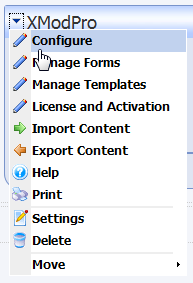
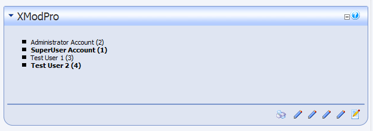

# Tutorial One: <br> Creating A List View of Your Data

In this tutorial, we're going to cover the basic mechanics of displaying some data in your database in a list-based view. We'll keep it as simple as possible, so you can see the basic steps involved in the process and then be able to apply those concepts to other tutorials and projects.

Since we don't want you to have to create any tables in your database, we'll choose one that every DotNetNuke (DNN) installation has: the Users table.

::: warning
Using XMod Pro, you will be interacting directly with your live data source. You should BACKUP you data beforehand to prevent the accidental loss or corruption of data due to typo's and other unforeseen circumstances.
:::

For our purposes, the Users table has the following columns (Note that the term "column" and "field" will be used interchangeably throughout the documentation): 

*   UserID
*   Username
*   FirstName
*   LastName
*   DisplayName
*   Email

There are some other fields besides those listed above, and different versions of DNN may have slight variations in fields and field names, but we'll focus on just these. It's also important to _note the capitalization of the field names_ as you will need to match it exactly when referring to that field: 'UserID' is not the same as 'UserId' or 'userid'.

1.  If you haven't done so already create a page in your website and add an XMod Pro module instance to that page
2.  Since only Hosts and SuperUsers can work with templates, ensure you're logged-in as such a user.
3.  Display of your data is done using templates. So, we'll need to create a template. From the Actions menu, select **Manage Templates**:  
    
4.  The **Manage Templates** page is where you add, edit, copy, and delete your display templates. For the mechanics of how to use the Manage Templates page, refer to [this topic](../manage-templates.md).
5.  Click the **New Template** button to create a new template. An inline dialog box will appear within the grid prompting you for a Template Name and Content. For the Template Name, type in "AllUsers" (without quotes). The Template Name can only consist of letters, numbers, hyphens (-) and underscores (_). The Content editor will contain some boilerplate code that can help you get a jump-start creating your template. We don't need it for this example, so just delete all the text.
6.  We'll type our template into the Content area of the dialog. Whenever you see `text that looks like this`, we're referring to code. At the end, we'll put all the pieces together so you can see the whole template. At that point you can type or copy/paste the code into the Content editor.  

    1.  `<xmod:template id="AllUsers">`  
        This is the 'template' tag. You can have one or more of these in your template. We'll just use one for this example. You may use your own HTML to surround the template tag, to lay it out in whatever manner you need. For instance, you could put multiple templates into an HTML `<table>` to position them within your module. Again, for our purposes, we don't need any of that - just the template tag will suffice.  

        In this example, we've given the template an ID of "AllUsers". The ID is a unique identifier for this template tag within the broader set of templates and controls. The ID can be anything you'd like, but it must start with a letter and consists of only letters, numbers, hyphens and underscores. While an ID isn't strictly required in this case, it's a good habit to get into. Later you'll use the ID when implementing communications between templates. We're using "AllUsers" here, which matches our template name, but that doesn't have to be the case. It could easily be "ListOfUsers" or "MyDogSpot" - though it's usually good practice for the ID to reflect the purpose of the template. See the [template tag topic](../template-controls/template.md) for additional attributes of the template tag.  

    2.  `<ListDataSource CommandText="SELECT UserID, DisplayName FROM Users ORDER BY DisplayName ASC" />`  
        This tag tells XMod Pro what data it should retrieve for your list view template. In the CommandText attribute, you can insert your own SQL `SELECT` query or use `EXEC sprocName` to execute a stored procedure. In this example, we're simply retrieving the UserID and the user's DisplayName. In this example, we just use "Users" as the table name. Depending on how your database is setup, you may need to pre-pend a database owner and/or object qualifier to the table name like: dbo.DNN_Users or something similar.  

    3.  `<HeaderTemplate>`  
        `  <ul>`  
        `</HeaderTemplate>`  
        Each list view template must contain at least an `<ItemTemplate>` tag. It may optionally contain a `<HeaderTemplate>`, `<AlternatingItemTemplate>`, and `<FooterTemplate>`. The `<HeaderTemplate>` is rendered once, at the beginning of the list of records on the page. We're going to display the users in an un-ordered list (a bullet list), so in the `<HeaderTemplate>` we'll place the opening un-ordered list tag (`<ul>`).  

    4.  `<ItemTemplate>`  
        `  <li class="Normal">[[DisplayName]] ([[UserID]])</li>`  
        `</ItemTemplate>`  
        In the ItemTemplate tag, we place the HTML for a list item (`<li>` and `</li>`).The list item has a CSS class of "Normal" assigned to it (a standard DNN CSS Class name used typically for basic text). Inside the list item, we've placed a "Field Token". Field Tokens are used to tell XMod Pro where to place your data within your template. The syntax is quite simple - two opening brackets `[[` followed by the field/column name (remember it is case-sensitive) followed by two closing brackets `]]`. In the example above, we're displaying the user's Display Name followed by the user's ID, in parentheses.  

    5.  `<AlternatingItemTemplate>`  
        `  <li class="Normal"><strong>[[DisplayName]] ([[UserID]])</strong></li>`  
        `</AlternatingItemTemplate>`  
        The AlternatingItemTemplate tag is optional. We're using it here so you can see it in action. The tag, when specified, is used for all even-numbered items in your list. The ItemTemplate will be used for record 1, 3, 5, 7, ... while the AlternatingItemTemplate will be used for records 2, 4, 6, 8, ... If we didn't specify an AlternatingItemTemplate then ItemTemplate would be used for every record.  

        In the example above, we're repeating the same layout as the ItemTemplate. That's not required, but is generally what you'll do. We've modified the style of this layout, though, to display the user's values in **bold**, by using the `<strong>` and `</strong>` tags.  

    6.  `<FooterTemplate>`  
        `  </ul>`  
        `</FooterTemplate>`  
        We close off our list with the FooterTemplate. The FooterTemplate is rendered once, at the end of the list of records on the page. So, we'll close our un-ordered list with the `</ul>` tag.  

    7.  `</xmod:template>`  
        Finally, we'll close our template tag.
7.  Let's take a look at the completed template:  
    ```html
    <xmod:template>  
      <ListDataSource CommandText="SELECT UserID, DisplayName FROM Users ORDER BY DisplayName ASC" />  
      <HeaderTemplate>  
        <ul>  
      </HeaderTemplate>  
      <ItemTemplate>  
        <li class="Normal">[[DisplayName]] ([[UserID]])</li>  
      </ItemTemplate>  
      <AlternatingItemTemplate>  
        <li class="Normal"><strong>[[DisplayName]] ([[UserID]])</strong></li>  
      </AlternatingItemTemplate>  
      <FooterTemplate>  
        </ul>  
      </FooterTemplate>  
    </xmod:template>
    ```
8.  Type or copy and paste the above code into the Content editor area and click the "Update" link. If there were errors in your template, you will be notified via an error message just below the Update and Cancel links. Assuming there were no errors, you've successfully created your template.
9.  Click the "Close" button at the bottom of the grid to return to the previous page.
10.  Now, all we need to do is configure the XMod Pro module to use the template we just created. From the Actions menu, select "Configure":  
    
11.  This displays the configuration page. On the Settings tab, select "AllUsers" from the list of available Templates.
12.  Click the "Close" button to save your changes and return to the previous page.
13.  Your display should look something like this (though your list of users may be different and your site's style may be different):  
       

#### Next Steps:

[Tutorial Two: Create a Detail View](2_user-detail-view.md)
