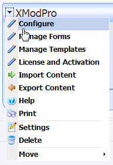
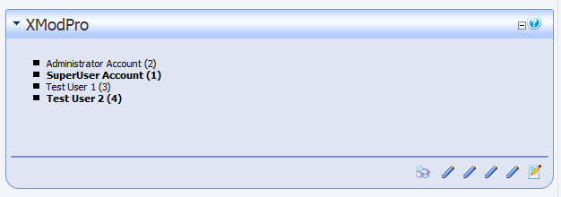

# Tutorial One: <br> Creating A List View of Your Data

In this tutorial, we're going to cover the basic mechanics of displaying some data in your database in a list-based view. We'll keep it as simple as possible, so you can see the basic steps involved in the process and then be able to apply those concepts to other tutorials and projects.

Since we don't want you to have to create any tables in your database, we'll choose one that every DotNetNuke (DNN) installation has: the Users table.

::: warning
Using XMod Pro, you will be interacting directly with your live data source. You should BACKUP your data beforehand to prevent the accidental loss or corruption of data due to typos and other unforeseen circumstances.
:::

For our purposes, the Users table has the following columns (Note that the term "column" and "field" will be used interchangeably throughout the documentation):

*   UserID
*   Username
*   FirstName
*   LastName
*   DisplayName
*   Email

There are some other fields besides those listed above, and different versions of DNN may have slight variations in fields and field names, but we'll focus on just these. It's also important to _note the capitalization of the field names_ as you will need to match it exactly when referring to that field: 'UserID' is not the same as 'UserId' or 'userid'.

1.  If you haven't done so already, create a page in your website and add an XMod Pro module instance to that page.
2.  Since only Hosts and SuperUsers can work with views, ensure you're logged in as such a user.
3.  Display of your data is done using views. So, we'll need to create one. Open the [Control Panel](../control-panel.md) and click the **+** button in the toolbar to create a new **View**.

    <!-- SCREENSHOT: tutorial1-create-view — The + menu in the Control Panel toolbar showing the New View option -->

4.  Give your view the name **AllUsers**. The name can only consist of letters, numbers, hyphens (-) and underscores (_). The [Code Editor](../code-editor.md) will open with some boilerplate code. Delete all the text — we'll type our own.

5.  We'll type our view definition into the Code Editor. Whenever you see `text that looks like this`, we're referring to code. At the end, we'll put all the pieces together so you can see the whole definition. At that point you can type or copy/paste the code into the editor.

    1.  `<xmod:template id="AllUsers">`
        This is the `<xmod:template>` tag — the XML tag that defines a view. You can have one or more of these in your view definition. We'll just use one for this example. You may use your own HTML to surround the tag, to lay it out in whatever manner you need.

        In this example, we've given the tag an ID of "AllUsers". The ID is a unique identifier for this `<xmod:template>` tag within the broader definition. The ID can be anything you'd like, but it must start with a letter and consist of only letters, numbers, hyphens and underscores. While an ID isn't strictly required in this case, it's a good habit to get into. Later you'll use the ID when implementing communications between template areas. See the [`<xmod:template>` tag topic](../template-controls/template.md) for additional attributes.

    2.  `<ListDataSource CommandText="SELECT UserID, DisplayName FROM Users ORDER BY DisplayName ASC" />`
        This tag tells XMod Pro what data it should retrieve for your list. In the CommandText attribute, you can insert your own SQL `SELECT` query or use `EXEC sprocName` to execute a stored procedure. In this example, we're simply retrieving the UserID and the user's DisplayName. Depending on how your database is set up, you may need to prepend a database owner and/or object qualifier to the table name like: dbo.DNN_Users or something similar.

    3.  `<HeaderTemplate>`
        `  <ul>`
        `</HeaderTemplate>`
        Each view must contain at least an `<ItemTemplate>` tag. It may optionally contain a `<HeaderTemplate>`, `<AlternatingItemTemplate>`, and `<FooterTemplate>`. The `<HeaderTemplate>` is rendered once, at the beginning of the list of records on the page. We're going to display the users in an unordered list (a bullet list), so in the `<HeaderTemplate>` we'll place the opening `<ul>` tag.

    4.  `<ItemTemplate>`
        `  <li class="Normal">[[DisplayName]] ([[UserID]])</li>`
        `</ItemTemplate>`
        In the ItemTemplate tag, we place the HTML for a list item (`<li>` and `</li>`). The list item has a CSS class of "Normal" assigned to it (a standard DNN CSS class). Inside the list item, we've placed a "Field Token". Field Tokens tell XMod Pro where to place your data. The syntax is simple — two opening brackets `[[` followed by the field/column name (remember it is case-sensitive) followed by two closing brackets `]]`. In the example above, we're displaying the user's Display Name followed by the user's ID, in parentheses.

    5.  `<AlternatingItemTemplate>`
        `  <li class="Normal"><strong>[[DisplayName]] ([[UserID]])</strong></li>`
        `</AlternatingItemTemplate>`
        The AlternatingItemTemplate tag is optional. We're using it here so you can see it in action. When specified, it is used for all even-numbered items in your list. The ItemTemplate will be used for records 1, 3, 5, 7, ... while the AlternatingItemTemplate will be used for records 2, 4, 6, 8, ... If we didn't specify an AlternatingItemTemplate then ItemTemplate would be used for every record.

        In the example above, we're repeating the same layout as the ItemTemplate but displaying the values in **bold**, using the `<strong>` and `</strong>` tags.

    6.  `<FooterTemplate>`
        `  </ul>`
        `</FooterTemplate>`
        We close off our list with the FooterTemplate, rendered once at the end of the list. We'll close our unordered list with the `</ul>` tag.

    7.  `</xmod:template>`
        Finally, we'll close our `<xmod:template>` tag.

6.  Let's take a look at the completed view definition:
    ```html
    <xmod:template>
      <ListDataSource CommandText="SELECT UserID, DisplayName FROM Users ORDER BY DisplayName ASC" />
      <HeaderTemplate>
        <ul>
      </HeaderTemplate>
      <ItemTemplate>
        <li class="Normal">[[DisplayName]] ([[UserID]])</li>
      </ItemTemplate>
      <AlternatingItemTemplate>
        <li class="Normal"><strong>[[DisplayName]] ([[UserID]])</strong></li>
      </AlternatingItemTemplate>
      <FooterTemplate>
        </ul>
      </FooterTemplate>
    </xmod:template>
    ```
7.  Type or copy and paste the above code into the Code Editor and click **Save** (or press **Ctrl+S**). If there are errors in your view definition, the editor's [validation indicators](../code-editor.md#validation) will alert you.
8.  Now, all we need to do is configure the XMod Pro module to use the view we just created. Navigate to your page with the XMod Pro module and select **Configure** from the module's action menu.

    

9.  On the Settings tab, select "AllUsers" from the list of available Views.
10. Click **Close** to save your changes and return to the page.
11. Your display should look something like this (though your list of users may be different and your site's style may be different):
    

#### Next Steps:

[Tutorial Two: Create a Detail View](2_user-detail-view.md)
