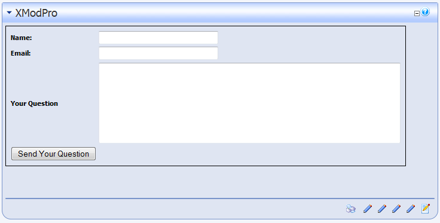
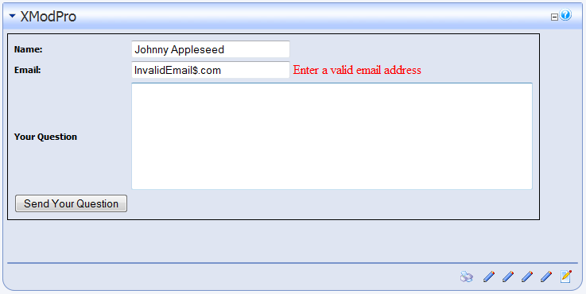

# Tutorial Three:  <br>Create a Feedback Form

In the first two tutorials, you created a list-based view of your data and then added the ability to view the details of each record. In this tutorial, we're going to switch gears from displaying data, to enabling the input of data via XMod Pro's custom forms. We'll be creating a simple Feedback form that will allow site visitors to enter their Name, Email Address, and Question. The form will then send that information, via email to our site administrator. To keep things simple, no data will be saved to the database.

1.  If you haven't done so already, install the FormView module that came with XMod Pro. You'll find it in the Installation folder alongside the XMod Pro installation file.
2.  Next, open a page in your site and add an XMod Pro FormView instance to the page.
3.  Ensure you're logged in as Host or SuperUser.
4.  We're going to create a form. Open the [Control Panel](../control-panel.md) and click the **+** button to create a new **Form**. Choose "Custom Form" to work with code directly.
5.  Give your form the name **FeedbackForm**. Form names can consist of only letters, numbers, hyphens (-) and underscores (_).
6.  The [Code Editor](../code-editor.md) will open. Delete any boilerplate text — we'll type our own.
7.  As with our other tutorials, we'll present and explain the individual parts of our form first and then present you with the full form definition at the end.
    1.  `<AddForm>`

        The AddForm is the form that is displayed when creating a record. We won't actually be creating a database record in this example, but we'll still use the `<AddForm>` tag. The reason for this is that we will be displaying this form in "form view" mode. This means that when the page is loaded, the form will be displayed. The user won't have to click an "Add" button or other button to display the form. XMod Pro uses the AddForm for this form.

    2.  ``` html
        <table style="border: 1px solid black;">
          <tr>
            <td>
              <label for="txtName" cssclass="NormalBold">Name: </label>
            </td>
            <td>
              <textbox id="txtName" datafield="CustName" width="200"/>
            </td>
          </tr>
          <tr>
            <td>
              <label for="txtEmail" cssclass="NormalBold">Email: </label>
            </td>
            <td>
              <textbox id="txtEmail" datafield="CustEmail" width="200"/>
              <validate type="email" target="txtEmail" message="Enter a valid email address" />
            </td>
          </tr>
        ```

        We'll be using a standard HTML table to arrange our controls. The important bits are the `<label>`, `<textbox>`, and `<validate>` tags. While they may look like HTML tags, they're actually specific to XMod Pro.

        The `<label>` tag has the same purpose as an HTML `<label>`. It displays static text. The for attribute is used to make your form more accessible to those with disabilities. Fill this attribute with the ID of the control for which it provides the caption.

        The `<textbox>` tag renders as a single-line text input box at run-time. The "id" attribute should consist of letters and numbers and begin with a letter. This value should be unique within the form. Notice that even though we aren't saving these values in the database, we still need to provide a value for the "datafield" attribute. This value will be used later when we discuss the `<email>` tag. Finally, we want the textbox to have a width of 200 pixels so we set width="200".

        The `<validate>` tag is one of the various controls you can use to validate your user's input. In this case, we are using the "email" validation type (via the "type" attribute) to ensure a properly formatted email address is entered. Notice that the "target" attribute contains the ID of the control we want to validate - txtEmail in this case. This is required. If you don't specify a target, you'll end up with a nasty error message. Finally, we provide some helpful text in the "message" attribute that will be displayed to the user when the email address doesn't validate.

    3.  ```html
        <tr>
          <td>
            <label for="txtQuestion" cssclass="NormalBold">Your Question</label>
          </td>
          <td>
            <textarea id="txtQuestion" rows="7" columns="60" datafield="CustQuestion" />
          </td>
        </tr>
        ```

        In this snippet, notice the `<textarea>` tag. At run-time, this tag renders as multi-line text input box. This provides the user with the ability to enter extended text. You can set the dimensions using "height" and "width" attributes or you can use the "rows" and "columns" attributes.

    4.  ``` html
          <tr>
            <td>
              <addbutton text="Send Your Question" />
            </td>
          </tr>
        </table>
        ```

        This tag renders as a push-button at run-time. It is used to submit an AddForm. The value of the "text" attribute is the text that will be displayed on the push button. Also in this snippet, we close out the table with the closing `</table>` tag.

    5.  ```html
          <email to="you@yoursite.com" from="[[CustEmail]]"
           subject="A Question Has Been Submitted" format="html">
           <strong>[[CustName]]</strong> has submitted a question:<br />
           Question:<br />
           [[CustQuestion]]
          </email>
        </AddForm>
        ```

        This tag defines the email that should be sent when the form has been submitted. If we were adding a record, the email wouldn't be sent until the record was successfully saved to the database. The tag can be placed anywhere between the `<AddForm>` and `</AddForm>` tags. It doesn't display at run-time.

        The attributes of the tag should be pretty familiar: `to` is the email address to which the email should be sent; `from` is the email from which the email is sent; `subject` is the text to use as the subject of the email; format determines if the email should be formatted as HTML (`format="html"`) or as plain text (`format="text"`). Finally, the text between the `<email>` and `</email>` tags make up the body of the email.

        You probably have noticed the use of field token tags: `[[CustEmail]]`, `[[CustName]]`, and `[[CustQuestion]]`. If you look at the `<textbox>` and `<textarea>` tags, you'll notice we specified a "datafield" attribute for each one. This allows us to use those control values in the `<email>` tag. We're using the customer entered email in the "from" attribute and the customer-entered name and question in the body of the email.

        Finally, the `</AddForm>` tag closes the AddForm definition.

    6.  The full form definition looks like this:

        ```html
        <AddForm>
          <table style="border: 1px solid black; padding: 5px;">
            <tr>
              <td>
                <label for="txtName" cssclass="NormalBold">Name: </label>
              </td>
              <td>
                <textbox id="txtName" datafield="Name" width="200"/>
              </td>
            </tr>
            <tr>
              <td>
                <label for="txtEmail" cssclass="NormalBold">Email: </label>
              </td>
              <td>
                <textbox id="txtEmail" datafield="Email" width="200"/>
                <validate type="email" target="txtEmail" message="Enter a valid email address" />
              </td>
            </tr>
            <tr>
              <td>
                <label for="txtQuestion" cssclass="NormalBold">Your Question</label>
              </td>
              <td>
                <textarea id="txtQuestion" rows="7" columns="60" datafield="Question" />
              </td>
            </tr>
            <tr>
              <td colspan="2">
                <addbutton text="Send Your Question" />
              </td>
            </tr>
          </table>

          <email to="you@yoursite.com" from="[[Email]]"
             subject="A Question Has Been Submitted" format="html">
             <strong>[[Name]]</strong> has submitted a question:<br />
             Question:<br />
             [[Question]]
          </email>

        </AddForm>

        ```

8.  Type or copy and paste the code above into the Code Editor and click **Save**.
9.  Navigate to your page with the FormView module and select **Configure** from the module's action menu.

    

10. Select "FeedbackForm" from the Form drop-down list.
11. Ensure that the Form Mode is set to Add. This tells the module to load the form defined in the `<AddForm>` tag.
12. Click **Close** to save your changes and return to the page.
13. You should now see the form displayed for you:
    
14. Now, if you fill in the form with an invalidly formatted email address, you'll see something like this:
    
15. When the user clicks the "Send Your Question" button, assuming the email address is correct, an email will be sent to "you@yoursite.com" - or whatever address you specified in the `<email>` tag.
