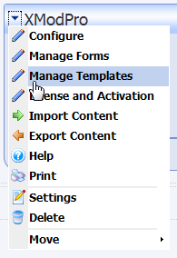
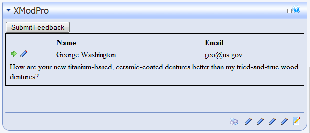
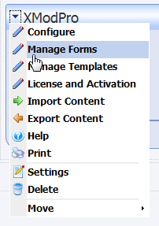
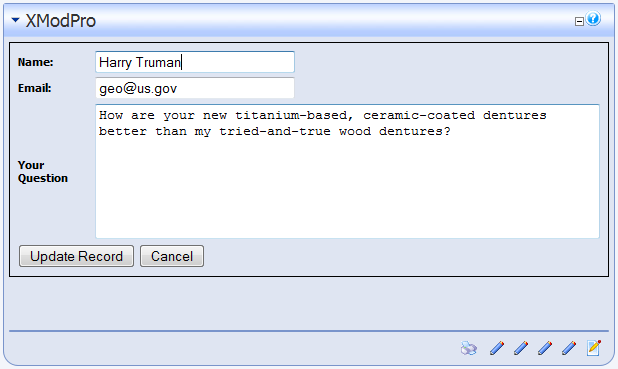
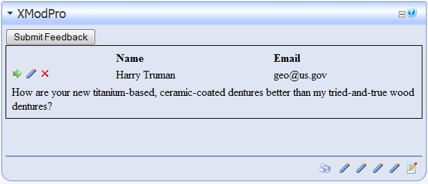
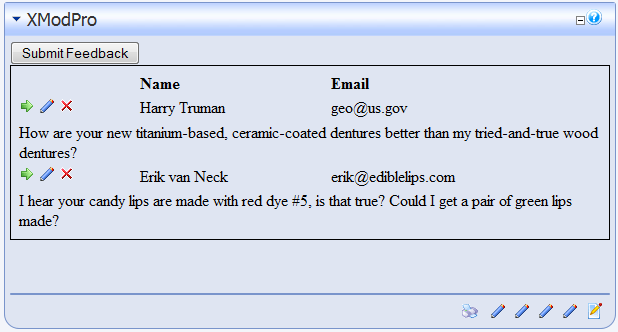
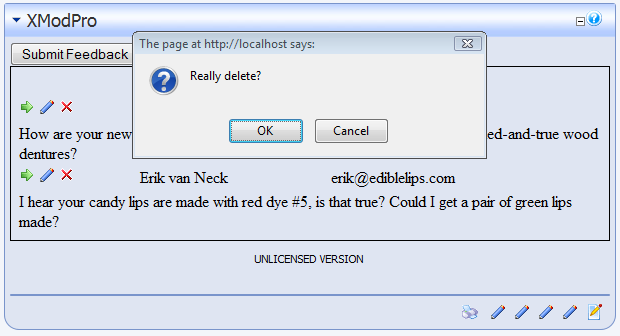

# Tutorial Six: <br>Editing And Deleting the Feedback Form Data

This tutorial assumes you have successfully completed [Tutorial Five "Displaying The Feedback Form Data"](5_displaying-feedback-form-data.md).

In the last tutorial, we created a template to display a list of the feedback we've received from customers and provided a button to add feedback. Now we'll modify that template and the feedback form to enable us to edit and delete feedback.

1.  If you haven't done so already open the page in your site that contains the Feedback form and its display template we've been working with.
2.  Ensure you're logged-in as Host or SuperUser.
3.  We're going to modify our existing template. So, from the Actions menu, select **Manage Templates**:  
    
4.  Click the **Edit** link next to the "CustomerFeedback" template name to open the content editor for that template.
5.  The current template is displayed below. The lines we'll be modifying are indicated highlighted. 
    ```html {2,30-32}
    <xmod:addbutton text="Submit Feedback" />
    <xmod:template EditRoles="Role 1;Role 3">
      <ListDataSource 
        CommandText="SELECT FeedbackId, Name, Email, Question 
                     FROM XMP_Feedback"/>
      <DetailDataSource 
        CommandText="SELECT Name, Email, Question 
                     FROM XMP_Feedback 
                     WHERE FeedbackId = @FeedbackId">
        <parameter name="FeedbackId" />
      </DetailDataSource>

      <HeaderTemplate>  
        <table style="border: 1px solid black; padding: 5px;">  
          <tr>
            <td>  
              <strong>Name</strong>  
            </td>  
            <td>  
              <strong>Email</strong>  
          </td>  
          </tr>
      </HeaderTemplate>
      <ItemTemplate>  
          <tr>
            <td>
              <xmod:detailimage imageurl="~/images/rt.gif">
                <parameter name="FeedbackId" value='[[FeedbackId]]'/>
              </xmod:detailimage>
              <xmod:editimage imageurl="~/images/edit.gif"> 
                <parameter name="FeedbackId" value='[[FeedbackId]]'/>
              </xmod:editimage>
            </td>
            <td>[[Name]]</td>  
            <td>[[Email]]</td>
          </tr>
          <tr>
            <td colspan="3">[[Question]]</td>  
          </tr>  
      </ItemTemplate>
      <FooterTemplate>  
        </table>  
      </FooterTemplate>

      <DetailTemplate>
        <h1>Feedback Details</h1>
        <strong>Name:</strong> [[Name]]<br />
        <strong>Email:</strong> <a href="mailto:[[Email]]">[[Email]]</a><br />
        <strong>Question:</strong><br />
        [[Question]]<br /><br />
        <xmod:returnbutton text="Back" />
      </DetailTemplate>
    </xmod:template>
    ```

    **Edit Roles**

    This property of the `<xmod:template>` tag is optional. Hosts and Administrators can always edit records. If you want members of other roles to have permission, you'll need to specify it using the EditRoles property. In this case, members of "Role 1" or "Role 2" can edit records as well. Note that you should replace these with appropriate role names for your site.

    **Edit Button**

    Just as we provided a detail button to initiate the display of a record's details, so too we need to provide an edit button to initiate editing of that record. As with most buttons in XMod Pro, the edit button comes in several varieties. For this example, we're using the `<xmod:editimage>` to display a clickable image instead of a button or a link. We've chosen a standard graphic from the default DNN installation. Feel free to choose your own image.

    As with the Detail Button ([See Tutorial 5](5_displaying-feedback-form-data.md)), we need to supply a parameter that will be passed to the EditForm so that it can retrieve the record to edit. We'll be passing the FeedbackId. At this point, you may be wondering where the command to retrieve that record is. You'll find it in the EditForm, which we'll cover in just a moment.

6.  Save your changes to the template. Your display should now look something like this:

    

7.  Before that Edit Button will work correctly, we need to add an Edit Form to our form definition. Go to the Manage Forms page:

    

8.  On the Manage Forms page, click to Edit the "FeedbackForm" form. Since we won't be modifying the `<AddForm>` code, we'll omit that, for the sake of brevity. After the closing `</AddForm>` tag, add the following highlighted code:

    ```html {5-50}
    <AddForm>  
     ...  
    </AddForm>

    <EditForm>
      <SelectCommand CommandText="SELECT FeedbackId, Name, Email, Question 
                                  FROM XMP_Feedback 
                                  WHERE FeedbackId=@FeedbackId">
      </SelectCommand>
      <SubmitCommand CommandText="UPDATE XMP_Feedback SET 
                                   Name=@Name, Email=@Email, Question=@Question 
                                  WHERE FeedbackId=@FeedbackId">
      </SubmitCommand>
      <table style="border: 1px solid black; padding: 5px;">
        <tr>
          <td>
            <label for="txtName" cssclass="NormalBold">Name: </label>
          </td>  
          <td>
            <textbox id="txtName" datafield="Name" width="200"/>
          </td>
        </tr>
        <tr>
          <td>
            <label for="txtEmail" cssclass="NormalBold">Email: </label>
          </td>  
          <td>  
            <textbox id="txtEmail" datafield="Email" width="200"/>  
            <Validate type="required" target="txtEmail" 
              message="An email address is required" />  
            <Validate type="email" target="txtEmail" 
              message="Invalid email address supplied" />
          </td>  
        </tr>  
        <tr>  
          <td>  
            <label for="txtQuestion" cssclass="NormalBold">Your Question</label>  
          </td>  
          <td>  
            <textarea id="txtQuestion" rows="7" columns="60" datafield="Question" />  
          </td>  
        </tr>  
        <tr>  
          <td colspan="2">  
            <updatebutton text="Update Record" /> <cancelbutton text="Cancel" />  
          </td>  
        </tr>  
      </table> 
      <textbox id="txtFeedbackId" datafield="FeedbackId" datatype="int32" visible="false"/>
    </EditForm>
    ```

    If you look closely at the code, you'll notice that it is almost identical to the AddForm definition, but there are some important differences

    **Select Command**

    This is the command XMod Pro will execute to retrieve the record to be edited. It uses a single parameter - FeedbackId. This is the parameter that is passed from the Edit Button. The parameter names must match.

    **Linking Controls to Data**

    Once we've retrieved the record's values, XMod Pro will populate the form's controls with those values. As with the AddForm, the "datafield" and "datatype" attributes are used for this purpose. The "datafield" must match the column name of a column returned from the Select Command. The "datatype" tells XMod Pro and the control what type of data it is handling. This is necessary when the form's data is saved back to the database in the Submit Command.

    **Saving the FeedbackId**

    **This is a critical step**. You need to save your key field values in the form so they can be used when updating the record. In this case, we only need to save the FeedbackId. To do this, we use the `<textbox>` control and set its Visible property to False, so that it is hidden. We also set the "datafield" property of the control to "FeedbackId" and its "datatype" to "int32". Now, when the Submit Command is executed, it can use FeedbackId.

    **Update/Cancel Button**

    Notice the `<addbutton>` tag has changed to an `<updatebutton>` tag. The Update button, when clicked, executes the Submit Command. The Cancel button will cancel the Edit record action and return to the previous view.

    **No Email**

    One other difference between the Add and Edit form is the lack of an `<email>` tag in the Edit form. For this solution, we only want to be notified when a user has created a new feedback record, not when that record has been edited. Should you need a notification be sent when a record is updated, you can add an `<email>` tag, following the example in the `<AddForm>`.

    **Submit Command**

    Finally, the `<SubmitCommand>` tag contains the command to execute when the Update button is clicked. The command uses `@Name`, `@Email`, `@Question`, and `@FeedbackId`. These are parameters to the command but you do not have to create `<parameter>` tags for each of them. The "datafield" properties you specified for the form controls are used to link these parameters with the values from those controls. No additional work is needed on your part.

9.  Once you've made the changes to your form, save it and close the Manage Forms page.
    

10.  Now you can click the Edit button: the pencil graphic in the example above. You be presented with the Edit Form, with the controls pre-populated with values from the record.
    

11.  You can make some changes to the record. In the example below, we've changed the name to "Harry Truman":    
    

12.  Click the Update Record button and your changes will be saved. The end result should look something like this:
    

13.  There's one more feature we want to add to our solution - the ability to delete a record. For this we'll add a Delete Button and a Delete Command to our template. So, go to the **Manage Templates** page:
    

14.  On the Manage Templates page click to Edit the "CustomerFeedback" template. This will load our existing template into the Content editor area.

15. Next, make the following changes - highlighted in red:
    ```html {2,13-15,36-39}
    <xmod:addbutton text="Submit Feedback" editroles="Role 1;Role 3" 
                    deleteroles="Role 1"/>
    <xmod:template>
      <ListDataSource 
        CommandText="SELECT FeedbackId, Name, Email, Question 
                     FROM XMP_Feedback"/>
      <DetailDataSource 
        CommandText="SELECT Name, Email, Question 
                     FROM XMP_Feedback 
                     WHERE FeedbackId = @FeedbackId">
        <parameter name="FeedbackId" />
      </DetailDataSource>
      <DeleteCommand CommandText="DELETE FROM XMP_Feedback WHERE FeedbackId=@FeedbackId">
        <parameter name="FeedbackId" />
      </DeleteCommand>
      <HeaderTemplate>  
      <table style="border: 1px solid black; padding: 5px;">  
        <tr>
          <td>  
            <strong>Name</strong>  
          </td>  
          <td>  
            <strong>Email</strong>  
         </td>  
        </tr>
      </HeaderTemplate>
      <ItemTemplate>  
        <tr>
          <td>
            <xmod:detailimage imageurl="~/images/rt.gif">
              <parameter name="FeedbackId" value='[[FeedbackId]]'/>
            </xmod:detailimage>
            <xmod:editimage imageurl="~/images/edit.gif">
              <parameter name="FeedbackId" value='[[FeedbackId]]'/>
            </xmod:editimage>
            <xmod:deleteimage imageurl="~/images/delete.gif" 
               onclientclick="return confirm('Really delete?');">
              <parameter name="FeedbackId" value='[[FeedbackId]]'/>
            </xmod:deleteimage>
          </td>
          <td>[[Name]]</td>  
          <td>[[Email]]</td>
        </tr>
        <tr>
          <td colspan="3">[[Question]]</td>  
        </tr>  
      </ItemTemplate>
      <FooterTemplate>  
        </table>  
      </FooterTemplate>

      <DetailTemplate>
        <h1>Feedback Details</h1>
        <strong>Name:</strong> [[Name]]<br />
        <strong>Email:</strong> <a href="mailto:[[Email]]">[[Email]]</a><br />
        <strong>Question:</strong><br />
        [[Question]]<br /><br />
        <xmod:returnbutton text="Back" />
      </DetailTemplate>
    </xmod:template>
    ```

    There are two required components and one optional component needed to delete records

    **Delete Roles**

    This is property of the `<xmod:template>` tag is optional. When used, you specify a semi-colon-delimited list of DotNetNuke security role names. Only members of those roles will see the delete button. Hosts and Administrators always can delete records.

    **Delete Command**

    In order to delete a record, you'll need to specify a `<DeleteCommand>` tag in your template. As with the `<DetailDataSource>` tag, your command should delete only one record. Usually this is done by specifying a parameter or set of parameters that limit what record(s) are deleted. In this case, we use the FeedbackId value to accomplish that task. So, the tag includes a `<parameter>` tag with the name "FeedbackId". 
    
    ::: warning
    As with any application that allows you to directly manipulate the database, an incorrectly formed delete command can cause you to accidentally delete all the records in your table. So, double-check your command and parameters and **backup your database** frequently.
    :::

    **Delete Button**

    The final piece in the delete puzzle is the button that initiates the process - the delete button. As with most buttons, it comes in several forms, including a push button (`<xmod:deletebutton>`), hyperlink (`<xmod:deletelink>`) and, the form we're using, a clickable image (`<xmod:deleteimage>`). As with the detail and edit buttons, we specify a URL to the image we want to use. Regardless of the type of button you use, you'll need to supply one or more `<parameter>` tags as shown in the code. Your parameter names must match the parameter names you defined in the Delete Command.

    Note that we've also added a confirmation to the Delete Button. Typically you want to help users avoid accidental deletions. You can do this by using the delete button's OnClientClick attribute. This attribute allows you to call your own or built-in Javascript functions when the button is clicked. In this example, we're showing a Javascript "confirm" dialog when the user clicks the button.

16.  Save your changes to the template and close the **Manage Templates** page. Your display should now look similar to this (remember we changed the Name to "Harry Truman" earlier):
    

17.  Now, let's add a new record and delete it. First, click the Submit Feedback button and add a new record.
    
    After adding the record, your display will look similar to this:
    

18.  Click the red "X" (or whatever image you used) next to the new record you've added.
     <br>
    If you click "OK", the record will be deleted. Clicking cancel will cancel the operation.
