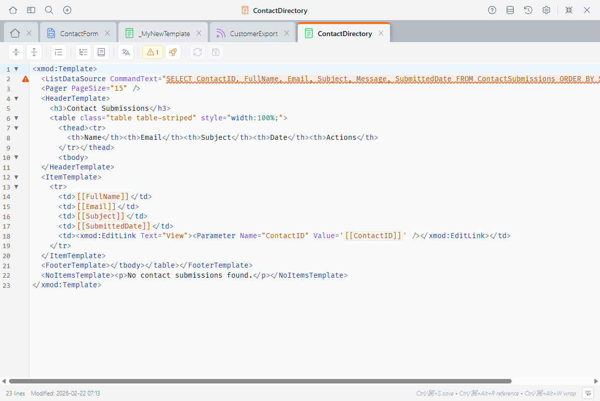
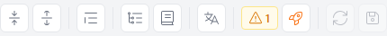
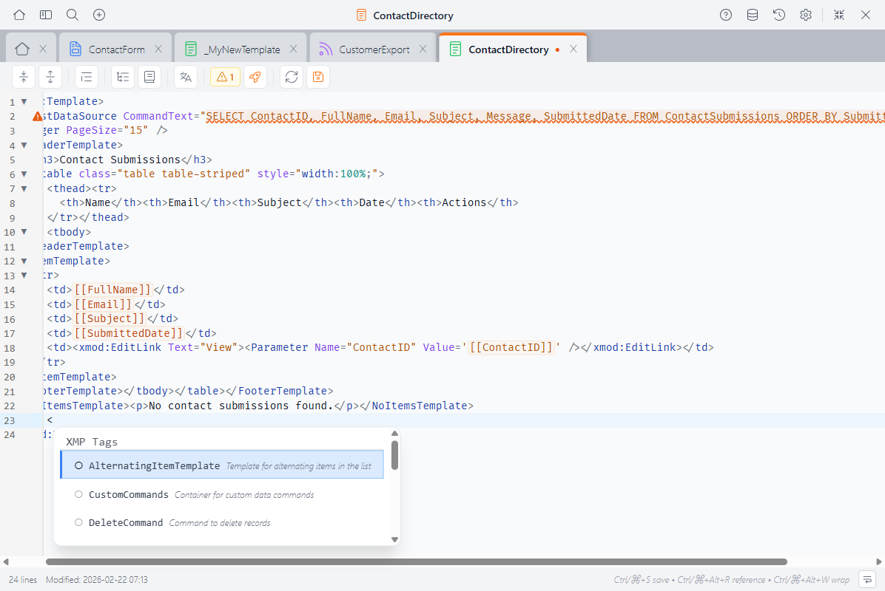
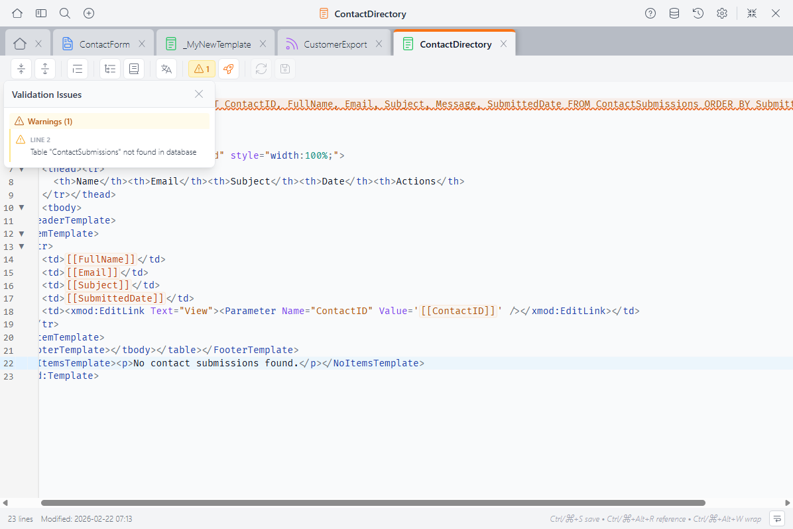

# View Editor <Badge type="info" text="v5.0" />

The View Editor is where you create and edit views — the display layer that shows your data to users. It's a professional-grade code editor built into the Control Panel, designed specifically for writing XMod Pro view definitions.



In the View Editor, you write `<xmod:Template>` definitions that include data sources, list and detail displays, and HTML layout — all with XMP-aware syntax highlighting, autocomplete, and real-time validation.

## What You Write Here

A view definition is wrapped in an `<xmod:Template>` tag and typically contains:

- **`<ListDataSource>`** — The SQL query that retrieves data for the list display
- **`<DetailDataSource>`** — The SQL query for the detail display (optional)
- **`<HeaderTemplate>`** / **`<FooterTemplate>`** — HTML that wraps the list
- **`<ItemTemplate>`** — The HTML rendered for each row of data
- **`<AlternatingItemTemplate>`** — Alternate styling for every other row (optional)
- **`<DetailTemplate>`** — The HTML for a single record's detail view (optional)
- **`<NoItemsTemplate>`** — What to show when there's no data

```xml
<xmod:Template>
  <ListDataSource CommandText="SELECT ContactId, FullName, Email
    FROM Contacts ORDER BY FullName" />

  <HeaderTemplate>
    <table class="table">
      <thead><tr><th>Name</th><th>Email</th></tr></thead>
      <tbody>
  </HeaderTemplate>

  <ItemTemplate>
    <tr>
      <td>[[FullName]]</td>
      <td>[[Email]]</td>
    </tr>
  </ItemTemplate>

  <FooterTemplate>
      </tbody>
    </table>
  </FooterTemplate>

  <NoItemsTemplate>
    <p>No contacts found.</p>
  </NoItemsTemplate>
</xmod:Template>
```

## The Toolbar

The toolbar runs along the top of the editor:



- **Fold All / Unfold All** — Collapse or expand all foldable sections
- **Format Code** — Clean up indentation (selected code, or all code if nothing is selected)
- **Structure Navigator** — Toggle a sidebar showing template areas and regions ([details below](#structure-navigator))
- **Reference Panel** — Toggle a sidebar with tag and token reference ([details below](#reference-panel))
- **Localization** — Edit localization strings for this view
- **Validation** — Shows the count of errors and warnings ([details below](#validation))
- **Quick Start** — Launch the View Quick Start wizard to generate a view from a data source
- **Reload** — Discard unsaved changes and reload from the server
- **Save** — Save your changes (**Ctrl+S** / **Cmd+S**)

The status bar at the bottom shows the line count, last modified date, keyboard shortcuts, and a word wrap toggle.

### Quick Start

The **Quick Start** button is unique to the View Editor. It launches a wizard that generates a complete view definition from a database table — including data source, column layout, and pager. It's a fast way to scaffold a view that you can then customize.

## Autocomplete

The editor understands the view context and offers suggestions as you type:



- **Template tags** — `<xmod:Template>`, `<HeaderTemplate>`, `<ItemTemplate>`, `<DetailTemplate>`, `<FooterTemplate>`, and more
- **View controls** — `<xmod:EditLink>`, `<xmod:DeleteButton>`, `<xmod:DetailLink>`, `<Pager>`, `<xmod:SearchSort>`, and all other [view controls](template-controls/template.md)
- **Data source tags** — `<ListDataSource>`, `<DetailDataSource>`, `<Parameter>`, and related tags
- **Tag attributes** — Context-aware suggestions for the current tag's attributes
- **Attribute values** — Known values for attributes like `DataType`, `PageSize`, etc.
- **Tokens** — `[[FieldName]]`, `[[User:...]]`, `[[Portal:...]]`, and other token types
- **Database columns** — Column names from your view's data source
- **DNN roles** — Portal role names for `ViewRoles` and similar attributes
- **HTML elements** — Standard HTML tags
- **Snippets** — Your saved code [snippets](snippets.md), ready to insert

Autocomplete appears automatically as you type, or press **Ctrl+Space** to trigger it manually.

## Validation

The editor validates your view structure in real time, catching problems before you save:



- **Errors** appear with red indicators in the gutter and wavy red underlines
- **Warnings** appear with orange indicators and orange underlines
- **Info messages** appear with blue indicators

The validation badge in the toolbar shows a count of current errors and warnings. Click it to open the validation panel, which lists all issues with line numbers — click any issue to jump to that line.

::: info What Gets Validated
The editor runs two levels of checks. **Structural checks** run automatically as you type:

- `<DetailTemplate>` without a `<DetailDataSource>` to supply data
- Detail controls (`<xmod:DetailButton>`, etc.) without a `<DetailTemplate>` to display
- Delete controls (`<xmod:DeleteButton>`, etc.) without a `<DeleteCommand>` to execute
- `<CommandButton>` / `<CommandImage>` / `<CommandLink>` whose `CommandName` doesn't match any `<DataCommand>`
- `<ItemTemplate>` content without a `<ListDataSource>` to supply data
- `<Pager>` without a `<ListDataSource>`

**Database checks** run when you click the validation button and verify your SQL against the actual database:

- Tables or stored procedures referenced in your SQL that don't exist
- `[[FieldName]]` tokens that don't match columns in the data source
- Tokens in custom `<DataCommand>` elements that reference unavailable fields

Validation is advisory — it highlights issues but never blocks saving.
:::

## Shared Editor Features

The View Editor shares these features with the [Custom Form Editor](custom-form-editor.md) and [Feed Editor](feed-editor.md):

### Syntax Highlighting

- **XMP tokens** like `[[FieldName]]` and `[[User:ID]]` are highlighted in orange
- **XMP tags** like `<xmod:Template>` and `<xmod:EditLink>` are highlighted
- **Comments** using `[-- ... --]` syntax are dimmed
- **HTML tags**, attributes, and strings each get their own colors
- **Regions** (`#region` / `#endregion`) are visually marked

The editor supports light and dark themes — switch between them in [Settings](control-panel.md).

### Code Folding

Collapse sections to focus on what you're working on. Click the fold indicator in the gutter, or use **Fold All** / **Unfold All** in the toolbar.

Foldable sections include template areas (`<HeaderTemplate>`, `<ItemTemplate>`, etc.), `#region` / `#endregion` blocks, and any multi-line XML/HTML tags.

::: tip Using Regions
Wrap sections in `#region Section Name` and `#endregion` to create named, collapsible sections — especially useful in long view definitions:
```xml
#region List View Header
<div class="header">
  <h2>My Items</h2>
</div>
#endregion
```
:::

### Structure Navigator

Click **Structure Navigator** in the toolbar to see an outline of your view: template areas like `<HeaderTemplate>`, `<ItemTemplate>`, and `<DetailTemplate>`, plus any regions. Click an item to jump directly to it.


This is especially useful in views with multiple template areas and regions.

### Reference Panel

Click **Reference Panel** (or press **Ctrl+Alt+R** / **Cmd+Alt+R**) to open a searchable sidebar with:

- **View tags & attributes** — Every available view tag and its properties
- **Tokens** — All token types and their syntax
- **Snippets** — Your saved snippets, ready to insert with a click


The panel automatically shows view-context content when you're editing a view.

## Keyboard Shortcuts

| Shortcut | Action |
|----------|--------|
| **Ctrl+S** / **Cmd+S** | Save |
| **Ctrl+Z** / **Cmd+Z** | Undo |
| **Ctrl+Shift+Z** / **Cmd+Shift+Z** | Redo |
| **Ctrl+F** / **Cmd+F** | Find |
| **Ctrl+Space** | Trigger autocomplete |
| **Ctrl+Alt+W** / **Cmd+Alt+W** | Wrap selection with a tag |
| **Ctrl+Alt+R** / **Cmd+Alt+R** | Toggle Reference Panel |
| **Tab** / **Shift+Tab** | Indent / outdent selected lines |

## Next Steps

- **[View Controls Reference](template-controls/template.md)** — Detailed docs for every view control
- **[Tutorials](tutorials/1_listing-users.md)** — Step-by-step guides starting with a simple list view
- **[Snippets](snippets.md)** — Create reusable code snippets
- **[Version History](version-history.md)** — Browse, compare, and restore previous versions
